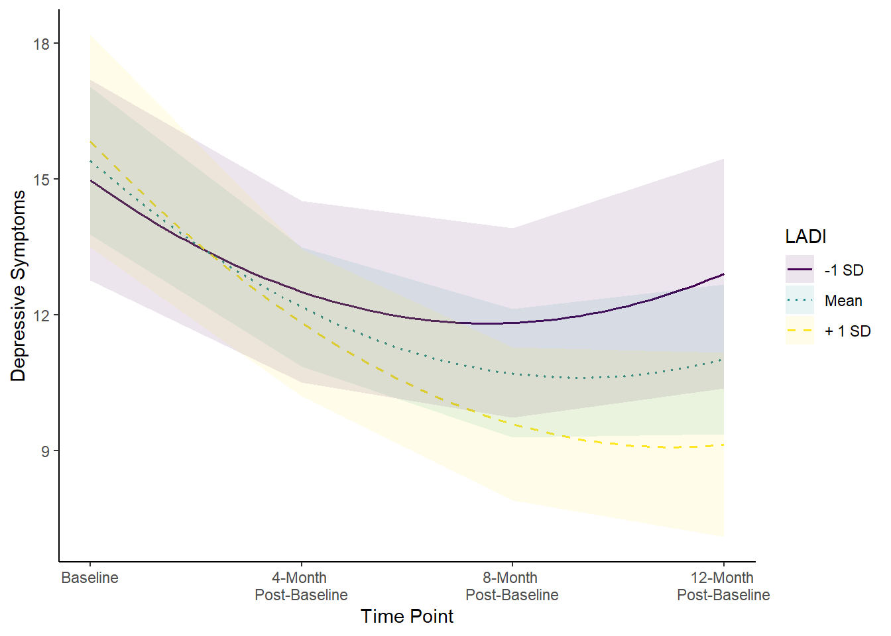
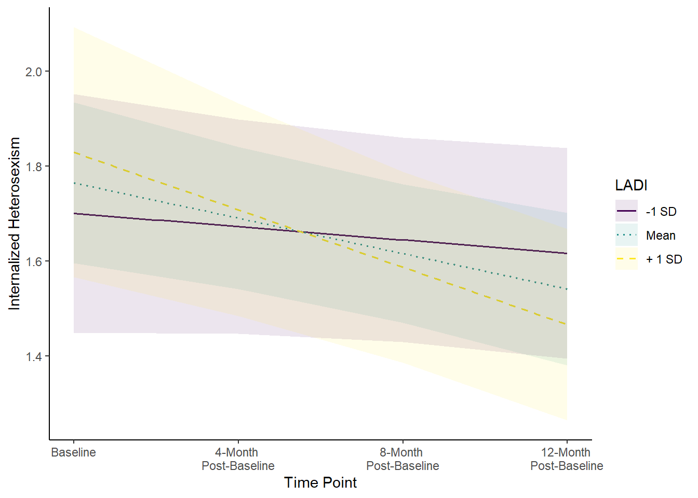
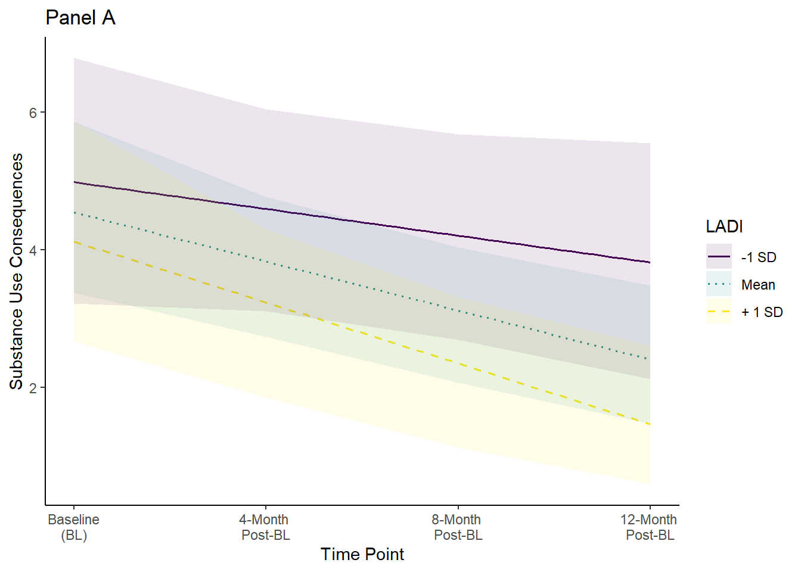
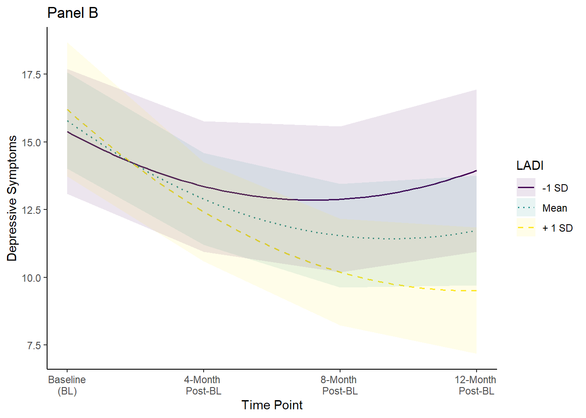
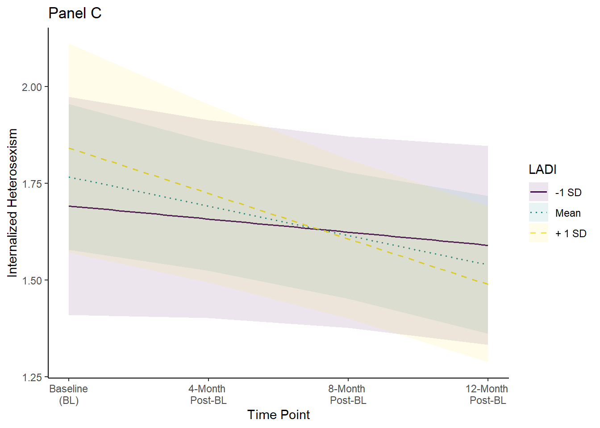
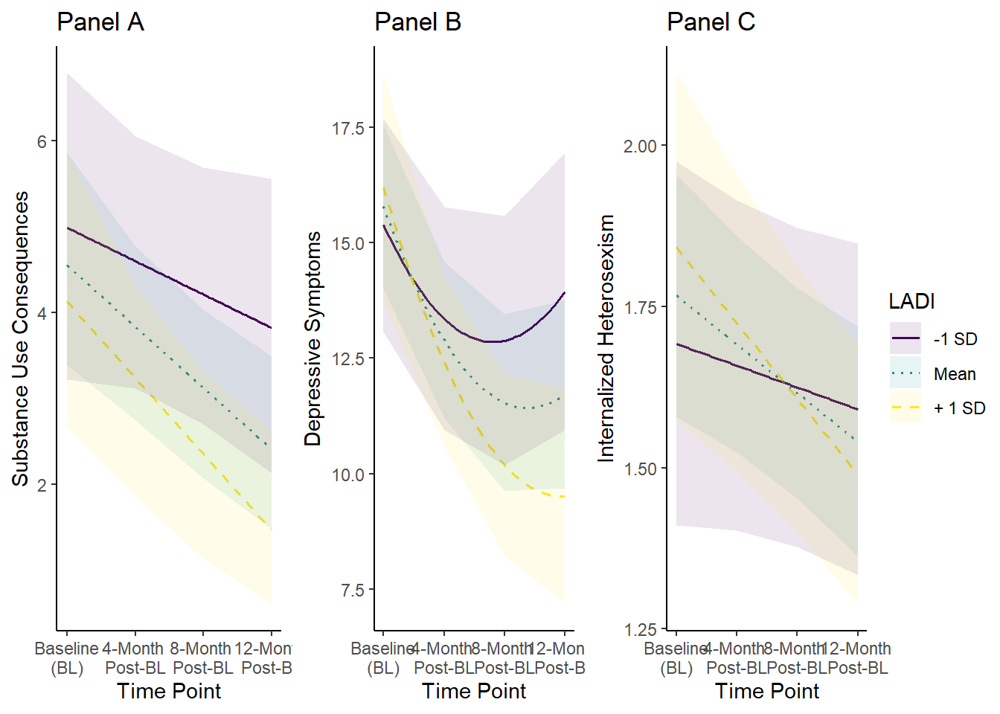
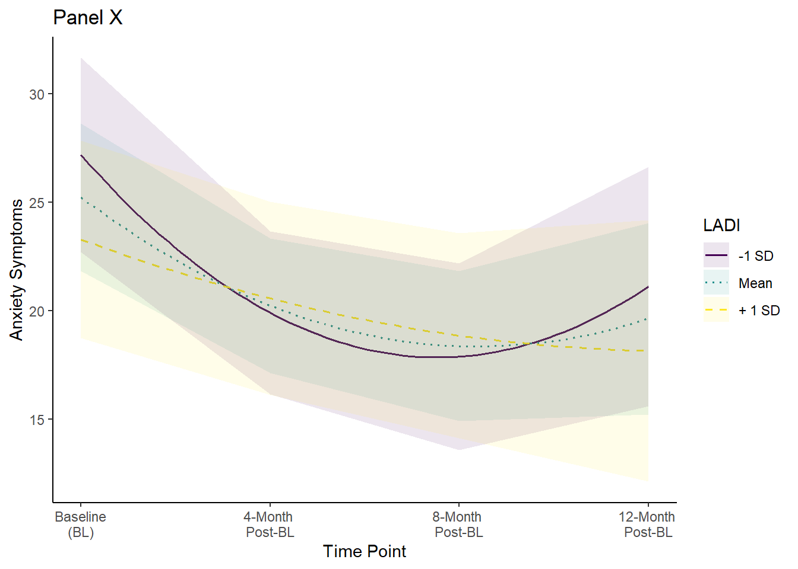

# Load packages and data


::: {.cell}

```{.r .cell-code}
library(tidyverse)
library(sjmisc)
library(haven)
library(easystats)
library(purrr)
library(psych)
library(gee)
library(geepack)
library(glmtoolbox)
library(mice)
library(marginaleffects)
library(ggpubr)
```
:::


# Load data


::: {.cell}

```{.r .cell-code}
apps_outcome <- readRDS("data/apps_outcome.rds") 
```
:::


# Modeling framework

For this project, we modeled validity analyses with generalized estimating equations. We made this decision because:

1.  the substantive interest here is the fixed effect of LADI scores (which do not vary within individuals) on outcomes, where we need to account for clustering (repeated measures within participants) to yield valid estimates but otherwise this clustering is not part of the research question for this study

2.  with small sample sizes, assumptions of MLM (e.g., properly specified random effects structure) become difficult to evaluate due to convergence problems that are introduced as well as it being impossible to compare model fit when using restricted maximum likelihood estimation

3.  with binary or count outcomes, GEEs can be more stable than MLMs

For sources supporting this decision, see McNeish, 2014; McNeish et al. 2017. Further, for support that you don't need normal residuals, see: https://www.researchgate.net/post/What_are_the_assumptions_of_the_generalized_estimating_equations

Resources for GEEs: https://library.virginia.edu/data/articles/getting-started-with-generalized-estimating-equations \*\* great https://www.rpubs.com/samopolo/759327 https://ehsanx.github.io/EpiMethods/longitudinal2.html https://tysonbarrett.com/Rstats/chapter-6-multilevel-modeling.html

## Model interpretation

*For outcomes, here is what the parameters represent:*

-   [**Intercept**:]{.underline} Expected value of the outcome at post-intervention, which is the first follow-up appointment. This is *NOT* baseline because of the way that we opted to center assessment so the intercept is interpetable as post-intervention symptoms.

-   [**Assessment_c**:]{.underline} Constant rate of change over time. Because we are modeling nonlinear change, this slope estimate is dependent on the timepoint. There are different slopes for 4MFU (post-intervention), 8MFU, and 12MFU. 

-   [**Assessment_c_quad**]{.underline}: Curvature of change overall. A positive number means the curve is a smiley face (turns upward) and a negative number means the curve is a frowney face (turns downward).

-   [**Average_c_affirm**]{.underline}: Association between affirmative technique and mean outcome score assessed at post-intervention. This reflects mean levels, *NOT* change over time.

-   [**Average_c_affirm\*Assessment_c:**]{.underline} Interaction between affirmative technique and the constant rate of change over time. In other words, this term tests whether rates of change are different across levels of affirmative techniques. If significant, this needs to be probed to plot the expected slopes across levels of affirmative technique to see whether change strengthens or weakens as a function of the LGBTQ-APPS. Note: this coefficient is NOT sensitive to centering. 

*Interpreting interactions:*

To fully understand the nature of any significant interactions, which is one of our main estimands of interest, then these need to be probed further. A common approach is to "pick a point" (usually 1 SD above and below the mean) and see if the slope is different from zero at that point. This method has been critiqued as being somewhat limited in capturing the full range of information. The Johnson-Neyman technique is one method that has been advanced that overcomes this limitation and is going to be the preferred one reported here (although will also report simple slopes). In these analyses, we are looking to see whether change over time is moderated by the LGBTQ-APPS. The J-N technique allows us to see at what values of the LGBTQ-APPS is change over time significantly different from zero, and it does so across the entire range of the LGBTQ-APPS instead of just 1 SD above and below the mean. **The neat thing about this is that it allows us to see *exactly* what LGBTQ-APPS scores are needed to lead to significant change in outcomes.** For more information on this technique, check out these two papers: McCabe et al. 2018 (link: <https://doi.org/10.1177/2515245917746792>) and Preacher et al. 2006 (link: <https://doi.org/10.3102/107699860310044>). Of note, we do not exactly do the J-N technique because we are 1) using multiple imputation, and 2) using GEEs, where available software in R to my knowledge cannot easily and possibly not accurately handle these models. However, the `marginaleffects` project lets us calculate marginal effects for each value in the dataset to approximate a J-N technique.

## Set of analyses

Based on preliminary analyses and exploration of the data, we are going to conduct the following sets of analyses:

1.  unadjusted models

2.  adjusted models with covariates: study site, continued treatment at the same community mental health agency, mental health treatment elsewhere, medication, and alliance; additionally, we'll control for total number of sex acts in models predicting HIV transmission risk behavior.

3.  SIDAS: evaluating consistency of results with SIDAS scored continuously or discretely

4.  HAMD, IHS, and SOC: evaluating consistency of results when excluding potential bivariate outlier

# Missing data

We'll handle missing data with multiple imputation via the `mice` package with 20 datasets. 


::: {.cell}

```{.r .cell-code}
# add in centering variables for follow-up analyses below 
apps_outcome <- apps_outcome |>  
  mutate(Assessment_c_8m = Assessment - 2,
         Assessment_c_12m = Assessment - 3) 

imp_df <- apps_outcome |> 
  mutate(Assessment_quad = Assessment*Assessment) |> 
  select(ParticipantID, Assessment, Assessment_quad, Assessment_c, Assessment_c_quad, Assessment_c_8m, Assessment_c_12m, Site, CMHT, MHgen, Medication, WAI_avg_c, Sx_totalacts_sum_c, Average_Affirm, Average_Affirm_c, Sx_CASriskacts, AUDIT_sum, SIP_sum, HAMD_sum, BAI_sum, SIDAS_sum, SIDAS_yn, IHS_mean, RS_mean, SOC_concealment_mean, LGBIS_identaffirm) 

# run the mice code with 0 iterations to get the predictorMatrix and methods of imputation
imp <- mice(imp_df, seed = 808, maxit = 0)
predM <- imp$predictorMatrix
meth <- imp$method

# change imputation model method for dichotomous SIDAS since coded as numeric  
log <- c("SIDAS_yn")
meth[log] <- "logreg"
meth
```

::: {.cell-output .cell-output-stdout}

```
       ParticipantID           Assessment      Assessment_quad 
                  ""                   ""                   "" 
        Assessment_c    Assessment_c_quad      Assessment_c_8m 
                  ""                   ""                   "" 
    Assessment_c_12m                 Site                 CMHT 
                  ""                   ""                   "" 
               MHgen           Medication            WAI_avg_c 
                  ""                   ""                   "" 
  Sx_totalacts_sum_c       Average_Affirm     Average_Affirm_c 
               "pmm"                   ""                   "" 
      Sx_CASriskacts            AUDIT_sum              SIP_sum 
               "pmm"                "pmm"                "pmm" 
            HAMD_sum              BAI_sum            SIDAS_sum 
               "pmm"                "pmm"                "pmm" 
            SIDAS_yn             IHS_mean              RS_mean 
            "logreg"                "pmm"                "pmm" 
SOC_concealment_mean    LGBIS_identaffirm 
               "pmm"                "pmm" 
```


:::

```{.r .cell-code}
imp <- mice(imp_df, seed = 808, maxit = 20, method = meth, print = F)
```
:::


# Linear vs. quadratic change trajectories

Preliminary inspection of the change trajectories with raw data suggested that most outcomes exhibited quadratic vs. linear change. However, here we formally test this. In a GEE framework, this can be done with the Quasi-Likelihood Information Criteria (QIC; McNeish et al., 2017; Pan, 2001), which is analogous to the Akaike and Bayesian Information Criteria where lower values = better fit. Of note, these tests of model fit are done only on the complete data because the function to calculate QIC have not been adapted for multiple imputation. 

TLFB - quadratic change is better fit. 

::: {.cell}

```{.r .cell-code}
m0.1a_tlfb <- geeglm(Sx_CASriskacts ~ Assessment_c, id = ParticipantID, family = poisson, corstr = "ar1", data = apps_outcome)

m0.1b_tlfb <- geeglm(Sx_CASriskacts ~ Assessment_c + Assessment_c_quad, id = ParticipantID, family = poisson, corstr = "ar1", data = apps_outcome)
geepack::QIC(m0.1a_tlfb, m0.1b_tlfb) # pref for quad
```

::: {.cell-output .cell-output-stdout}

```
                 QIC      QICu Quasi Lik      CIC params      QICC
m0.1a_tlfb -971.9001 -974.1267  489.0633 3.113304      2 -971.4472
m0.1b_tlfb -985.9229 -986.8836  496.4418 3.480374      3 -985.1536
```


:::
:::


AUDIT - no diff so linear is better fit. 

::: {.cell}

```{.r .cell-code}
m0.2a_audit <- geeglm(AUDIT_sum ~ Assessment_c, id = ParticipantID, family = gaussian, corstr = "ar1", data = apps_outcome)
m0.2b_audit <- geeglm(AUDIT_sum ~ Assessment_c + Assessment_c_quad, id = ParticipantID, family = gaussian, corstr = "ar1", data = apps_outcome)
geepack::QIC(m0.2a_audit, m0.2b_audit) # virtually identical - within .13
```

::: {.cell-output .cell-output-stdout}

```
                 QIC     QICu Quasi Lik      CIC params     QICC
m0.2a_audit 8294.611 8291.230 -4143.615 3.690413      2 8295.064
m0.2b_audit 8294.743 8293.228 -4143.614 3.757680      3 8295.512
```


:::
:::


SIP - no diff so linear is better fit. 

::: {.cell}

```{.r .cell-code}
m0.2a_sip <- geeglm(SIP_sum ~ Assessment_c, id = ParticipantID, family = poisson, corstr = "ar1", data = apps_outcome)
m0.2b_sip <- geeglm(SIP_sum ~ Assessment_c + Assessment_c_quad, id = ParticipantID, family = poisson, corstr = "ar1", data = apps_outcome)
geepack::QIC(m0.2a_sip, m0.2b_sip) # virtually identical - slight pref for linear
```

::: {.cell-output .cell-output-stdout}

```
                QIC      QICu Quasi Lik      CIC params      QICC
m0.2a_sip -240.1073 -242.6670  123.3335 3.279862      2 -239.6544
m0.2b_sip -239.3210 -240.7064  123.3532 3.692672      3 -238.5518
```


:::
:::


HAMD - quad is better fit. 

::: {.cell}

```{.r .cell-code}
m0.2a_hamd <- geeglm(HAMD_sum ~ Assessment_c, id = ParticipantID, family = gaussian, corstr = "ar1", data = apps_outcome)
m0.2b_hamd <- geeglm(HAMD_sum ~ Assessment_c + Assessment_c_quad, id = ParticipantID, family = gaussian, corstr = "ar1", data = apps_outcome)
geepack::QIC(m0.2a_hamd, m0.2b_hamd) # pref for quad
```

::: {.cell-output .cell-output-stdout}

```
                QIC     QICu Quasi Lik      CIC params     QICC
m0.2a_hamd 9033.780 9032.627 -4514.313 2.576876      2 9034.233
m0.2b_hamd 8854.072 8853.512 -4423.756 3.280001      3 8854.842
```


:::
:::


BAI - quad is better fit.

::: {.cell}

```{.r .cell-code}
m0.2a_bai <- geeglm(BAI_sum ~ Assessment_c, id = ParticipantID, family = gaussian, corstr = "ar1", data = apps_outcome)
m0.2b_bai <- geeglm(BAI_sum ~ Assessment_c + Assessment_c_quad, id = ParticipantID, family = gaussian, corstr = "ar1", data = apps_outcome)
geepack::QIC(m0.2a_bai, m0.2b_bai) # pref for quad
```

::: {.cell-output .cell-output-stdout}

```
               QIC     QICu Quasi Lik      CIC params     QICC
m0.2a_bai 26999.82 26996.64 -13496.32 3.585465      2 27000.27
m0.2b_bai 26353.72 26352.13 -13173.06 3.798724      3 26354.49
```


:::
:::


SIDAS - quad is better fit. 

::: {.cell}

```{.r .cell-code}
m0.2a_sidas <- geeglm(SIDAS_sum ~ Assessment_c, id = ParticipantID, family = gaussian, corstr = "ar1", data = apps_outcome)
m0.2b_sidas <- geeglm(SIDAS_sum ~ Assessment_c + Assessment_c_quad, id = ParticipantID, family = gaussian, corstr = "ar1", data = apps_outcome)
geepack::QIC(m0.2a_sidas, m0.2b_sidas) # pref for quad
```

::: {.cell-output .cell-output-stdout}

```
                 QIC     QICu Quasi Lik     CIC params     QICC
m0.2a_sidas 6845.493 6844.718 -3420.359 2.38751      2 6845.945
m0.2b_sidas 6829.181 6829.523 -3411.762 2.82869      3 6829.950
```


:::
:::


IHS - no diff so linear is better fit. 

::: {.cell}

```{.r .cell-code}
m0.2a_ihs <- geeglm(IHS_mean ~ Assessment_c, id = ParticipantID, family = gaussian, corstr = "ar1", data = apps_outcome)
m0.2b_ihs<- geeglm(IHS_mean ~ Assessment_c + Assessment_c_quad, id = ParticipantID, family = gaussian, corstr = "ar1", data = apps_outcome)
geepack::QIC(m0.2a_ihs, m0.2b_ihs) # virtually identical - within .20
```

::: {.cell-output .cell-output-stdout}

```
               QIC     QICu Quasi Lik      CIC params     QICC
m0.2a_ihs 89.13369 86.32382 -41.16191 3.404936      2 89.58652
m0.2b_ihs 89.33420 88.26563 -41.13281 3.534287      3 90.10343
```


:::
:::


RS - quad is beter fit. 

::: {.cell}

```{.r .cell-code}
m0.2a_rs <- geeglm(RS_mean ~ Assessment_c, id = ParticipantID, family = gaussian, corstr = "ar1", data = apps_outcome)
m0.2b_rs <- geeglm(RS_mean ~ Assessment_c + Assessment_c_quad, id = ParticipantID, family = gaussian, corstr = "ar1", data = apps_outcome)
geepack::QIC(m0.2a_rs, m0.2b_rs) # pref for quad
```

::: {.cell-output .cell-output-stdout}

```
              QIC     QICu Quasi Lik      CIC params     QICC
m0.2a_rs 10902.59 10899.72 -5447.858 3.438462      2 10903.05
m0.2b_rs 10867.61 10866.54 -5430.269 3.534349      3 10868.38
```


:::
:::


SOC - no diff so linear is better fit. 

::: {.cell}

```{.r .cell-code}
m0.2a_soc <- geeglm(SOC_concealment_mean ~ Assessment_c, id = ParticipantID, family = gaussian, corstr = "ar1", data = apps_outcome)
m0.2b_soc <- geeglm(SOC_concealment_mean ~ Assessment_c + Assessment_c_quad, id = ParticipantID, family = gaussian, corstr = "ar1", data = apps_outcome)
geepack::QIC(m0.2a_soc, m0.2b_soc) # virtually identical - no pref either way within .22
```

::: {.cell-output .cell-output-stdout}

```
               QIC     QICu Quasi Lik      CIC params     QICC
m0.2a_soc 108.9210 105.8293 -50.91466 3.545851      2 109.3739
m0.2b_soc 108.7015 107.2682 -50.63410 3.716638      3 109.4707
```


:::
:::


LGBIS - no diff so linear is better fit. 

::: {.cell}

```{.r .cell-code}
m0.2a_lgbis <- geeglm(LGBIS_identaffirm ~ Assessment_c, id = ParticipantID, family = gaussian, corstr = "ar1", data = apps_outcome)
m0.2b_lgbis <- geeglm(LGBIS_identaffirm ~ Assessment_c + Assessment_c_quad, id = ParticipantID, family = gaussian, corstr = "ar1", data = apps_outcome)
geepack::QIC(m0.2a_lgbis, m0.2b_lgbis) # virtually identical - slight pref for linear
```

::: {.cell-output .cell-output-stdout}

```
                 QIC     QICu Quasi Lik      CIC params     QICC
m0.2a_lgbis 354.9328 351.9293 -173.9646 3.501736      2 355.3856
m0.2b_lgbis 355.1425 353.8620 -173.9310 3.640240      3 355.9117
```


:::
:::


# Unadjusted models

## TLFB


::: {.cell}

```{.r .cell-code}
m1_tlfb <- with(imp, 
               geeglm(Sx_CASriskacts ~ Assessment_c + Assessment_c_quad + Average_Affirm_c + Assessment_c*Average_Affirm_c,
                     id = ParticipantID,
                     family = poisson,
                     corstr = "ar1")) 
o1 <- pool(m1_tlfb) |> 
  summary() |> 
  as.data.frame() |> 
  mutate_if(is.numeric, round, digits = 3) |> 
  mutate(variable = "TLFB") |> relocate(variable, 1)
o1
```

::: {.cell-output .cell-output-stdout}

```
  variable                          term estimate std.error statistic      df
1     TLFB                   (Intercept)    1.452     0.160     9.103  67.686
2     TLFB                  Assessment_c   -0.191     0.101    -1.899 119.348
3     TLFB             Assessment_c_quad    0.095     0.076     1.248  44.075
4     TLFB              Average_Affirm_c    0.135     0.070     1.940 210.388
5     TLFB Assessment_c:Average_Affirm_c    0.057     0.069     0.818 217.911
  p.value
1   0.000
2   0.060
3   0.219
4   0.054
5   0.414
```


:::
:::


## AUDIT


::: {.cell}

```{.r .cell-code}
m2_audit <- with(imp, 
               geeglm(AUDIT_sum ~ Assessment_c + Average_Affirm_c + Assessment_c*Average_Affirm_c,
                     id = ParticipantID,
                     family = gaussian,
                     corstr = "ar1")) 

o2 <- pool(m2_audit) |> 
  summary() |> 
  as.data.frame() |> 
  mutate_if(is.numeric, round, digits = 3) |> 
  mutate(variable = "AUDIT") |> relocate(variable, 1)

o2
```

::: {.cell-output .cell-output-stdout}

```
  variable                          term estimate std.error statistic      df
1    AUDIT                   (Intercept)    8.601     0.794    10.836 218.597
2    AUDIT                  Assessment_c   -0.901     0.268    -3.364 180.297
3    AUDIT              Average_Affirm_c   -0.137     0.716    -0.191 221.822
4    AUDIT Assessment_c:Average_Affirm_c   -0.207     0.242    -0.856 218.918
  p.value
1   0.000
2   0.001
3   0.849
4   0.393
```


:::
:::


## SIP


::: {.cell}

```{.r .cell-code}
m3_sip <- with(imp, 
               geeglm(SIP_sum ~ Assessment_c + Average_Affirm_c + Assessment_c*Average_Affirm_c,
                     id = ParticipantID,
                     family = poisson,
                     corstr = "ar1")) 

o3 <- pool(m3_sip) |> 
  summary() |> 
  as.data.frame() |> 
  mutate_if(is.numeric, round, digits = 3) |> 
  mutate(variable = "SIP") |> relocate(variable, 1)

o3
```

::: {.cell-output .cell-output-stdout}

```
  variable                          term estimate std.error statistic      df
1      SIP                   (Intercept)    1.209     0.126     9.605 217.146
2      SIP                  Assessment_c   -0.206     0.056    -3.650 132.157
3      SIP              Average_Affirm_c   -0.110     0.105    -1.049 212.865
4      SIP Assessment_c:Average_Affirm_c   -0.101     0.052    -1.930 182.428
  p.value
1   0.000
2   0.000
3   0.296
4   0.055
```


:::
:::


## HAMD


::: {.cell}

```{.r .cell-code}
m4_hamd <- with(imp, 
               geeglm(HAMD_sum ~ I(Assessment_c^2) + Average_Affirm_c + Assessment_c*Average_Affirm_c,
                     id = ParticipantID,
                     family = gaussian,
                     corstr = "ar1")) 

o4 <- pool(m4_hamd) |> 
  summary() |> 
  as.data.frame() |> 
  mutate_if(is.numeric, round, digits = 3) |> 
  mutate(variable = "HAMD") |> relocate(variable, 1)

o4
```

::: {.cell-output .cell-output-stdout}

```
  variable                          term estimate std.error statistic      df
1     HAMD                   (Intercept)   12.171     0.667    18.244 179.885
2     HAMD             I(Assessment_c^2)    0.888     0.352     2.525 195.574
3     HAMD              Average_Affirm_c   -0.285     0.532    -0.536 211.900
4     HAMD                  Assessment_c   -2.348     0.511    -4.598 202.775
5     HAMD Average_Affirm_c:Assessment_c   -0.645     0.294    -2.191 199.268
  p.value
1   0.000
2   0.012
3   0.593
4   0.000
5   0.030
```


:::
:::


### Interaction probing

Since the interaction was significant, we need to probe this deeper.

Get a J-N type of estimate where we can see each value of the LADI and a test of whether the association between LADI and instantaneous linear change is significantly different from zero


::: {.cell}

```{.r .cell-code}
avg_slopes(m4_hamd, variables = "Assessment_c", by = "Average_Affirm_c")
```

::: {.cell-output .cell-output-stdout}

```

 Average_Affirm_c Estimate Std. Error     t Pr(>|t|)    S 2.5 % 97.5 %  Df
           -1.377   -0.572      0.494 -1.16  0.24872  2.0 -1.55  0.404 158
           -1.127   -0.734      0.441 -1.66  0.09832  3.3 -1.61  0.138 154
           -0.877   -0.895      0.394 -2.27  0.02467  5.3 -1.67 -0.116 151
           -0.627   -1.056      0.357 -2.96  0.00357  8.1 -1.76 -0.351 151
           -0.377   -1.217      0.331 -3.67  < 0.001 11.6 -1.87 -0.563 156
           -0.127   -1.378      0.321 -4.29  < 0.001 15.0 -2.01 -0.744 167
            0.123   -1.540      0.328 -4.70  < 0.001 17.6 -2.19 -0.893 182
            0.373   -1.701      0.350 -4.86  < 0.001 18.7 -2.39 -1.011 195
            0.873   -2.023      0.430 -4.71  < 0.001 17.7 -2.87 -1.175 209
            1.123   -2.184      0.482 -4.53  < 0.001 16.6 -3.13 -1.234 211
            1.373   -2.346      0.539 -4.35  < 0.001 15.5 -3.41 -1.283 212
            1.623   -2.507      0.600 -4.18  < 0.001 14.5 -3.69 -1.324 212
            1.873   -2.668      0.663 -4.02  < 0.001 13.6 -3.98 -1.361 212
            2.123   -2.829      0.728 -3.88  < 0.001 12.8 -4.26 -1.393 212
            2.623   -3.152      0.863 -3.65  < 0.001 11.6 -4.85 -1.451 211
            3.373   -3.635      1.071 -3.39  < 0.001 10.2 -5.75 -1.524 210

Term: Assessment_c
Type:  response 
Comparison: dY/dX
```


:::
:::


Get simple slopes at +/- SD (1.20):


::: {.cell}

```{.r .cell-code}
avg_slopes(m4_hamd, variables = "Assessment_c", by = "Average_Affirm_c", newdata = datagrid(Average_Affirm_c = c(-1.2, 1.2)))
```

::: {.cell-output .cell-output-stdout}

```

 Average_Affirm_c Estimate Std. Error     t Pr(>|t|)    S 2.5 % 97.5 %  Df
             -1.2   -0.687      0.456 -1.51    0.134  2.9 -1.59  0.214 155
              1.2   -2.234      0.499 -4.47   <0.001 16.3 -3.22 -1.250 211

Term: Assessment_c
Type:  response 
Comparison: dY/dX
```


:::
:::


Create a manual version of the `plot_predictions` function from `marginaleffects` package that can handle the imputed data, focusing on simple slopes & the instantaneous rate of change from pre-post treatment as this was the effect of interest.


::: {.cell}

```{.r .cell-code}
dg <- apps_outcome |> 
  select(ParticipantID, Assessment_c, Average_Affirm_c) 

predictions <- predictions(m4_hamd, datagrid(ParticipantID = unique, Assessment_c = c(-1, 0, 1, 2), Average_Affirm_c = c(-1.20, 0, 1.20), newdata = dg))

ggplot(predictions, aes(x = Assessment_c, y = estimate, color = as.factor(Average_Affirm_c) , linetype = as.factor(Average_Affirm_c))) +
  geom_smooth(method = "lm", formula = y ~ poly(x, 2), se = F, linewidth = 0.7) +
  geom_ribbon(aes(ymin = conf.low, ymax = conf.high, fill = as.factor(Average_Affirm_c)), alpha = 0.1, color = NA) +
  scale_x_continuous(breaks = c(-1, 0, 1, 2), labels = c('Baseline', '4-Month \nPost-Baseline', '8-Month \nPost-Baseline', '12-Month \nPost-Baseline')) +
  scale_color_viridis_d(name = "LADI", labels = c("-1 SD", "Mean", "+ 1 SD")) +
  scale_fill_viridis_d(name = "LADI", labels = c("-1 SD", "Mean", "+ 1 SD")) + 
  scale_linetype_manual(name = "LADI", values = c("solid", "dotted", "dashed"), labels = c("-1 SD", "Mean", "+ 1 SD")) +
  labs(x = "Time Point", y = "Depressive Symptoms") +
  theme_classic()  
```

::: {.cell-output-display}
{width=672}
:::
:::


## BAI


::: {.cell}

```{.r .cell-code}
m5_bai <- with(imp, 
               geeglm(BAI_sum ~ Assessment_c + Assessment_c_quad + Average_Affirm_c + Assessment_c*Average_Affirm_c,
                     id = ParticipantID,
                     family = gaussian,
                     corstr = "ar1")) 

o5 <- pool(m5_bai) |> 
  summary() |> 
  as.data.frame() |> 
  mutate_if(is.numeric, round, digits = 3) |> 
  mutate(variable = "BAI") |> relocate(variable, 1)

o5
```

::: {.cell-output .cell-output-stdout}

```
  variable                          term estimate std.error statistic      df
1      BAI                   (Intercept)   18.231     1.248    14.607 186.130
2      BAI                  Assessment_c   -3.621     0.689    -5.258 163.728
3      BAI             Assessment_c_quad    1.499     0.502     2.985 168.924
4      BAI              Average_Affirm_c   -0.443     1.065    -0.416 218.444
5      BAI Assessment_c:Average_Affirm_c   -0.076     0.423    -0.180 195.369
  p.value
1   0.000
2   0.000
3   0.003
4   0.678
5   0.857
```


:::
:::


## SIDAS (continuous)


::: {.cell}

```{.r .cell-code}
m6_sidascont <- with(imp, 
               geeglm(SIDAS_sum ~ Assessment_c + Assessment_c_quad + Average_Affirm_c + Assessment_c*Average_Affirm_c,
                     id = ParticipantID,
                     family = gaussian,
                     corstr = "ar1")) 

o6 <- pool(m6_sidascont) |> 
  summary() |> 
  as.data.frame() |> 
  mutate_if(is.numeric, round, digits = 3) |> 
  mutate(variable = "SIDAS_cont") |> relocate(variable, 1)

o6
```

::: {.cell-output .cell-output-stdout}

```
    variable                          term estimate std.error statistic      df
1 SIDAS_cont                   (Intercept)    2.737     0.685     3.995 156.707
2 SIDAS_cont                  Assessment_c   -1.200     0.431    -2.784 134.724
3 SIDAS_cont             Assessment_c_quad    0.242     0.261     0.927  99.881
4 SIDAS_cont              Average_Affirm_c   -0.683     0.511    -1.336 206.210
5 SIDAS_cont Assessment_c:Average_Affirm_c    0.024     0.228     0.106 202.023
  p.value
1   0.000
2   0.006
3   0.356
4   0.183
5   0.916
```


:::
:::


## IHS


::: {.cell}

```{.r .cell-code}
m7_ihs <- with(imp, 
               geeglm(IHS_mean ~ Assessment_c + Average_Affirm_c + Assessment_c*Average_Affirm_c,
                     id = ParticipantID,
                     family = gaussian,
                     corstr = "ar1")) 

o7 <- pool(m7_ihs) |> 
  summary() |> 
  as.data.frame() |> 
  mutate_if(is.numeric, round, digits = 3) |> 
  mutate(variable = "IHS") |> relocate(variable, 1)

o7
```

::: {.cell-output .cell-output-stdout}

```
  variable                          term estimate std.error statistic      df
1      IHS                   (Intercept)    1.690     0.076    22.246 211.639
2      IHS                  Assessment_c   -0.075     0.026    -2.904  58.090
3      IHS              Average_Affirm_c    0.015     0.071     0.209 221.780
4      IHS Assessment_c:Average_Affirm_c   -0.039     0.017    -2.225 215.923
  p.value
1   0.000
2   0.005
3   0.835
4   0.027
```


:::
:::


### Interaction probing

Get a J-N type of estimate where we can see each value of the LADI and a test of whether the association between LADI and instantaneous linear change is significantly different from zero


::: {.cell}

```{.r .cell-code}
avg_slopes(m7_ihs, variables = "Assessment_c", by = "Average_Affirm_c")
```

::: {.cell-output .cell-output-stdout}

```

 Average_Affirm_c Estimate Std. Error      t Pr(>|t|)    S   2.5 %   97.5 %
           -1.377  -0.0212     0.0326 -0.649  0.51815  0.9 -0.0861  0.04377
           -1.127  -0.0309     0.0300 -1.027  0.30828  1.7 -0.0909  0.02917
           -0.877  -0.0406     0.0280 -1.450  0.15258  2.7 -0.0966  0.01546
           -0.627  -0.0503     0.0265 -1.900  0.06301  4.0 -0.1033  0.00283
           -0.377  -0.0600     0.0256 -2.342  0.02309  5.4 -0.1113 -0.00857
           -0.127  -0.0697     0.0255 -2.735  0.00839  6.9 -0.1207 -0.01861
            0.123  -0.0793     0.0261 -3.043  0.00341  8.2 -0.1315 -0.02724
            0.373  -0.0890     0.0274 -3.253  0.00170  9.2 -0.1436 -0.03454
            0.873  -0.1084     0.0316 -3.426  < 0.001 10.2 -0.1711 -0.04576
            1.123  -0.1181     0.0344 -3.431  < 0.001 10.3 -0.1862 -0.05006
            1.373  -0.1278     0.0375 -3.408  < 0.001 10.2 -0.2019 -0.05375
            1.623  -0.1375     0.0408 -3.370  < 0.001 10.1 -0.2181 -0.05698
            1.873  -0.1472     0.0443 -3.324  0.00107  9.9 -0.2346 -0.05984
            2.123  -0.1569     0.0479 -3.274  0.00126  9.6 -0.2515 -0.06239
            2.623  -0.1763     0.0555 -3.176  0.00172  9.2 -0.2858 -0.06687
            3.373  -0.2054     0.0674 -3.048  0.00259  8.6 -0.3383 -0.07258
    Df
  73.5
  63.8
  56.4
  52.0
  51.1
  54.5
  62.8
  76.4
 115.8
 137.3
 156.5
 172.3
 184.4
 193.4
 204.7
 212.6

Term: Assessment_c
Type:  response 
Comparison: dY/dX
```


:::
:::


Get simple slopes at +/- SD (1.20):


::: {.cell}

```{.r .cell-code}
avg_slopes(m7_ihs, variables = "Assessment_c", by = "Average_Affirm_c", newdata = datagrid(Average_Affirm_c = c(-1.2, 1.2)))
```

::: {.cell-output .cell-output-stdout}

```

 Average_Affirm_c Estimate Std. Error      t Pr(>|t|)    S   2.5 %  97.5 %
             -1.2   -0.028     0.0307 -0.912    0.365  1.5 -0.0894  0.0334
              1.2   -0.121     0.0354 -3.427   <0.001 10.3 -0.1910 -0.0513
    Df
  66.5
 143.6

Term: Assessment_c
Type:  response 
Comparison: dY/dX
```


:::
:::


Simple slopes plot:


::: {.cell}

```{.r .cell-code}
dg <- apps_outcome |> 
  select(ParticipantID, Assessment_c, Average_Affirm_c) 

predictions <- predictions(m7_ihs, datagrid(ParticipantID = unique, Assessment_c = c(-1, 0, 1, 2), Average_Affirm_c = c(-1.20, 0, 1.20), newdata = dg))

ggplot(predictions, aes(x = Assessment_c, y = estimate, color = as.factor(Average_Affirm_c) , linetype = as.factor(Average_Affirm_c))) +
  geom_smooth(method = "lm", formula = y ~ poly(x, 2), se = F, linewidth = 0.7) +
  geom_ribbon(aes(ymin = conf.low, ymax = conf.high, fill = as.factor(Average_Affirm_c)), alpha = 0.1, color = NA) +
  scale_x_continuous(breaks = c(-1, 0, 1, 2), labels = c('Baseline', '4-Month \nPost-Baseline', '8-Month \nPost-Baseline', '12-Month \nPost-Baseline')) +
  scale_color_viridis_d(name = "LADI", labels = c("-1 SD", "Mean", "+ 1 SD")) +
  scale_fill_viridis_d(name = "LADI", labels = c("-1 SD", "Mean", "+ 1 SD")) + 
  scale_linetype_manual(name = "LADI", values = c("solid", "dotted", "dashed"), labels = c("-1 SD", "Mean", "+ 1 SD")) +
  labs(x = "Time Point", y = "Internalized Heterosexism") +
  theme_classic()  
```

::: {.cell-output-display}
{width=672}
:::
:::


## RS


::: {.cell}

```{.r .cell-code}
m8_rs <- with(imp, 
               geeglm(RS_mean ~ Assessment_c + Assessment_c_quad + Average_Affirm_c + Assessment_c*Average_Affirm_c,
                     id = ParticipantID,
                     family = gaussian,
                     corstr = "ar1")) 

o8 <- pool(m8_rs) |> 
  summary() |> 
  as.data.frame() |> 
  mutate_if(is.numeric, round, digits = 3) |> 
  mutate(variable = "RS") |> relocate(variable, 1)

o8
```

::: {.cell-output .cell-output-stdout}

```
  variable                          term estimate std.error statistic      df
1       RS                   (Intercept)   12.661     0.884    14.330 208.267
2       RS                  Assessment_c   -1.697     0.437    -3.882 214.301
3       RS             Assessment_c_quad    0.348     0.310     1.125 131.496
4       RS              Average_Affirm_c    0.167     0.768     0.218 220.434
5       RS Assessment_c:Average_Affirm_c   -0.181     0.204    -0.889 188.319
  p.value
1   0.000
2   0.000
3   0.263
4   0.828
5   0.375
```


:::
:::


## SOC


::: {.cell}

```{.r .cell-code}
m9_soc <- with(imp, 
               geeglm(SOC_concealment_mean ~ Assessment_c + Average_Affirm_c + Assessment_c*Average_Affirm_c,
                     id = ParticipantID,
                     family = gaussian,
                     corstr = "ar1")) 

o9 <- pool(m9_soc) |> 
  summary() |> 
  as.data.frame() |> 
  mutate_if(is.numeric, round, digits = 3) |> 
  mutate(variable = "SOC") |> relocate(variable, 1)

o9
```

::: {.cell-output .cell-output-stdout}

```
  variable                          term estimate std.error statistic      df
1      SOC                   (Intercept)    1.771     0.081    21.895 221.359
2      SOC                  Assessment_c    0.015     0.020     0.747 208.937
3      SOC              Average_Affirm_c   -0.141     0.073    -1.928 221.597
4      SOC Assessment_c:Average_Affirm_c   -0.010     0.013    -0.740 195.284
  p.value
1   0.000
2   0.456
3   0.055
4   0.460
```


:::
:::


## LGBIS identity affirmation


::: {.cell}

```{.r .cell-code}
m10_lgbis <- with(imp, 
               geeglm(LGBIS_identaffirm ~ Assessment_c + Average_Affirm_c + Assessment_c*Average_Affirm_c,
                     id = ParticipantID,
                     family = gaussian,
                     corstr = "ar1")) 

o10 <- pool(m10_lgbis) |> 
  summary() |> 
  as.data.frame() |> 
  mutate_if(is.numeric, round, digits = 3) |> 
  mutate(variable = "LGBIS") |> relocate(variable, 1)

o10
```

::: {.cell-output .cell-output-stdout}

```
  variable                          term estimate std.error statistic      df
1    LGBIS                   (Intercept)    4.524     0.158    28.645 215.719
2    LGBIS                  Assessment_c    0.065     0.047     1.402 115.104
3    LGBIS              Average_Affirm_c    0.003     0.137     0.020 221.107
4    LGBIS Assessment_c:Average_Affirm_c    0.048     0.032     1.508 123.024
  p.value
1   0.000
2   0.164
3   0.984
4   0.134
```


:::
:::


# Adjusted models (with covariates)

## TLFB


::: {.cell}

```{.r .cell-code}
m1.2_tlfb <- with(imp, 
               geeglm(Sx_CASriskacts ~ Site + CMHT + MHgen + Medication + WAI_avg_c + Sx_totalacts_sum_c + Assessment_c + Assessment_c_quad + Average_Affirm_c + Assessment_c*Average_Affirm_c,
                     id = ParticipantID,
                     family = poisson,
                     corstr = "ar1")) 
o1.2 <- pool(m1.2_tlfb) |> 
  summary() |> 
  as.data.frame() |> 
  mutate_if(is.numeric, round, digits = 3) |> 
  mutate(variable = "TLFB.cov") |> relocate(variable, 1)
o1.2
```

::: {.cell-output .cell-output-stdout}

```
   variable                          term estimate std.error statistic      df
1  TLFB.cov                   (Intercept)    1.422     0.206     6.887 124.679
2  TLFB.cov                     SiteMiami   -0.272     0.333    -0.816  70.237
3  TLFB.cov                 CMHTContinued    0.127     0.644     0.197 212.226
4  TLFB.cov                 MHgenUtilized   -0.092     0.445    -0.206 214.747
5  TLFB.cov               MedicationTaken    0.630     0.310     2.030 118.493
6  TLFB.cov                     WAI_avg_c    0.006     0.009     0.708 210.176
7  TLFB.cov            Sx_totalacts_sum_c    0.002     0.001     4.140  11.983
8  TLFB.cov                  Assessment_c   -0.294     0.094    -3.143  74.632
9  TLFB.cov             Assessment_c_quad    0.116     0.068     1.705  44.977
10 TLFB.cov              Average_Affirm_c    0.135     0.093     1.452 163.529
11 TLFB.cov Assessment_c:Average_Affirm_c    0.074     0.074     0.994 209.454
   p.value
1    0.000
2    0.417
3    0.844
4    0.837
5    0.045
6    0.480
7    0.001
8    0.002
9    0.095
10   0.148
11   0.321
```


:::
:::


## AUDIT


::: {.cell}

```{.r .cell-code}
m2.2_audit <- with(imp, 
               geeglm(AUDIT_sum ~ Site + CMHT + MHgen + Medication + WAI_avg_c + Assessment_c + Average_Affirm_c + Assessment_c*Average_Affirm_c,
                     id = ParticipantID,
                     family = gaussian,
                     corstr = "ar1")) 

o2.2 <- pool(m2.2_audit) |> 
  summary() |> 
  as.data.frame() |> 
  mutate_if(is.numeric, round, digits = 3) |> 
  mutate(variable = "AUDIT.cov") |> relocate(variable, 1)

o2.2
```

::: {.cell-output .cell-output-stdout}

```
   variable                          term estimate std.error statistic      df
1 AUDIT.cov                   (Intercept)    9.632     1.018     9.465 208.931
2 AUDIT.cov                     SiteMiami   -2.469     1.548    -1.595 216.573
3 AUDIT.cov                 CMHTContinued   -0.146     1.346    -0.108 213.948
4 AUDIT.cov                 MHgenUtilized   -1.560     0.768    -2.031 215.595
5 AUDIT.cov               MedicationTaken   -1.764     1.562    -1.129  32.130
6 AUDIT.cov                     WAI_avg_c    0.060     0.062     0.980 208.505
7 AUDIT.cov                  Assessment_c   -0.684     0.285    -2.400 104.686
8 AUDIT.cov              Average_Affirm_c   -0.407     0.765    -0.532 216.649
9 AUDIT.cov Assessment_c:Average_Affirm_c   -0.236     0.236    -0.999 215.366
  p.value
1   0.000
2   0.112
3   0.914
4   0.044
5   0.267
6   0.328
7   0.018
8   0.595
9   0.319
```


:::
:::


## SIP


::: {.cell}

```{.r .cell-code}
m3.2_sip <- with(imp, 
               geeglm(SIP_sum ~ Site + CMHT + MHgen + Medication + WAI_avg_c + Assessment_c + Average_Affirm_c + Assessment_c*Average_Affirm_c,
                     id = ParticipantID,
                     family = poisson,
                     corstr = "ar1")) 

o3.2 <- pool(m3.2_sip) |> 
  summary() |> 
  as.data.frame() |> 
  mutate_if(is.numeric, round, digits = 3) |> 
  mutate(variable = "SIP_cov") |> relocate(variable, 1)

o3.2
```

::: {.cell-output .cell-output-stdout}

```
  variable                          term estimate std.error statistic      df
1  SIP_cov                   (Intercept)    1.323     0.137     9.655 193.516
2  SIP_cov                     SiteMiami   -0.467     0.300    -1.558 215.773
3  SIP_cov                 CMHTContinued    0.212     0.339     0.626 216.550
4  SIP_cov                 MHgenUtilized   -0.179     0.204    -0.877 216.424
5  SIP_cov               MedicationTaken    0.139     0.302     0.462  31.433
6  SIP_cov                     WAI_avg_c    0.019     0.014     1.379 209.566
7  SIP_cov                  Assessment_c   -0.208     0.061    -3.437  72.601
8  SIP_cov              Average_Affirm_c   -0.165     0.101    -1.632 205.923
9  SIP_cov Assessment_c:Average_Affirm_c   -0.099     0.050    -1.983 188.367
  p.value
1   0.000
2   0.121
3   0.532
4   0.381
5   0.647
6   0.169
7   0.001
8   0.104
9   0.049
```


:::
:::


### Interaction probing

Get a J-N type of estimate where we can see each value of the LADI and a test of whether the association between LADI and instantaneous linear change is significantly different from zero


::: {.cell}

```{.r .cell-code}
avg_slopes(m3.2_sip, variables = "Assessment_c", by = "Average_Affirm_c")
```

::: {.cell-output .cell-output-stdout}

```

 Average_Affirm_c Estimate Std. Error      t Pr(>|t|)    S  2.5 %  97.5 %    Df
           -1.377   -0.272      0.321 -0.845  0.39965  1.3 -0.907  0.3643 125.7
           -1.127   -0.364      0.288 -1.266  0.20769  2.3 -0.934  0.2049 134.6
           -0.877   -0.446      0.256 -1.741  0.08415  3.6 -0.954  0.0611 126.5
           -0.627   -0.462      0.215 -2.144  0.03459  4.9 -0.889 -0.0342  96.0
           -0.377   -0.508      0.195 -2.610  0.01004  6.6 -0.893 -0.1232 139.4
           -0.127   -0.777      0.245 -3.175  0.00221  8.8 -1.265 -0.2892  71.7
            0.123   -0.480      0.175 -2.748  0.00666  7.2 -0.825 -0.1351 165.3
            0.373   -0.757      0.207 -3.650  < 0.001 11.2 -1.169 -0.3450  90.6
            0.873   -0.657      0.208 -3.162  0.00181  9.1 -1.067 -0.2473 197.9
            1.123   -0.992      0.275 -3.612  < 0.001 11.3 -1.535 -0.4502 179.4
            1.373   -0.887      0.263 -3.367  < 0.001 10.1 -1.406 -0.3675 205.5
            1.623   -1.089      0.317 -3.440  < 0.001 10.5 -1.714 -0.4647 194.1
            1.873   -1.028      0.317 -3.242  0.00139  9.5 -1.653 -0.4028 206.2
            2.123   -0.890      0.316 -2.819  0.00528  7.6 -1.512 -0.2676 213.0
            2.623   -1.339      0.525 -2.552  0.01143  6.5 -2.373 -0.3045 207.3
            3.373   -1.033      0.478 -2.161  0.03179  5.0 -1.975 -0.0909 216.4

Term: Assessment_c
Type:  response 
Comparison: dY/dX
```


:::
:::


Get simple slopes at +/- SD (1.20):


::: {.cell}

```{.r .cell-code}
avg_slopes(m3.2_sip, variables = "Assessment_c", by = "Average_Affirm_c", newdata = datagrid(Average_Affirm_c = c(-1.2, 1.2)))
```

::: {.cell-output .cell-output-stdout}

```

 Average_Affirm_c Estimate Std. Error     t Pr(>|t|)    S 2.5 % 97.5 %  Df
             -1.2   -0.387      0.334 -1.16    0.249  2.0 -1.05  0.274 137
              1.2   -0.854      0.213 -4.01   <0.001 13.5 -1.27 -0.434 205

Term: Assessment_c
Type:  response 
Comparison: dY/dX
```


:::
:::


Create a manual version of the `plot_predictions` function from `marginaleffects` package that can handle the imputed data, focusing on simple slopes & the instantaneous rate of change from pre-post treatment as this was the effect of interest.


::: {.cell}

```{.r .cell-code}
dg <- apps_outcome |> 
  select(ParticipantID, Assessment_c, Average_Affirm_c, Site, CMHT, MHgen, Medication, WAI_avg_c) 

predictions <- predictions(m3.2_sip, datagrid(ParticipantID = unique, Assessment_c = c(-1, 0, 1, 2), Average_Affirm_c = c(-1.20, 0, 1.20), newdata = dg))

fig_sip_cov <- ggplot(predictions, aes(x = Assessment_c, y = estimate, color = as.factor(Average_Affirm_c) , linetype = as.factor(Average_Affirm_c))) +
  geom_smooth(method = "lm", se = F, linewidth = 0.7) +
  geom_ribbon(aes(ymin = conf.low, ymax = conf.high, fill = as.factor(Average_Affirm_c)), alpha = 0.1, color = NA) +
  scale_x_continuous(breaks = c(-1, 0, 1, 2), labels = c('Baseline\n(BL)', '4-Month \nPost-BL', '8-Month \nPost-BL', '12-Month \nPost-BL')) +
  scale_color_viridis_d(name = "LADI", labels = c("-1 SD", "Mean", "+ 1 SD")) +
  scale_fill_viridis_d(name = "LADI", labels = c("-1 SD", "Mean", "+ 1 SD")) + 
  scale_linetype_manual(name = "LADI", values = c("solid", "dotted", "dashed"), labels = c("-1 SD", "Mean", "+ 1 SD")) +
  labs(title = "Panel A", x = "Time Point", y = "Substance Use Consequences") +
  theme_classic()  
#+
  # code below puts the "Panel A" in the plot since this is surprisingly complicated
#  labs(tag = "Panel A",
#    caption = " \n ") +
#  theme(plot.tag.position = "bottom",
#        plot.tag.location = "plot")
  
fig_sip_cov
```

::: {.cell-output .cell-output-stderr}

```
`geom_smooth()` using formula = 'y ~ x'
```


:::

::: {.cell-output-display}
{width=672}
:::
:::


## HAMD


::: {.cell}

```{.r .cell-code}
m4.2_hamd <- with(imp, 
               geeglm(HAMD_sum ~ Site + CMHT + MHgen + Medication + WAI_avg_c + I(Assessment_c^2) + Average_Affirm_c + Assessment_c*Average_Affirm_c,
                     id = ParticipantID,
                     family = gaussian,
                     corstr = "ar1")) 

o4.2 <- pool(m4.2_hamd) |> 
  summary() |> 
  as.data.frame() |> 
  mutate_if(is.numeric, round, digits = 3) |> 
  mutate(variable = "HAMD_cov") |> relocate(variable, 1)

o4.2
```

::: {.cell-output .cell-output-stdout}

```
   variable                          term estimate std.error statistic      df
1  HAMD_cov                   (Intercept)   12.892     0.852    15.138  78.402
2  HAMD_cov                     SiteMiami   -1.174     1.440    -0.816 127.490
3  HAMD_cov                 CMHTContinued    2.971     2.228     1.334 212.081
4  HAMD_cov                 MHgenUtilized   -1.359     1.525    -0.891 212.990
5  HAMD_cov               MedicationTaken   -2.194     1.640    -1.338 140.304
6  HAMD_cov                     WAI_avg_c   -0.069     0.060    -1.146 183.164
7  HAMD_cov             I(Assessment_c^2)    0.771     0.380     2.029 190.209
8  HAMD_cov              Average_Affirm_c   -0.390     0.553    -0.706 173.411
9  HAMD_cov                  Assessment_c   -2.124     0.573    -3.707 171.585
10 HAMD_cov Average_Affirm_c:Assessment_c   -0.728     0.301    -2.423 182.978
   p.value
1    0.000
2    0.416
3    0.184
4    0.374
5    0.183
6    0.253
7    0.044
8    0.481
9    0.000
10   0.016
```


:::
:::


### Interaction probing

Get a J-N type of estimate where we can see each value of the LADI and a test of whether the association between LADI and instantaneous linear change is significantly different from zero


::: {.cell}

```{.r .cell-code}
avg_slopes(m4.2_hamd, variables = "Assessment_c", by = "Average_Affirm_c")
```

::: {.cell-output .cell-output-stdout}

```

 Average_Affirm_c Estimate Std. Error      t Pr(>|t|)    S 2.5 % 97.5 %  Df
           -1.377   -0.349      0.536 -0.651  0.51619  1.0 -1.41  0.713 116
           -1.127   -0.531      0.483 -1.101  0.27314  1.9 -1.49  0.425 111
           -0.877   -0.714      0.435 -1.640  0.10382  3.3 -1.58  0.149 109
           -0.627   -0.896      0.396 -2.261  0.02576  5.3 -1.68 -0.110 110
           -0.377   -1.078      0.369 -2.922  0.00418  7.9 -1.81 -0.347 116
           -0.127   -1.260      0.355 -3.544  < 0.001 10.8 -1.96 -0.557 130
            0.123   -1.442      0.358 -4.030  < 0.001 13.5 -2.15 -0.735 151
            0.373   -1.624      0.375 -4.326  < 0.001 15.2 -2.37 -0.883 173
            0.873   -1.988      0.448 -4.437  < 0.001 16.0 -2.87 -1.105 200
            1.123   -2.170      0.498 -4.362  < 0.001 15.6 -3.15 -1.189 205
            1.373   -2.353      0.553 -4.254  < 0.001 14.9 -3.44 -1.262 208
            1.623   -2.535      0.613 -4.138  < 0.001 14.3 -3.74 -1.327 208
            1.873   -2.717      0.675 -4.023  < 0.001 13.6 -4.05 -1.385 209
            2.123   -2.899      0.740 -3.916  < 0.001 13.0 -4.36 -1.439 208
            2.623   -3.263      0.875 -3.728  < 0.001 12.0 -4.99 -1.538 207
            3.373   -3.809      1.085 -3.510  < 0.001 10.8 -5.95 -1.670 205

Term: Assessment_c
Type:  response 
Comparison: dY/dX
```


:::
:::


Get simple slopes at +/- SD (1.20):


::: {.cell}

```{.r .cell-code}
avg_slopes(m4.2_hamd, variables = "Assessment_c", by = "Average_Affirm_c", newdata = datagrid(Average_Affirm_c = c(-1.2, 1.2)))
```

::: {.cell-output .cell-output-stdout}

```

 Average_Affirm_c Estimate Std. Error      t Pr(>|t|)    S 2.5 % 97.5 %  Df
             -1.2   -0.478      0.498 -0.961    0.338  1.6 -1.46  0.507 113
              1.2   -2.227      0.514 -4.330   <0.001 15.4 -3.24 -1.213 206

Term: Assessment_c
Type:  response 
Comparison: dY/dX
```


:::
:::


Create a manual version of the `plot_predictions` function from `marginaleffects` package that can handle the imputed data, focusing on simple slopes & the instantaneous rate of change from pre-post treatment as this was the effect of interest.


::: {.cell}

```{.r .cell-code}
dg <- apps_outcome |> 
  select(ParticipantID, Assessment_c, Average_Affirm_c, Site, CMHT, MHgen, Medication, WAI_avg_c) 

predictions <- predictions(m4.2_hamd, datagrid(ParticipantID = unique, Assessment_c = c(-1, 0, 1, 2), Average_Affirm_c = c(-1.20, 0, 1.20), newdata = dg))

fig_hamd_cov <- ggplot(predictions, aes(x = Assessment_c, y = estimate, color = as.factor(Average_Affirm_c) , linetype = as.factor(Average_Affirm_c))) +
  geom_smooth(method = "lm", formula = y ~ poly(x, 2), se = F, linewidth = 0.7) +
  geom_ribbon(aes(ymin = conf.low, ymax = conf.high, fill = as.factor(Average_Affirm_c)), alpha = 0.1, color = NA) +
  scale_x_continuous(breaks = c(-1, 0, 1, 2), labels = c('Baseline\n(BL)', '4-Month \nPost-BL', '8-Month \nPost-BL', '12-Month \nPost-BL')) +
  scale_color_viridis_d(name = "LADI", labels = c("-1 SD", "Mean", "+ 1 SD")) +
  scale_fill_viridis_d(name = "LADI", labels = c("-1 SD", "Mean", "+ 1 SD")) + 
  scale_linetype_manual(name = "LADI", values = c("solid", "dotted", "dashed"), labels = c("-1 SD", "Mean", "+ 1 SD")) +
  labs(title = "Panel B", x = "Time Point", y = "Depressive Symptoms") +
  theme_classic()  

fig_hamd_cov
```

::: {.cell-output-display}
{width=672}
:::
:::


## BAI


::: {.cell}

```{.r .cell-code}
m5.2_bai <- with(imp, 
               geeglm(BAI_sum ~ Site + CMHT + MHgen + Medication + WAI_avg_c + Assessment_c + Assessment_c_quad + Average_Affirm_c + Assessment_c*Average_Affirm_c,
                     id = ParticipantID,
                     family = gaussian,
                     corstr = "ar1")) 

o5.2 <- pool(m5.2_bai) |> 
  summary() |> 
  as.data.frame() |> 
  mutate_if(is.numeric, round, digits = 3) |> 
  mutate(variable = "BAI_cov") |> relocate(variable, 1)

o5.2
```

::: {.cell-output .cell-output-stdout}

```
   variable                          term estimate std.error statistic      df
1   BAI_cov                   (Intercept)   20.077     1.552    12.938 127.531
2   BAI_cov                     SiteMiami   -6.678     2.029    -3.290 196.137
3   BAI_cov                 CMHTContinued   -3.226     2.833    -1.139 214.078
4   BAI_cov                 MHgenUtilized   -1.271     2.075    -0.613 215.632
5   BAI_cov               MedicationTaken    3.987     3.207     1.243 132.586
6   BAI_cov                     WAI_avg_c    0.030     0.101     0.297 199.962
7   BAI_cov                  Assessment_c   -3.743     0.785    -4.767 105.662
8   BAI_cov             Assessment_c_quad    1.629     0.493     3.303 130.022
9   BAI_cov              Average_Affirm_c   -0.655     0.991    -0.661 203.328
10  BAI_cov Assessment_c:Average_Affirm_c    0.102     0.426     0.239 170.752
   p.value
1    0.000
2    0.001
3    0.256
4    0.541
5    0.216
6    0.767
7    0.000
8    0.001
9    0.509
10   0.812
```


:::
:::


## SIDAS (continuous)


::: {.cell}

```{.r .cell-code}
m6.2_sidascont <- with(imp, 
               geeglm(SIDAS_sum ~ Site + CMHT + MHgen + Medication + WAI_avg_c + Assessment_c + Assessment_c_quad + Average_Affirm_c + Assessment_c*Average_Affirm_c,
                     id = ParticipantID,
                     family = gaussian,
                     corstr = "ar1")) 

o6.2 <- pool(m6.2_sidascont) |> 
  summary() |> 
  as.data.frame() |> 
  mutate_if(is.numeric, round, digits = 3) |> 
  mutate(variable = "SIDAS_cont_cov") |> relocate(variable, 1)

o6.2
```

::: {.cell-output .cell-output-stdout}

```
         variable                          term estimate std.error statistic
1  SIDAS_cont_cov                   (Intercept)    3.209     0.990     3.242
2  SIDAS_cont_cov                     SiteMiami   -0.750     1.062    -0.706
3  SIDAS_cont_cov                 CMHTContinued    1.946     1.016     1.915
4  SIDAS_cont_cov                 MHgenUtilized   -1.853     0.918    -2.018
5  SIDAS_cont_cov               MedicationTaken   -0.591     1.156    -0.511
6  SIDAS_cont_cov                     WAI_avg_c   -0.004     0.036    -0.113
7  SIDAS_cont_cov                  Assessment_c   -1.040     0.504    -2.064
8  SIDAS_cont_cov             Assessment_c_quad    0.178     0.287     0.621
9  SIDAS_cont_cov              Average_Affirm_c   -0.759     0.555    -1.368
10 SIDAS_cont_cov Assessment_c:Average_Affirm_c    0.008     0.233     0.033
        df p.value
1  160.768   0.001
2  136.958   0.481
3  152.284   0.057
4  207.811   0.045
5   60.761   0.611
6  181.722   0.910
7  119.469   0.041
8  104.096   0.536
9  193.217   0.173
10 179.195   0.974
```


:::
:::


## IHS


::: {.cell}

```{.r .cell-code}
m7.2_ihs <- with(imp, 
               geeglm(IHS_mean ~ Site + CMHT + MHgen + Medication + WAI_avg_c + Assessment_c + Average_Affirm_c + Assessment_c*Average_Affirm_c,
                     id = ParticipantID,
                     family = gaussian,
                     corstr = "ar1")) 

o7.2 <- pool(m7.2_ihs) |> 
  summary() |> 
  as.data.frame() |> 
  mutate_if(is.numeric, round, digits = 3) |> 
  mutate(variable = "IHS_cov") |> relocate(variable, 1)

o7.2
```

::: {.cell-output .cell-output-stdout}

```
  variable                          term estimate std.error statistic      df
1  IHS_cov                   (Intercept)    1.691     0.085    19.937 211.861
2  IHS_cov                     SiteMiami   -0.012     0.187    -0.062 213.207
3  IHS_cov                 CMHTContinued   -0.113     0.186    -0.610 199.589
4  IHS_cov                 MHgenUtilized    0.006     0.105     0.058 156.632
5  IHS_cov               MedicationTaken    0.087     0.121     0.720  43.514
6  IHS_cov                     WAI_avg_c   -0.006     0.008    -0.763 207.788
7  IHS_cov                  Assessment_c   -0.076     0.028    -2.729  44.365
8  IHS_cov              Average_Affirm_c    0.028     0.075     0.369 216.438
9  IHS_cov Assessment_c:Average_Affirm_c   -0.035     0.017    -2.088 204.429
  p.value
1   0.000
2   0.951
3   0.542
4   0.954
5   0.475
6   0.446
7   0.009
8   0.713
9   0.038
```


:::
:::


### Interaction probing

Get a J-N type of estimate where we can see each value of the LADI and a test of whether the association between LADI and instantaneous linear change is significantly different from zero


::: {.cell}

```{.r .cell-code}
avg_slopes(m7.2_ihs, variables = "Assessment_c", by = "Average_Affirm_c")
```

::: {.cell-output .cell-output-stdout}

```

 Average_Affirm_c Estimate Std. Error      t Pr(>|t|)    S  2.5 %   97.5 %
           -1.377  -0.0277     0.0360 -0.768  0.44613  1.2 -0.100  0.04467
           -1.127  -0.0364     0.0335 -1.085  0.28357  1.8 -0.104  0.03111
           -0.877  -0.0451     0.0314 -1.437  0.15807  2.7 -0.108  0.01823
           -0.627  -0.0538     0.0296 -1.815  0.07719  3.7 -0.114  0.00614
           -0.377  -0.0625     0.0284 -2.198  0.03390  4.9 -0.120 -0.00500
           -0.127  -0.0712     0.0278 -2.561  0.01413  6.1 -0.127 -0.01509
            0.123  -0.0799     0.0278 -2.875  0.00601  7.4 -0.136 -0.02402
            0.373  -0.0886     0.0284 -3.121  0.00281  8.5 -0.145 -0.03177
            0.873  -0.1060     0.0313 -3.389  0.00103  9.9 -0.168 -0.04390
            1.123  -0.1147     0.0334 -3.432  < 0.001 10.2 -0.181 -0.04853
            1.373  -0.1234     0.0359 -3.436  < 0.001 10.3 -0.194 -0.05243
            1.623  -0.1321     0.0387 -3.413  < 0.001 10.3 -0.209 -0.05569
            1.873  -0.1409     0.0417 -3.375  < 0.001 10.1 -0.223 -0.05850
            2.123  -0.1496     0.0449 -3.329  0.00105  9.9 -0.238 -0.06093
            2.623  -0.1670     0.0518 -3.226  0.00146  9.4 -0.269 -0.06493
            3.373  -0.1931     0.0627 -3.081  0.00233  8.7 -0.317 -0.06956
    Df
  50.4
  45.3
  41.5
  39.3
  39.3
  41.8
  47.8
  58.2
  94.1
 117.8
 141.8
 162.9
 179.6
 191.6
 205.5
 213.0

Term: Assessment_c
Type:  response 
Comparison: dY/dX
```


:::
:::


Get simple slopes at +/- SD (1.20):


::: {.cell}

```{.r .cell-code}
avg_slopes(m7.2_ihs, variables = "Assessment_c", by = "Average_Affirm_c", newdata = datagrid(Average_Affirm_c = c(-1.2, 1.2)))
```

::: {.cell-output .cell-output-stdout}

```

 Average_Affirm_c Estimate Std. Error      t Pr(>|t|)    S  2.5 %  97.5 %    Df
             -1.2  -0.0338     0.0342 -0.989    0.328  1.6 -0.103  0.0350  46.7
              1.2  -0.1174     0.0341 -3.438   <0.001 10.3 -0.185 -0.0498 125.3

Term: Assessment_c
Type:  response 
Comparison: dY/dX
```


:::
:::


Simple slopes plot:


::: {.cell}

```{.r .cell-code}
dg <- apps_outcome |> 
  select(ParticipantID, Assessment_c, Average_Affirm_c, Site, CMHT, MHgen, Medication, WAI_avg_c) 

predictions <- predictions(m7.2_ihs, datagrid(ParticipantID = unique, Assessment_c = c(-1, 0, 1, 2), Average_Affirm_c = c(-1.20, 0, 1.20), newdata = dg))

fig_ihs_cov <- ggplot(predictions, aes(x = Assessment_c, y = estimate, color = as.factor(Average_Affirm_c) , linetype = as.factor(Average_Affirm_c))) +
  geom_smooth(method = "lm", se = F, linewidth = 0.7) +
  geom_ribbon(aes(ymin = conf.low, ymax = conf.high, fill = as.factor(Average_Affirm_c)), alpha = 0.1, color = NA) +
  scale_x_continuous(breaks = c(-1, 0, 1, 2), labels = c('Baseline\n(BL)', '4-Month \nPost-BL', '8-Month \nPost-BL', '12-Month \nPost-BL')) +
  scale_color_viridis_d(name = "LADI", labels = c("-1 SD", "Mean", "+ 1 SD")) +
  scale_fill_viridis_d(name = "LADI", labels = c("-1 SD", "Mean", "+ 1 SD")) + 
  scale_linetype_manual(name = "LADI", values = c("solid", "dotted", "dashed"), labels = c("-1 SD", "Mean", "+ 1 SD")) +
  labs(title = "Panel C", x = "Time Point", y = "Internalized Heterosexism") +
  theme_classic()  

fig_ihs_cov 
```

::: {.cell-output .cell-output-stderr}

```
`geom_smooth()` using formula = 'y ~ x'
```


:::

::: {.cell-output-display}
{width=672}
:::
:::


## RS


::: {.cell}

```{.r .cell-code}
m8.2_rs <- with(imp, 
               geeglm(RS_mean ~ Site + CMHT + MHgen + Medication + WAI_avg_c + Assessment_c + Assessment_c_quad + Average_Affirm_c + Assessment_c*Average_Affirm_c,
                     id = ParticipantID,
                     family = gaussian,
                     corstr = "ar1")) 

o8.2 <- pool(m8.2_rs) |> 
  summary() |> 
  as.data.frame() |> 
  mutate_if(is.numeric, round, digits = 3) |> 
  mutate(variable = "RS_cov") |> relocate(variable, 1)

o8.2
```

::: {.cell-output .cell-output-stdout}

```
   variable                          term estimate std.error statistic      df
1    RS_cov                   (Intercept)   13.626     1.152    11.831 207.706
2    RS_cov                     SiteMiami   -2.535     1.596    -1.588 210.042
3    RS_cov                 CMHTContinued   -1.073     1.522    -0.705 215.579
4    RS_cov                 MHgenUtilized    0.752     0.941     0.799 215.302
5    RS_cov               MedicationTaken   -1.645     1.730    -0.951 155.470
6    RS_cov                     WAI_avg_c    0.076     0.071     1.062 211.791
7    RS_cov                  Assessment_c   -1.581     0.472    -3.352 208.041
8    RS_cov             Assessment_c_quad    0.300     0.311     0.966 131.884
9    RS_cov              Average_Affirm_c   -0.139     0.783    -0.178 213.860
10   RS_cov Assessment_c:Average_Affirm_c   -0.224     0.211    -1.061 180.836
   p.value
1    0.000
2    0.114
3    0.481
4    0.425
5    0.343
6    0.289
7    0.001
8    0.336
9    0.859
10   0.290
```


:::
:::


## SOC


::: {.cell}

```{.r .cell-code}
m9.2_soc <- with(imp, 
               geeglm(SOC_concealment_mean ~ Site + CMHT + MHgen + Medication + WAI_avg_c + Assessment_c + Average_Affirm_c + Assessment_c*Average_Affirm_c,
                     id = ParticipantID,
                     family = gaussian,
                     corstr = "ar1")) 

o9.2 <- pool(m9.2_soc) |> 
  summary() |> 
  as.data.frame() |> 
  mutate_if(is.numeric, round, digits = 3) |> 
  mutate(variable = "SOC_cov") |> relocate(variable, 1)

o9.2
```

::: {.cell-output .cell-output-stdout}

```
  variable                          term estimate std.error statistic      df
1  SOC_cov                   (Intercept)    1.799     0.104    17.278 211.141
2  SOC_cov                     SiteMiami   -0.038     0.152    -0.249 192.030
3  SOC_cov                 CMHTContinued    0.005     0.089     0.056 207.817
4  SOC_cov                 MHgenUtilized   -0.166     0.079    -2.108 213.935
5  SOC_cov               MedicationTaken   -0.046     0.231    -0.201 101.136
6  SOC_cov                     WAI_avg_c   -0.009     0.009    -0.999 208.508
7  SOC_cov                  Assessment_c    0.030     0.026     1.174 161.605
8  SOC_cov              Average_Affirm_c   -0.131     0.072    -1.820 213.007
9  SOC_cov Assessment_c:Average_Affirm_c   -0.009     0.015    -0.616 167.150
  p.value
1   0.000
2   0.804
3   0.955
4   0.036
5   0.841
6   0.319
7   0.242
8   0.070
9   0.539
```


:::
:::


## LGBIS identity affirmation


::: {.cell}

```{.r .cell-code}
m10.2_lgbis <- with(imp, 
               geeglm(LGBIS_identaffirm ~ Site + CMHT + MHgen + Medication + WAI_avg_c + Assessment_c + Average_Affirm_c + Assessment_c*Average_Affirm_c,
                     id = ParticipantID,
                     family = gaussian,
                     corstr = "ar1")) 

o10.2 <- pool(m10.2_lgbis) |> 
  summary() |> 
  as.data.frame() |> 
  mutate_if(is.numeric, round, digits = 3) |> 
  mutate(variable = "LGBIS_cov") |> relocate(variable, 1)

o10.2
```

::: {.cell-output .cell-output-stdout}

```
   variable                          term estimate std.error statistic      df
1 LGBIS_cov                   (Intercept)    4.384     0.197    22.259 204.350
2 LGBIS_cov                     SiteMiami    0.352     0.314     1.120 210.494
3 LGBIS_cov                 CMHTContinued   -0.011     0.240    -0.047 211.430
4 LGBIS_cov                 MHgenUtilized    0.231     0.195     1.188 204.251
5 LGBIS_cov               MedicationTaken    0.148     0.253     0.585 109.578
6 LGBIS_cov                     WAI_avg_c    0.016     0.018     0.886 216.079
7 LGBIS_cov                  Assessment_c    0.040     0.053     0.759 101.894
8 LGBIS_cov              Average_Affirm_c    0.006     0.136     0.043 214.519
9 LGBIS_cov Assessment_c:Average_Affirm_c    0.050     0.033     1.487 113.433
  p.value
1   0.000
2   0.264
3   0.962
4   0.236
5   0.560
6   0.377
7   0.450
8   0.966
9   0.140
```


:::
:::


# Sensitivity analysis a: SIDAS discrete


::: {.cell}

```{.r .cell-code}
m6.3_sidasyn <- with(imp, 
               geeglm(SIDAS_yn ~ Site + CMHT + MHgen + Medication + WAI_avg_c + Assessment_c + Assessment_c_quad + Average_Affirm_c + Assessment_c*Average_Affirm_c,
                     id = ParticipantID,
                     family = binomial,
                     corstr = "ar1")) 

o6.3 <- pool(m6.3_sidasyn) |> 
  summary() |> 
  as.data.frame() |> 
  mutate_if(is.numeric, round, digits = 3) |> 
  mutate(variable = "SIDAS_yn") |> relocate(variable, 1)

o6.3
```

::: {.cell-output .cell-output-stdout}

```
   variable                          term estimate std.error statistic      df
1  SIDAS_yn                   (Intercept)   -1.158     0.345    -3.355  85.480
2  SIDAS_yn                     SiteMiami    0.042     0.487     0.087 195.186
3  SIDAS_yn                 CMHTContinued    0.410     0.846     0.485 215.721
4  SIDAS_yn                 MHgenUtilized   -0.252     0.302    -0.834 213.183
5  SIDAS_yn               MedicationTaken    0.458     0.686     0.667 181.213
6  SIDAS_yn                     WAI_avg_c   -0.008     0.017    -0.493 173.952
7  SIDAS_yn                  Assessment_c   -0.763     0.199    -3.832 106.353
8  SIDAS_yn             Assessment_c_quad    0.328     0.119     2.750 101.789
9  SIDAS_yn              Average_Affirm_c   -0.256     0.220    -1.164 178.394
10 SIDAS_yn Assessment_c:Average_Affirm_c   -0.010     0.141    -0.074 194.790
   p.value
1    0.001
2    0.931
3    0.628
4    0.405
5    0.505
6    0.623
7    0.000
8    0.007
9    0.246
10   0.941
```


:::
:::


# Sensitivity analysis b: HAMD, IHS, and SOC w/ potential outlier excluded

Identify the outlier (score of 4.75 on LADI):


::: {.cell}

```{.r .cell-code}
apps_outcome |> select(ParticipantID, Average_Affirm) |> arrange(desc(Average_Affirm))
```

::: {.cell-output .cell-output-stdout}

```
# A tibble: 228 × 2
   ParticipantID Average_Affirm
           <dbl>          <dbl>
 1          3115           4.75
 2          3115           4.75
 3          3115           4.75
 4          3115           4.75
 5          3153           4   
 6          3153           4   
 7          3153           4   
 8          3153           4   
 9          3081           3.5 
10          3081           3.5 
# ℹ 218 more rows
```


:::
:::


Create a new imputed dataset without 3115:


::: {.cell}

```{.r .cell-code}
imp_df_sens <- apps_outcome |> 
  mutate(Assessment_quad = Assessment*Assessment) |> 
  filter(ParticipantID != 3115) |> 
  select(ParticipantID, Assessment, Assessment_quad, Assessment_c, Assessment_c_quad, Site, CMHT, MHgen, Medication, WAI_avg_c, Sx_totalacts_sum_c, Average_Affirm, Average_Affirm_c, Sx_CASriskacts, AUDIT_sum, SIP_sum, HAMD_sum, BAI_sum, SIDAS_sum, SIDAS_yn, IHS_mean, RS_mean, SOC_concealment_mean, LGBIS_identaffirm) 

# run the mice code with 0 iterations to get the predictorMatrix and methods of imputation
imp <- mice(imp_df_sens, seed = 808, maxit = 0)
predM <- imp$predictorMatrix
meth <- imp$method

# change imputation model method for dichotomous SIDAS since coded as numeric  
log <- c("SIDAS_yn")
meth[log] <- "logreg"
meth
```

::: {.cell-output .cell-output-stdout}

```
       ParticipantID           Assessment      Assessment_quad 
                  ""                   ""                   "" 
        Assessment_c    Assessment_c_quad                 Site 
                  ""                   ""                   "" 
                CMHT                MHgen           Medication 
                  ""                   ""                   "" 
           WAI_avg_c   Sx_totalacts_sum_c       Average_Affirm 
                  ""                "pmm"                   "" 
    Average_Affirm_c       Sx_CASriskacts            AUDIT_sum 
                  ""                "pmm"                "pmm" 
             SIP_sum             HAMD_sum              BAI_sum 
               "pmm"                "pmm"                "pmm" 
           SIDAS_sum             SIDAS_yn             IHS_mean 
               "pmm"             "logreg"                "pmm" 
             RS_mean SOC_concealment_mean    LGBIS_identaffirm 
               "pmm"                "pmm"                "pmm" 
```


:::

```{.r .cell-code}
imp_sens <- mice(imp_df_sens, seed = 808, maxit = 20, method = meth, print = F)
```
:::


## HAMD


::: {.cell}

```{.r .cell-code}
m4.3_hamd <- with(imp_sens, 
               geeglm(HAMD_sum ~ Site + CMHT + MHgen + Medication + WAI_avg_c + Assessment_c + Assessment_c_quad + Average_Affirm_c + Assessment_c*Average_Affirm_c,
                     id = ParticipantID,
                     family = gaussian,
                     corstr = "ar1")) 

o4.3 <- pool(m4.3_hamd) |> 
  summary() |> 
  as.data.frame() |> 
  mutate_if(is.numeric, round, digits = 3) |> 
  mutate(variable = "HAMD_nooutlier") |> relocate(variable, 1)

o4.3
```

::: {.cell-output .cell-output-stdout}

```
         variable                          term estimate std.error statistic
1  HAMD_nooutlier                   (Intercept)   12.895     0.765    16.862
2  HAMD_nooutlier                     SiteMiami   -1.222     1.345    -0.908
3  HAMD_nooutlier                 CMHTContinued    2.827     2.230     1.267
4  HAMD_nooutlier                 MHgenUtilized   -1.335     1.512    -0.883
5  HAMD_nooutlier               MedicationTaken   -2.121     1.589    -1.334
6  HAMD_nooutlier                     WAI_avg_c   -0.072     0.058    -1.245
7  HAMD_nooutlier                  Assessment_c   -2.145     0.575    -3.730
8  HAMD_nooutlier             Assessment_c_quad    0.780     0.385     2.027
9  HAMD_nooutlier              Average_Affirm_c   -0.250     0.612    -0.408
10 HAMD_nooutlier Assessment_c:Average_Affirm_c   -0.711     0.347    -2.049
        df p.value
1  209.803   0.000
2  200.456   0.365
3  211.003   0.206
4  211.236   0.378
5  200.955   0.184
6  205.050   0.215
7  207.692   0.000
8  202.937   0.044
9  209.036   0.684
10 207.899   0.042
```


:::
:::


## IHS


::: {.cell}

```{.r .cell-code}
m7.3_ihs <- with(imp_sens, 
               geeglm(IHS_mean ~ Site + CMHT + MHgen + Medication + WAI_avg_c + Assessment_c + Average_Affirm_c + Assessment_c*Average_Affirm_c,
                     id = ParticipantID,
                     family = gaussian,
                     corstr = "ar1")) 

o7.3 <- pool(m7.3_ihs) |> 
  summary() |> 
  as.data.frame() |> 
  mutate_if(is.numeric, round, digits = 3) |> 
  mutate(variable = "IHS_nooutlier") |> relocate(variable, 1)

o7.3
```

::: {.cell-output .cell-output-stdout}

```
       variable                          term estimate std.error statistic
1 IHS_nooutlier                   (Intercept)    1.677     0.083    20.322
2 IHS_nooutlier                     SiteMiami   -0.018     0.190    -0.095
3 IHS_nooutlier                 CMHTContinued   -0.114     0.180    -0.633
4 IHS_nooutlier                 MHgenUtilized    0.006     0.099     0.055
5 IHS_nooutlier               MedicationTaken    0.116     0.108     1.071
6 IHS_nooutlier                     WAI_avg_c   -0.005     0.008    -0.619
7 IHS_nooutlier                  Assessment_c   -0.073     0.026    -2.794
8 IHS_nooutlier              Average_Affirm_c   -0.016     0.076    -0.212
9 IHS_nooutlier Assessment_c:Average_Affirm_c   -0.027     0.017    -1.572
       df p.value
1 207.752   0.000
2 211.606   0.924
3 210.997   0.528
4 198.175   0.956
5  25.050   0.294
6 209.625   0.536
7  76.550   0.007
8 212.543   0.832
9 209.900   0.117
```


:::
:::


## SOC


::: {.cell}

```{.r .cell-code}
m9.3_soc <- with(imp_sens, 
               geeglm(SOC_concealment_mean ~ Site + CMHT + MHgen + Medication + WAI_avg_c + Assessment_c + Average_Affirm_c + Assessment_c*Average_Affirm_c,
                     id = ParticipantID,
                     family = gaussian,
                     corstr = "ar1")) 

o9.3 <- pool(m9.3_soc) |> 
  summary() |> 
  as.data.frame() |> 
  mutate_if(is.numeric, round, digits = 3) |> 
  mutate(variable = "SOC_nooutlier") |> relocate(variable, 1)

o9.3
```

::: {.cell-output .cell-output-stdout}

```
       variable                          term estimate std.error statistic
1 SOC_nooutlier                   (Intercept)    1.786     0.105    17.023
2 SOC_nooutlier                     SiteMiami   -0.025     0.146    -0.168
3 SOC_nooutlier                 CMHTContinued    0.004     0.090     0.047
4 SOC_nooutlier                 MHgenUtilized   -0.166     0.079    -2.085
5 SOC_nooutlier               MedicationTaken   -0.075     0.232    -0.324
6 SOC_nooutlier                     WAI_avg_c   -0.008     0.008    -0.982
7 SOC_nooutlier                  Assessment_c    0.037     0.028     1.353
8 SOC_nooutlier              Average_Affirm_c   -0.162     0.077    -2.093
9 SOC_nooutlier Assessment_c:Average_Affirm_c   -0.007     0.018    -0.405
       df p.value
1 206.247   0.000
2 200.554   0.867
3 211.915   0.962
4 210.702   0.038
5 183.834   0.746
6 209.598   0.327
7 102.978   0.179
8 209.162   0.038
9 113.407   0.686
```


:::
:::


# Output for reporting

## Tables

Unadjusted models in one dataframe


::: {.cell}

```{.r .cell-code}
output1_unadj <- rbind(o1, o2, o3, o4, o5, o6, o7, o8, o9, o10)
output1_unadj
```

::: {.cell-output .cell-output-stdout}

```
     variable                          term estimate std.error statistic
1        TLFB                   (Intercept)    1.452     0.160     9.103
2        TLFB                  Assessment_c   -0.191     0.101    -1.899
3        TLFB             Assessment_c_quad    0.095     0.076     1.248
4        TLFB              Average_Affirm_c    0.135     0.070     1.940
5        TLFB Assessment_c:Average_Affirm_c    0.057     0.069     0.818
6       AUDIT                   (Intercept)    8.601     0.794    10.836
7       AUDIT                  Assessment_c   -0.901     0.268    -3.364
8       AUDIT              Average_Affirm_c   -0.137     0.716    -0.191
9       AUDIT Assessment_c:Average_Affirm_c   -0.207     0.242    -0.856
10        SIP                   (Intercept)    1.209     0.126     9.605
11        SIP                  Assessment_c   -0.206     0.056    -3.650
12        SIP              Average_Affirm_c   -0.110     0.105    -1.049
13        SIP Assessment_c:Average_Affirm_c   -0.101     0.052    -1.930
14       HAMD                   (Intercept)   12.171     0.667    18.244
15       HAMD             I(Assessment_c^2)    0.888     0.352     2.525
16       HAMD              Average_Affirm_c   -0.285     0.532    -0.536
17       HAMD                  Assessment_c   -2.348     0.511    -4.598
18       HAMD Average_Affirm_c:Assessment_c   -0.645     0.294    -2.191
19        BAI                   (Intercept)   18.231     1.248    14.607
20        BAI                  Assessment_c   -3.621     0.689    -5.258
21        BAI             Assessment_c_quad    1.499     0.502     2.985
22        BAI              Average_Affirm_c   -0.443     1.065    -0.416
23        BAI Assessment_c:Average_Affirm_c   -0.076     0.423    -0.180
24 SIDAS_cont                   (Intercept)    2.737     0.685     3.995
25 SIDAS_cont                  Assessment_c   -1.200     0.431    -2.784
26 SIDAS_cont             Assessment_c_quad    0.242     0.261     0.927
27 SIDAS_cont              Average_Affirm_c   -0.683     0.511    -1.336
28 SIDAS_cont Assessment_c:Average_Affirm_c    0.024     0.228     0.106
29        IHS                   (Intercept)    1.690     0.076    22.246
30        IHS                  Assessment_c   -0.075     0.026    -2.904
31        IHS              Average_Affirm_c    0.015     0.071     0.209
32        IHS Assessment_c:Average_Affirm_c   -0.039     0.017    -2.225
33         RS                   (Intercept)   12.661     0.884    14.330
34         RS                  Assessment_c   -1.697     0.437    -3.882
35         RS             Assessment_c_quad    0.348     0.310     1.125
36         RS              Average_Affirm_c    0.167     0.768     0.218
37         RS Assessment_c:Average_Affirm_c   -0.181     0.204    -0.889
38        SOC                   (Intercept)    1.771     0.081    21.895
39        SOC                  Assessment_c    0.015     0.020     0.747
40        SOC              Average_Affirm_c   -0.141     0.073    -1.928
41        SOC Assessment_c:Average_Affirm_c   -0.010     0.013    -0.740
42      LGBIS                   (Intercept)    4.524     0.158    28.645
43      LGBIS                  Assessment_c    0.065     0.047     1.402
44      LGBIS              Average_Affirm_c    0.003     0.137     0.020
45      LGBIS Assessment_c:Average_Affirm_c    0.048     0.032     1.508
        df p.value
1   67.686   0.000
2  119.348   0.060
3   44.075   0.219
4  210.388   0.054
5  217.911   0.414
6  218.597   0.000
7  180.297   0.001
8  221.822   0.849
9  218.918   0.393
10 217.146   0.000
11 132.157   0.000
12 212.865   0.296
13 182.428   0.055
14 179.885   0.000
15 195.574   0.012
16 211.900   0.593
17 202.775   0.000
18 199.268   0.030
19 186.130   0.000
20 163.728   0.000
21 168.924   0.003
22 218.444   0.678
23 195.369   0.857
24 156.707   0.000
25 134.724   0.006
26  99.881   0.356
27 206.210   0.183
28 202.023   0.916
29 211.639   0.000
30  58.090   0.005
31 221.780   0.835
32 215.923   0.027
33 208.267   0.000
34 214.301   0.000
35 131.496   0.263
36 220.434   0.828
37 188.319   0.375
38 221.359   0.000
39 208.937   0.456
40 221.597   0.055
41 195.284   0.460
42 215.719   0.000
43 115.104   0.164
44 221.107   0.984
45 123.024   0.134
```


:::
:::


Adjusted models in one dataframe


::: {.cell}

```{.r .cell-code}
output2_adj <- rbind(o1.2, o2.2, o3.2, o4.2, o5.2, o6.2, o7.2, o8.2, o9.2, o10.2)
output2_adj
```

::: {.cell-output .cell-output-stdout}

```
         variable                          term estimate std.error statistic
1        TLFB.cov                   (Intercept)    1.422     0.206     6.887
2        TLFB.cov                     SiteMiami   -0.272     0.333    -0.816
3        TLFB.cov                 CMHTContinued    0.127     0.644     0.197
4        TLFB.cov                 MHgenUtilized   -0.092     0.445    -0.206
5        TLFB.cov               MedicationTaken    0.630     0.310     2.030
6        TLFB.cov                     WAI_avg_c    0.006     0.009     0.708
7        TLFB.cov            Sx_totalacts_sum_c    0.002     0.001     4.140
8        TLFB.cov                  Assessment_c   -0.294     0.094    -3.143
9        TLFB.cov             Assessment_c_quad    0.116     0.068     1.705
10       TLFB.cov              Average_Affirm_c    0.135     0.093     1.452
11       TLFB.cov Assessment_c:Average_Affirm_c    0.074     0.074     0.994
12      AUDIT.cov                   (Intercept)    9.632     1.018     9.465
13      AUDIT.cov                     SiteMiami   -2.469     1.548    -1.595
14      AUDIT.cov                 CMHTContinued   -0.146     1.346    -0.108
15      AUDIT.cov                 MHgenUtilized   -1.560     0.768    -2.031
16      AUDIT.cov               MedicationTaken   -1.764     1.562    -1.129
17      AUDIT.cov                     WAI_avg_c    0.060     0.062     0.980
18      AUDIT.cov                  Assessment_c   -0.684     0.285    -2.400
19      AUDIT.cov              Average_Affirm_c   -0.407     0.765    -0.532
20      AUDIT.cov Assessment_c:Average_Affirm_c   -0.236     0.236    -0.999
21        SIP_cov                   (Intercept)    1.323     0.137     9.655
22        SIP_cov                     SiteMiami   -0.467     0.300    -1.558
23        SIP_cov                 CMHTContinued    0.212     0.339     0.626
24        SIP_cov                 MHgenUtilized   -0.179     0.204    -0.877
25        SIP_cov               MedicationTaken    0.139     0.302     0.462
26        SIP_cov                     WAI_avg_c    0.019     0.014     1.379
27        SIP_cov                  Assessment_c   -0.208     0.061    -3.437
28        SIP_cov              Average_Affirm_c   -0.165     0.101    -1.632
29        SIP_cov Assessment_c:Average_Affirm_c   -0.099     0.050    -1.983
30       HAMD_cov                   (Intercept)   12.892     0.852    15.138
31       HAMD_cov                     SiteMiami   -1.174     1.440    -0.816
32       HAMD_cov                 CMHTContinued    2.971     2.228     1.334
33       HAMD_cov                 MHgenUtilized   -1.359     1.525    -0.891
34       HAMD_cov               MedicationTaken   -2.194     1.640    -1.338
35       HAMD_cov                     WAI_avg_c   -0.069     0.060    -1.146
36       HAMD_cov             I(Assessment_c^2)    0.771     0.380     2.029
37       HAMD_cov              Average_Affirm_c   -0.390     0.553    -0.706
38       HAMD_cov                  Assessment_c   -2.124     0.573    -3.707
39       HAMD_cov Average_Affirm_c:Assessment_c   -0.728     0.301    -2.423
40        BAI_cov                   (Intercept)   20.077     1.552    12.938
41        BAI_cov                     SiteMiami   -6.678     2.029    -3.290
42        BAI_cov                 CMHTContinued   -3.226     2.833    -1.139
43        BAI_cov                 MHgenUtilized   -1.271     2.075    -0.613
44        BAI_cov               MedicationTaken    3.987     3.207     1.243
45        BAI_cov                     WAI_avg_c    0.030     0.101     0.297
46        BAI_cov                  Assessment_c   -3.743     0.785    -4.767
47        BAI_cov             Assessment_c_quad    1.629     0.493     3.303
48        BAI_cov              Average_Affirm_c   -0.655     0.991    -0.661
49        BAI_cov Assessment_c:Average_Affirm_c    0.102     0.426     0.239
50 SIDAS_cont_cov                   (Intercept)    3.209     0.990     3.242
51 SIDAS_cont_cov                     SiteMiami   -0.750     1.062    -0.706
52 SIDAS_cont_cov                 CMHTContinued    1.946     1.016     1.915
53 SIDAS_cont_cov                 MHgenUtilized   -1.853     0.918    -2.018
54 SIDAS_cont_cov               MedicationTaken   -0.591     1.156    -0.511
55 SIDAS_cont_cov                     WAI_avg_c   -0.004     0.036    -0.113
56 SIDAS_cont_cov                  Assessment_c   -1.040     0.504    -2.064
57 SIDAS_cont_cov             Assessment_c_quad    0.178     0.287     0.621
58 SIDAS_cont_cov              Average_Affirm_c   -0.759     0.555    -1.368
59 SIDAS_cont_cov Assessment_c:Average_Affirm_c    0.008     0.233     0.033
60        IHS_cov                   (Intercept)    1.691     0.085    19.937
61        IHS_cov                     SiteMiami   -0.012     0.187    -0.062
62        IHS_cov                 CMHTContinued   -0.113     0.186    -0.610
63        IHS_cov                 MHgenUtilized    0.006     0.105     0.058
64        IHS_cov               MedicationTaken    0.087     0.121     0.720
65        IHS_cov                     WAI_avg_c   -0.006     0.008    -0.763
66        IHS_cov                  Assessment_c   -0.076     0.028    -2.729
67        IHS_cov              Average_Affirm_c    0.028     0.075     0.369
68        IHS_cov Assessment_c:Average_Affirm_c   -0.035     0.017    -2.088
69         RS_cov                   (Intercept)   13.626     1.152    11.831
70         RS_cov                     SiteMiami   -2.535     1.596    -1.588
71         RS_cov                 CMHTContinued   -1.073     1.522    -0.705
72         RS_cov                 MHgenUtilized    0.752     0.941     0.799
73         RS_cov               MedicationTaken   -1.645     1.730    -0.951
74         RS_cov                     WAI_avg_c    0.076     0.071     1.062
75         RS_cov                  Assessment_c   -1.581     0.472    -3.352
76         RS_cov             Assessment_c_quad    0.300     0.311     0.966
77         RS_cov              Average_Affirm_c   -0.139     0.783    -0.178
78         RS_cov Assessment_c:Average_Affirm_c   -0.224     0.211    -1.061
79        SOC_cov                   (Intercept)    1.799     0.104    17.278
80        SOC_cov                     SiteMiami   -0.038     0.152    -0.249
81        SOC_cov                 CMHTContinued    0.005     0.089     0.056
82        SOC_cov                 MHgenUtilized   -0.166     0.079    -2.108
83        SOC_cov               MedicationTaken   -0.046     0.231    -0.201
84        SOC_cov                     WAI_avg_c   -0.009     0.009    -0.999
85        SOC_cov                  Assessment_c    0.030     0.026     1.174
86        SOC_cov              Average_Affirm_c   -0.131     0.072    -1.820
87        SOC_cov Assessment_c:Average_Affirm_c   -0.009     0.015    -0.616
88      LGBIS_cov                   (Intercept)    4.384     0.197    22.259
89      LGBIS_cov                     SiteMiami    0.352     0.314     1.120
90      LGBIS_cov                 CMHTContinued   -0.011     0.240    -0.047
91      LGBIS_cov                 MHgenUtilized    0.231     0.195     1.188
92      LGBIS_cov               MedicationTaken    0.148     0.253     0.585
93      LGBIS_cov                     WAI_avg_c    0.016     0.018     0.886
94      LGBIS_cov                  Assessment_c    0.040     0.053     0.759
95      LGBIS_cov              Average_Affirm_c    0.006     0.136     0.043
96      LGBIS_cov Assessment_c:Average_Affirm_c    0.050     0.033     1.487
        df p.value
1  124.679   0.000
2   70.237   0.417
3  212.226   0.844
4  214.747   0.837
5  118.493   0.045
6  210.176   0.480
7   11.983   0.001
8   74.632   0.002
9   44.977   0.095
10 163.529   0.148
11 209.454   0.321
12 208.931   0.000
13 216.573   0.112
14 213.948   0.914
15 215.595   0.044
16  32.130   0.267
17 208.505   0.328
18 104.686   0.018
19 216.649   0.595
20 215.366   0.319
21 193.516   0.000
22 215.773   0.121
23 216.550   0.532
24 216.424   0.381
25  31.433   0.647
26 209.566   0.169
27  72.601   0.001
28 205.923   0.104
29 188.367   0.049
30  78.402   0.000
31 127.490   0.416
32 212.081   0.184
33 212.990   0.374
34 140.304   0.183
35 183.164   0.253
36 190.209   0.044
37 173.411   0.481
38 171.585   0.000
39 182.978   0.016
40 127.531   0.000
41 196.137   0.001
42 214.078   0.256
43 215.632   0.541
44 132.586   0.216
45 199.962   0.767
46 105.662   0.000
47 130.022   0.001
48 203.328   0.509
49 170.752   0.812
50 160.768   0.001
51 136.958   0.481
52 152.284   0.057
53 207.811   0.045
54  60.761   0.611
55 181.722   0.910
56 119.469   0.041
57 104.096   0.536
58 193.217   0.173
59 179.195   0.974
60 211.861   0.000
61 213.207   0.951
62 199.589   0.542
63 156.632   0.954
64  43.514   0.475
65 207.788   0.446
66  44.365   0.009
67 216.438   0.713
68 204.429   0.038
69 207.706   0.000
70 210.042   0.114
71 215.579   0.481
72 215.302   0.425
73 155.470   0.343
74 211.791   0.289
75 208.041   0.001
76 131.884   0.336
77 213.860   0.859
78 180.836   0.290
79 211.141   0.000
80 192.030   0.804
81 207.817   0.955
82 213.935   0.036
83 101.136   0.841
84 208.508   0.319
85 161.605   0.242
86 213.007   0.070
87 167.150   0.539
88 204.350   0.000
89 210.494   0.264
90 211.430   0.962
91 204.251   0.236
92 109.578   0.560
93 216.079   0.377
94 101.894   0.450
95 214.519   0.966
96 113.433   0.140
```


:::
:::


Note: sensitivity analysis a (SIDAS discrete) is not going into a table since it's a single model.

Sensitivity analysis b (outlier exclusion for HAMD, IHS, SOC):


::: {.cell}

```{.r .cell-code}
output3_sens <- rbind(o4.3, o7.3, o9.3)
output3_sens
```

::: {.cell-output .cell-output-stdout}

```
         variable                          term estimate std.error statistic
1  HAMD_nooutlier                   (Intercept)   12.895     0.765    16.862
2  HAMD_nooutlier                     SiteMiami   -1.222     1.345    -0.908
3  HAMD_nooutlier                 CMHTContinued    2.827     2.230     1.267
4  HAMD_nooutlier                 MHgenUtilized   -1.335     1.512    -0.883
5  HAMD_nooutlier               MedicationTaken   -2.121     1.589    -1.334
6  HAMD_nooutlier                     WAI_avg_c   -0.072     0.058    -1.245
7  HAMD_nooutlier                  Assessment_c   -2.145     0.575    -3.730
8  HAMD_nooutlier             Assessment_c_quad    0.780     0.385     2.027
9  HAMD_nooutlier              Average_Affirm_c   -0.250     0.612    -0.408
10 HAMD_nooutlier Assessment_c:Average_Affirm_c   -0.711     0.347    -2.049
11  IHS_nooutlier                   (Intercept)    1.677     0.083    20.322
12  IHS_nooutlier                     SiteMiami   -0.018     0.190    -0.095
13  IHS_nooutlier                 CMHTContinued   -0.114     0.180    -0.633
14  IHS_nooutlier                 MHgenUtilized    0.006     0.099     0.055
15  IHS_nooutlier               MedicationTaken    0.116     0.108     1.071
16  IHS_nooutlier                     WAI_avg_c   -0.005     0.008    -0.619
17  IHS_nooutlier                  Assessment_c   -0.073     0.026    -2.794
18  IHS_nooutlier              Average_Affirm_c   -0.016     0.076    -0.212
19  IHS_nooutlier Assessment_c:Average_Affirm_c   -0.027     0.017    -1.572
20  SOC_nooutlier                   (Intercept)    1.786     0.105    17.023
21  SOC_nooutlier                     SiteMiami   -0.025     0.146    -0.168
22  SOC_nooutlier                 CMHTContinued    0.004     0.090     0.047
23  SOC_nooutlier                 MHgenUtilized   -0.166     0.079    -2.085
24  SOC_nooutlier               MedicationTaken   -0.075     0.232    -0.324
25  SOC_nooutlier                     WAI_avg_c   -0.008     0.008    -0.982
26  SOC_nooutlier                  Assessment_c    0.037     0.028     1.353
27  SOC_nooutlier              Average_Affirm_c   -0.162     0.077    -2.093
28  SOC_nooutlier Assessment_c:Average_Affirm_c   -0.007     0.018    -0.405
        df p.value
1  209.803   0.000
2  200.456   0.365
3  211.003   0.206
4  211.236   0.378
5  200.955   0.184
6  205.050   0.215
7  207.692   0.000
8  202.937   0.044
9  209.036   0.684
10 207.899   0.042
11 207.752   0.000
12 211.606   0.924
13 210.997   0.528
14 198.175   0.956
15  25.050   0.294
16 209.625   0.536
17  76.550   0.007
18 212.543   0.832
19 209.900   0.117
20 206.247   0.000
21 200.554   0.867
22 211.915   0.962
23 210.702   0.038
24 183.834   0.746
25 209.598   0.327
26 102.978   0.179
27 209.162   0.038
28 113.407   0.686
```


:::
:::


For the manuscript, we're going to report the adjusted models in a table.


::: {.cell}

```{.r .cell-code}
save <- output2_adj |> 
  mutate(across(c("estimate", "std.error", "statistic", "df"), ~ format(round(., 2), nsmall  = 2))) |> 
  # formatting standard error to be in parentheses
  mutate(std.error = as.character(std.error)) |> 
  mutate(se = paste0('(', std.error) %>% paste0(')')) |>
  # formatting p-value stars
  mutate(p.value = ifelse(is.na(p.value), 1, p.value),
         p = ifelse(p.value < .10, '+', ''),
         p = ifelse(p.value < .05, '*', p),
         p = ifelse(p.value < .01, '**', p),
         p = ifelse(p.value < .001, '***', p)) |> 
  mutate(p = as.character(p)) |> 
  unite(Estimate_p, c("estimate", "p"), sep = "", remove = F) |> 
  unite(Estimate_p_SE, c("Estimate_p", "se"), sep = " ", remove = F) 

save <- save |> select(variable, term, Estimate_p_SE) |> 
  # puts a ' in front of any negative estimates so Excel will not view it as a formula >.<
  mutate(Estimate_p_SE = ifelse(str_detect(Estimate_p_SE, "-"), paste0("'", Estimate_p_SE), Estimate_p_SE))

write.csv(save, "output/table-output.csv")
```
:::


## Graphs

Created combined plot:

::: {.cell}

```{.r .cell-code}
combined <- ggarrange(fig_sip_cov, fig_hamd_cov, fig_ihs_cov, ncol = 3, common.legend = TRUE, legend = "right")
```

::: {.cell-output .cell-output-stderr}

```
`geom_smooth()` using formula = 'y ~ x'
`geom_smooth()` using formula = 'y ~ x'
`geom_smooth()` using formula = 'y ~ x'
```


:::

```{.r .cell-code}
combined
```

::: {.cell-output-display}
{width=672}
:::

```{.r .cell-code}
combined <- ggarrange(
  fig_sip_cov, NULL, fig_hamd_cov, NULL, fig_ihs_cov,
  nrow = 1, widths = c(1, 0.05, 1, 0.05, 1), common.legend = TRUE,
  legend = "right"
  )
```

::: {.cell-output .cell-output-stderr}

```
`geom_smooth()` using formula = 'y ~ x'
`geom_smooth()` using formula = 'y ~ x'
`geom_smooth()` using formula = 'y ~ x'
```


:::

```{.r .cell-code}
combined
```

::: {.cell-output-display}
{width=672}
:::
:::


Save combined plot: 

::: {.cell}

```{.r .cell-code}
ggsave(combined, filename = "output/interaction_figure.png", device = "png", width = 8, height = 3, units = "in", dpi = 300) # note: width and height are in inches
```
:::


# Session info


::: {.cell}

```{.r .cell-code}
sessionInfo()
```

::: {.cell-output .cell-output-stdout}

```
R version 4.4.3 (2025-02-28 ucrt)
Platform: x86_64-w64-mingw32/x64
Running under: Windows 11 x64 (build 22631)

Matrix products: default


locale:
[1] LC_COLLATE=English_United States.utf8 
[2] LC_CTYPE=English_United States.utf8   
[3] LC_MONETARY=English_United States.utf8
[4] LC_NUMERIC=C                          
[5] LC_TIME=English_United States.utf8    

time zone: America/New_York
tzcode source: internal

attached base packages:
[1] stats     graphics  grDevices utils     datasets  methods   base     

other attached packages:
 [1] ggpubr_0.6.0           marginaleffects_0.25.1 mice_3.17.0           
 [4] glmtoolbox_0.1.12      geepack_1.3.12         gee_4.13-29           
 [7] psych_2.5.3            see_0.11.0             report_0.6.3          
[10] parameters_0.28.3      performance_0.15.3     modelbased_0.13.1     
[13] insight_1.4.4          effectsize_1.0.1       datawizard_1.3.0      
[16] correlation_0.8.8      bayestestR_0.17.0      easystats_0.7.5       
[19] haven_2.5.4            sjmisc_2.8.10          lubridate_1.9.4       
[22] forcats_1.0.0          stringr_1.5.1          dplyr_1.1.4           
[25] purrr_1.0.4            readr_2.1.5            tidyr_1.3.1           
[28] tibble_3.2.1           ggplot2_3.5.1          tidyverse_2.0.0       

loaded via a namespace (and not attached):
 [1] Rdpack_2.6.3        mnormt_2.1.1        gridExtra_2.3      
 [4] rlang_1.1.5         magrittr_2.0.3      compiler_4.4.3     
 [7] mgcv_1.9-1          systemfonts_1.2.2   vctrs_0.6.5        
[10] pkgconfig_2.0.3     shape_1.4.6.1       fastmap_1.2.0      
[13] backports_1.5.0     labeling_0.4.3      rmarkdown_2.29     
[16] tzdb_0.5.0          nloptr_2.2.1        ragg_1.3.3         
[19] xfun_0.52           Rfast_2.1.5.1       glmnet_4.1-8       
[22] jomo_2.7-6          jsonlite_2.0.0      SuppDists_1.1-9.9  
[25] pan_1.9             broom_1.0.8         parallel_4.4.3     
[28] R6_2.6.1            stringi_1.8.7       car_3.1-3          
[31] boot_1.3-31         rpart_4.1.24        numDeriv_2016.8-1.1
[34] estimability_1.5.1  Rcpp_1.0.14         iterators_1.0.14   
[37] knitr_1.50          Matrix_1.7-2        splines_4.4.3      
[40] nnet_7.3-20         timechange_0.3.0    tidyselect_1.2.1   
[43] abind_1.4-8         rstudioapi_0.17.1   yaml_2.3.10        
[46] codetools_0.2-20    sjlabelled_1.2.0    lattice_0.22-6     
[49] withr_3.0.2         coda_0.19-4.1       evaluate_1.0.3     
[52] survival_3.8-3      RcppParallel_5.1.10 pillar_1.10.2      
[55] carData_3.0-5       checkmate_2.3.2     foreach_1.5.2      
[58] reformulas_0.4.0    generics_0.1.3      hms_1.1.3          
[61] munsell_0.5.1       scales_1.3.0        minqa_1.2.8        
[64] xtable_1.8-4        glue_1.8.0          emmeans_1.11.0     
[67] tools_4.4.3         data.table_1.17.0   lme4_1.1-37        
[70] ggsignif_0.6.4      mvtnorm_1.3-3       cowplot_1.1.3      
[73] grid_4.4.3          rbibutils_2.3       colorspace_2.1-1   
[76] nlme_3.1-167        Formula_1.2-5       cli_3.6.4          
[79] zigg_0.0.2          textshaping_1.0.0   viridisLite_0.4.2  
[82] gtable_0.3.6        rstatix_0.7.2       digest_0.6.37      
[85] farver_2.1.2        htmltools_0.5.8.1   lifecycle_1.0.4    
[88] mitml_0.4-5         statmod_1.5.0       MASS_7.3-64        
```


:::
:::


# SENSITIVITY ANALYSES FOR REVISION:

## TLFB therapist effects

One reviewer noted that we should see whether results for TLFB are similar when doing a MLM that accounts for therapist nesting. 


::: {.cell}

```{.r .cell-code}
m1.2_tlfb <- with(imp, 
               geeglm(Sx_CASriskacts ~ Site + CMHT + MHgen + Medication + WAI_avg_c + Sx_totalacts_sum_c + Assessment_c + Assessment_c_quad + Average_Affirm_c + Assessment_c*Average_Affirm_c,
                     id = ParticipantID,
                     family = poisson,
                     corstr = "ar1")) 
o1.2 <- pool(m1.2_tlfb) |> 
  summary() |> 
  as.data.frame() |> 
  mutate_if(is.numeric, round, digits = 3) |> 
  mutate(variable = "TLFB.cov") |> relocate(variable, 1)
o1.2
```

::: {.cell-output .cell-output-stdout}

```
   variable                          term estimate std.error statistic      df
1  TLFB.cov                   (Intercept)    1.346     0.202     6.658 196.243
2  TLFB.cov                     SiteMiami   -0.244     0.309    -0.790 208.519
3  TLFB.cov                 CMHTContinued    0.132     0.671     0.197 210.767
4  TLFB.cov                 MHgenUtilized   -0.122     0.491    -0.249 211.002
5  TLFB.cov               MedicationTaken    0.706     0.308     2.293 160.515
6  TLFB.cov                     WAI_avg_c    0.004     0.008     0.454 210.251
7  TLFB.cov            Sx_totalacts_sum_c    0.001     0.001     1.768 138.436
8  TLFB.cov                  Assessment_c   -0.316     0.088    -3.584 135.640
9  TLFB.cov             Assessment_c_quad    0.154     0.054     2.835 197.304
10 TLFB.cov              Average_Affirm_c    0.160     0.105     1.527 205.190
11 TLFB.cov Assessment_c:Average_Affirm_c    0.114     0.081     1.409 209.124
   p.value
1    0.000
2    0.430
3    0.844
4    0.804
5    0.023
6    0.650
7    0.079
8    0.000
9    0.005
10   0.128
11   0.160
```


:::

```{.r .cell-code}
library(lme4)
```

::: {.cell-output .cell-output-stderr}

```
Loading required package: Matrix
```


:::

::: {.cell-output .cell-output-stderr}

```

Attaching package: 'Matrix'
```


:::

::: {.cell-output .cell-output-stderr}

```
The following objects are masked from 'package:tidyr':

    expand, pack, unpack
```


:::

```{.r .cell-code}
library(lmerTest)
```

::: {.cell-output .cell-output-stderr}

```

Attaching package: 'lmerTest'
```


:::

::: {.cell-output .cell-output-stderr}

```
The following object is masked from 'package:lme4':

    lmer
```


:::

::: {.cell-output .cell-output-stderr}

```
The following object is masked from 'package:insight':

    get_model
```


:::

::: {.cell-output .cell-output-stderr}

```
The following object is masked from 'package:stats':

    step
```


:::

```{.r .cell-code}
# unadjusted model: 
s1 <- glmer(Sx_CASriskacts ~ scale(Sx_totalacts_sum_c) + Assessment_c + Assessment_c_quad + Average_Affirm_c + Assessment_c*Average_Affirm_c + (1 | ParticipantID),
      data = apps_outcome,
      family = poisson)
summary(s1) 
```

::: {.cell-output .cell-output-stdout}

```
Generalized linear mixed model fit by maximum likelihood (Laplace
  Approximation) [glmerMod]
 Family: poisson  ( log )
Formula: 
Sx_CASriskacts ~ scale(Sx_totalacts_sum_c) + Assessment_c + Assessment_c_quad +  
    Average_Affirm_c + Assessment_c * Average_Affirm_c + (1 |  
    ParticipantID)
   Data: apps_outcome

      AIC       BIC    logLik -2*log(L)  df.resid 
   1175.6    1199.2    -580.8    1161.6       210 

Scaled residuals: 
    Min      1Q  Median      3Q     Max 
-3.6198 -1.0286 -0.2959  0.8057  6.2840 

Random effects:
 Groups        Name        Variance Std.Dev.
 ParticipantID (Intercept) 0.5262   0.7254  
Number of obs: 217, groups:  ParticipantID, 57

Fixed effects:
                              Estimate Std. Error z value Pr(>|z|)    
(Intercept)                    1.20488    0.11424  10.547  < 2e-16 ***
scale(Sx_totalacts_sum_c)      1.42687    0.11556  12.348  < 2e-16 ***
Assessment_c                  -0.15802    0.04288  -3.685 0.000229 ***
Assessment_c_quad              0.05019    0.03409   1.472 0.140979    
Average_Affirm_c               0.08579    0.08670   0.990 0.322417    
Assessment_c:Average_Affirm_c -0.02459    0.02318  -1.061 0.288810    
---
Signif. codes:  0 '***' 0.001 '**' 0.01 '*' 0.05 '.' 0.1 ' ' 1

Correlation of Fixed Effects:
            (Intr) s(S___ Assss_ Asss__ Avr_A_
scl(Sx_t__)  0.102                            
Assessmnt_c  0.196  0.096                     
Assssmnt_c_ -0.353 -0.219 -0.721              
Avrg_Affrm_ -0.027 -0.029 -0.003  0.016       
Assss_:A_A_ -0.010 -0.256 -0.137  0.031 -0.088
```


:::

```{.r .cell-code}
# with covariates:

# does not converge: 
#s1 <- glmer(Sx_CASriskacts ~ Site + CMHT + MHgen + Medication + WAI_avg_c + scale(Sx_totalacts_sum_c) + Assessment_c + Assessment_c_quad + Average_Affirm_c + Assessment_c*Average_Affirm_c + (1 | ParticipantID) + (1 | TherapistID),
#      data = apps_outcome,
#      family = poisson)

# so, only kept total sex acts & WAI as covariates here: 
s1 <- glmer(Sx_CASriskacts ~ scale(Sx_totalacts_sum_c) + WAI_avg_c + Assessment_c + Assessment_c_quad + Average_Affirm_c + Assessment_c*Average_Affirm_c + (1 | ParticipantID) + (1 | TherapistID),
     data = apps_outcome,
     family = poisson)
summary(s1) 
```

::: {.cell-output .cell-output-stdout}

```
Generalized linear mixed model fit by maximum likelihood (Laplace
  Approximation) [glmerMod]
 Family: poisson  ( log )
Formula: 
Sx_CASriskacts ~ scale(Sx_totalacts_sum_c) + WAI_avg_c + Assessment_c +  
    Assessment_c_quad + Average_Affirm_c + Assessment_c * Average_Affirm_c +  
    (1 | ParticipantID) + (1 | TherapistID)
   Data: apps_outcome

      AIC       BIC    logLik -2*log(L)  df.resid 
   1176.6    1207.0    -579.3    1158.6       208 

Scaled residuals: 
    Min      1Q  Median      3Q     Max 
-3.6051 -1.0626 -0.3613  0.8219  6.1688 

Random effects:
 Groups        Name        Variance Std.Dev.
 ParticipantID (Intercept) 0.3378   0.5812  
 TherapistID   (Intercept) 0.2229   0.4722  
Number of obs: 217, groups:  ParticipantID, 57; TherapistID, 24

Fixed effects:
                                Estimate Std. Error z value Pr(>|z|)    
(Intercept)                    1.2124891  0.1453371   8.343  < 2e-16 ***
scale(Sx_totalacts_sum_c)      1.4179254  0.1143262  12.402  < 2e-16 ***
WAI_avg_c                      0.0006046  0.0100507   0.060 0.952032    
Assessment_c                  -0.1562338  0.0428707  -3.644 0.000268 ***
Assessment_c_quad              0.0507570  0.0340485   1.491 0.136033    
Average_Affirm_c               0.0703147  0.0874163   0.804 0.421186    
Assessment_c:Average_Affirm_c -0.0238233  0.0231942  -1.027 0.304362    
---
Signif. codes:  0 '***' 0.001 '**' 0.01 '*' 0.05 '.' 0.1 ' ' 1

Correlation of Fixed Effects:
            (Intr) s(S___ WAI_v_ Assss_ Asss__ Avr_A_
scl(Sx_t__)  0.089                                   
WAI_avg_c    0.089  0.028                            
Assessmnt_c  0.159  0.098  0.013                     
Assssmnt_c_ -0.281 -0.218 -0.010 -0.721              
Avrg_Affrm_ -0.107 -0.030 -0.200 -0.002  0.016       
Assss_:A_A_ -0.010 -0.254 -0.024 -0.137  0.030 -0.087
```


:::
:::


## Interaction with quadratic term

One Reviewer wanted to see whether we would see a significant interaction of the LADI with the quadratic term. However, we chose not to report in the manuscript in the end because these effects are preliminary, were not originally hypothesized, and potentially capture overfitting to the data. 

### TLFB


::: {.cell}

```{.r .cell-code}
m1.4_tlfb <- with(imp, 
               geeglm(Sx_CASriskacts ~ Site + CMHT + MHgen + Medication + WAI_avg_c + Sx_totalacts_sum_c + Assessment_c + Assessment_c_quad + Average_Affirm_c + Assessment_c*Average_Affirm_c + Assessment_c_quad*Average_Affirm_c,
                     id = ParticipantID,
                     family = poisson,
                     corstr = "ar1")) 
o1.4 <- pool(m1.4_tlfb) |> 
  summary() |> 
  as.data.frame() |> 
  mutate_if(is.numeric, round, digits = 3) |> 
  mutate(variable = "TLFB.cov") |> relocate(variable, 1)
o1.4
```

::: {.cell-output .cell-output-stdout}

```
   variable                               term estimate std.error statistic
1  TLFB.cov                        (Intercept)    1.362     0.194     7.018
2  TLFB.cov                          SiteMiami   -0.235     0.315    -0.746
3  TLFB.cov                      CMHTContinued    0.181     0.673     0.269
4  TLFB.cov                      MHgenUtilized   -0.132     0.505    -0.261
5  TLFB.cov                    MedicationTaken    0.677     0.307     2.207
6  TLFB.cov                          WAI_avg_c    0.004     0.008     0.473
7  TLFB.cov                 Sx_totalacts_sum_c    0.001     0.001     1.741
8  TLFB.cov                       Assessment_c   -0.311     0.088    -3.530
9  TLFB.cov                  Assessment_c_quad    0.142     0.052     2.716
10 TLFB.cov                   Average_Affirm_c    0.043     0.122     0.352
11 TLFB.cov      Assessment_c:Average_Affirm_c    0.046     0.081     0.574
12 TLFB.cov Assessment_c_quad:Average_Affirm_c    0.072     0.044     1.609
        df p.value
1  195.284   0.000
2  207.894   0.456
3  209.862   0.788
4  210.000   0.794
5  166.019   0.029
6  208.866   0.637
7  135.048   0.084
8  143.860   0.001
9  194.080   0.007
10 195.391   0.725
11 203.496   0.566
12 185.084   0.109
```


:::
:::


### HAMD


::: {.cell}

```{.r .cell-code}
m4.4_hamd <- with(imp, 
               geeglm(HAMD_sum ~ Site + CMHT + MHgen + Medication + WAI_avg_c + I(Assessment_c^2) + Average_Affirm_c + Assessment_c*Average_Affirm_c + I(Assessment_c^2)*Average_Affirm_c,
                     id = ParticipantID,
                     family = gaussian,
                     corstr = "ar1")) 

o4.4 <- pool(m4.4_hamd) |> 
  summary() |> 
  as.data.frame() |> 
  mutate_if(is.numeric, round, digits = 3) |> 
  mutate(variable = "HAMD_cov") |> relocate(variable, 1)

o4.4
```

::: {.cell-output .cell-output-stdout}

```
   variable                               term estimate std.error statistic
1  HAMD_cov                        (Intercept)   12.814     0.747    17.151
2  HAMD_cov                          SiteMiami   -1.250     1.357    -0.921
3  HAMD_cov                      CMHTContinued    2.636     2.263     1.165
4  HAMD_cov                      MHgenUtilized   -1.237     1.507    -0.821
5  HAMD_cov                    MedicationTaken   -1.835     1.588    -1.156
6  HAMD_cov                          WAI_avg_c   -0.061     0.057    -1.057
7  HAMD_cov                  I(Assessment_c^2)    0.784     0.380     2.062
8  HAMD_cov                   Average_Affirm_c   -0.243     0.675    -0.361
9  HAMD_cov                       Assessment_c   -2.174     0.568    -3.826
10 HAMD_cov      Average_Affirm_c:Assessment_c   -0.693     0.628    -1.104
11 HAMD_cov I(Assessment_c^2):Average_Affirm_c   -0.044     0.408    -0.107
        df p.value
1  202.804   0.000
2  199.171   0.358
3  209.764   0.245
4  210.611   0.413
5  187.902   0.249
6  207.894   0.292
7  196.274   0.040
8  210.377   0.719
9  206.870   0.000
10 210.024   0.271
11 207.982   0.915
```


:::
:::


### BAI


::: {.cell}

```{.r .cell-code}
m5.4_bai <- with(imp, 
               geeglm(BAI_sum ~ Site + CMHT + MHgen + Medication + WAI_avg_c + I(Assessment_c^2) + Average_Affirm_c + Assessment_c*Average_Affirm_c + I(Assessment_c^2)*Average_Affirm_c,
                     id = ParticipantID,
                     family = gaussian,
                     corstr = "ar1")) 

o5.4 <- pool(m5.4_bai) |> 
  summary() |> 
  as.data.frame() |> 
  mutate_if(is.numeric, round, digits = 3) |> 
  mutate(variable = "BAI_cov") |> relocate(variable, 1)

o5.4
```

::: {.cell-output .cell-output-stdout}

```
   variable                               term estimate std.error statistic
1   BAI_cov                        (Intercept)   20.238     1.572    12.875
2   BAI_cov                          SiteMiami   -6.644     2.135    -3.112
3   BAI_cov                      CMHTContinued   -3.944     2.988    -1.320
4   BAI_cov                      MHgenUtilized   -1.185     2.150    -0.551
5   BAI_cov                    MedicationTaken    3.556     2.934     1.212
6   BAI_cov                          WAI_avg_c    0.034     0.102     0.330
7   BAI_cov                  I(Assessment_c^2)    1.565     0.495     3.159
8   BAI_cov                   Average_Affirm_c    0.274     1.139     0.241
9   BAI_cov                       Assessment_c   -3.430     0.752    -4.560
10  BAI_cov      Average_Affirm_c:Assessment_c    1.010     0.559     1.805
11  BAI_cov I(Assessment_c^2):Average_Affirm_c   -0.882     0.335    -2.635
        df p.value
1  162.252   0.000
2  137.558   0.002
3  204.069   0.188
4  208.178   0.582
5  163.657   0.227
6  194.352   0.742
7  129.423   0.002
8  180.321   0.810
9  173.644   0.000
10 180.977   0.073
11 184.246   0.009
```


:::
:::


#### INTERACTION PROBING

Get a J-N type of estimate where we can see each value of the LADI and a test of whether the association between LADI and instantaneous linear change is significantly different from zero.

::: {.cell}

```{.r .cell-code}
# this maps on to fig 7.1 in marginaleffects book - we get 1 value because it reflects the derivative here. 
#slopes(m5.4_bai, variables = "Assessment_c")
#avg_slopes(m5.4_bai, variables = "Assessment_c", by = Assessment_c)

# this takes that average derivative here and separates it out by the LADI - first at +/-1SD & mean, then for each value 
avg_slopes(m5.4_bai, variables = "Assessment_c", by = c("Average_Affirm_c"), newdata = datagrid(Assessment_c = c(-1, 0, 1, 2), Average_Affirm_c = c(-1.2, 0, 1.2))) 
```

::: {.cell-output .cell-output-stdout}

```

 Average_Affirm_c Estimate Std. Error     t Pr(>|t|)   S 2.5 %  97.5 %  Df
             -1.2    -2.02      0.854 -2.36  0.01914 5.7 -3.70 -0.3336 187
              0.0    -1.87      0.607 -3.07  0.00247 8.7 -3.06 -0.6670 176
              1.2    -1.71      0.836 -2.05  0.04188 4.6 -3.36 -0.0636 194

Term: Assessment_c
Type:  response 
Comparison: dY/dX
```


:::

```{.r .cell-code}
# this will give you the same thing but with each value of the LADI 
avg_slopes(m5.4_bai, variables = "Assessment_c", by = "Average_Affirm_c")
```

::: {.cell-output .cell-output-stdout}

```

 Average_Affirm_c Estimate Std. Error     t Pr(>|t|)   S 2.5 %  97.5 %  Df
           -1.377    -2.04      0.917 -2.23  0.02723 5.2 -3.85 -0.2319 189
           -1.127    -2.01      0.829 -2.42  0.01635 5.9 -3.65 -0.3734 186
           -0.877    -1.98      0.751 -2.63  0.00922 6.8 -3.46 -0.4950 183
           -0.627    -1.95      0.686 -2.83  0.00512 7.6 -3.30 -0.5912 179
           -0.377    -1.91      0.638 -3.00  0.00311 8.3 -3.17 -0.6540 176
           -0.127    -1.88      0.612 -3.08  0.00244 8.7 -3.09 -0.6744 175
            0.123    -1.85      0.610 -3.04  0.00277 8.5 -3.05 -0.6472 177
            0.373    -1.82      0.631 -2.88  0.00441 7.8 -3.06 -0.5741 180
            0.873    -1.75      0.736 -2.39  0.01803 5.8 -3.21 -0.3038 190
            1.123    -1.72      0.811 -2.13  0.03486 4.8 -3.32 -0.1238 193
            1.373    -1.69      0.897 -1.89  0.06078 4.0 -3.46  0.0773 196
            1.623    -1.66      0.990 -1.68  0.09537 3.4 -3.61  0.2934 198
            1.873    -1.63      1.089 -1.49  0.13680 2.9 -3.78  0.5208 199
            2.123    -1.60      1.193 -1.34  0.18266 2.5 -3.95  0.7572 200
            2.623    -1.53      1.409 -1.09  0.27840 1.8 -4.31  1.2473 202

Term: Assessment_c
Type:  response 
Comparison: dY/dX
```


:::

```{.r .cell-code}
# THIS GETS YOU THE SLOPES AT EACH TIME POINT AS A FUNCTION OF THE LADI - this is the preferred term; code in above line just averages across those changes so you can't really see it - this is testing what we see in the quadratic change model here :)  
# how to interpret these results here: 
# CHANGE FROM BL TO 4M: both high and low levels of the LADI related to linear decreases in anxiety from BL to 4M - or "Anxiety significantly decreased from BL to 4M among clients who had therapists rated both high and low on the LADI"
# CHANGE FROM 4M TO 8M: LADI was not significantly related to linear decreases in anxiety from 4M TO 8M - or "Anxiety remained steady from 4M to 8M among clients regardless of whether their therapists were rated high or low on the LADI"
# CHANGE FROM 8M TO 12M: low, but not high, levels of the LADI related to linear INCREASES in anxiety from 8M to 12M - or "Then, anxiety symptoms significantly increased from 8M to 12M amoing clients who had therapists rated high, but NOT low, on the LADI" 
avg_slopes(m5.4_bai, variables = "Assessment_c", by = c("Assessment_c", "Average_Affirm_c"), newdata = datagrid(Assessment_c = c(0, 1, 2), Average_Affirm_c = c(-1.2, 0, 1.2))) 
```

::: {.cell-output .cell-output-stdout}

```

 Assessment_c Average_Affirm_c Estimate Std. Error       t Pr(>|t|)    S  2.5 %
            0             -1.2   -4.642      1.118 -4.1510   <0.001 14.2 -6.851
            0              0.0   -3.430      0.752 -4.5595   <0.001 16.7 -4.915
            0              1.2   -2.219      0.885 -2.5083   0.0129  6.3 -3.963
            1             -1.2    0.605      0.997  0.6063   0.5450  0.9 -1.362
            1              0.0   -0.301      0.814 -0.3700   0.7119  0.5 -1.911
            1              1.2   -1.207      1.207 -0.9999   0.3188  1.6 -3.591
            2             -1.2    5.851      1.970  2.9705   0.0034  8.2  1.963
            2              0.0    2.828      1.650  1.7141   0.0889  3.5 -0.437
            2              1.2   -0.195      2.345 -0.0833   0.9337  0.1 -4.828
 97.5 %  Df
 -2.433 152
 -1.945 174
 -0.475 207
  2.571 197
  1.308 143
  1.177 162
  9.740 171
  6.093 127
  4.437 150

Term: Assessment_c
Type:  response 
Comparison: dY/dX
```


:::
:::


Create a manual version of the `plot_predictions` function from `marginaleffects` package that can handle the imputed data, focusing on simple slopes & the instantaneous rate of change from pre-post treatment as this was the effect of interest.


::: {.cell}

```{.r .cell-code}
dg <- apps_outcome |> 
  select(ParticipantID, Assessment_c, Average_Affirm_c, Site, CMHT, MHgen, Medication, WAI_avg_c) 

predictions <- predictions(m5.4_bai, datagrid(ParticipantID = unique, Assessment_c = c(-1, 0, 1, 2), Average_Affirm_c = c(-1.20, 0, 1.20), newdata = dg))

fig_bai_cov <- ggplot(predictions, aes(x = Assessment_c, y = estimate, color = as.factor(Average_Affirm_c) , linetype = as.factor(Average_Affirm_c))) +
  geom_smooth(method = "lm", formula = y ~ poly(x, 2), se = F, linewidth = 0.7) +
  geom_ribbon(aes(ymin = conf.low, ymax = conf.high, fill = as.factor(Average_Affirm_c)), alpha = 0.1, color = NA) +
  scale_x_continuous(breaks = c(-1, 0, 1, 2), labels = c('Baseline\n(BL)', '4-Month \nPost-BL', '8-Month \nPost-BL', '12-Month \nPost-BL')) +
  scale_color_viridis_d(name = "LADI", labels = c("-1 SD", "Mean", "+ 1 SD")) +
  scale_fill_viridis_d(name = "LADI", labels = c("-1 SD", "Mean", "+ 1 SD")) + 
  scale_linetype_manual(name = "LADI", values = c("solid", "dotted", "dashed"), labels = c("-1 SD", "Mean", "+ 1 SD")) +
  labs(title = "Panel X", x = "Time Point", y = "Anxiety Symptoms") +
  theme_classic()  

fig_bai_cov
```

::: {.cell-output-display}
{width=672}
:::
:::


### SIDAS


::: {.cell}

```{.r .cell-code}
m6.4_sidascont <- with(imp, 
               geeglm(SIDAS_sum ~ Site + CMHT + MHgen + Medication + WAI_avg_c + Assessment_c + Assessment_c_quad + Average_Affirm_c + Assessment_c*Average_Affirm_c + Assessment_c_quad*Average_Affirm_c,
                     id = ParticipantID,
                     family = gaussian,
                     corstr = "ar1")) 

o6.4 <- pool(m6.4_sidascont) |> 
  summary() |> 
  as.data.frame() |> 
  mutate_if(is.numeric, round, digits = 3) |> 
  mutate(variable = "SIDAS_cont_cov") |> relocate(variable, 1)

o6.4
```

::: {.cell-output .cell-output-stdout}

```
         variable                               term estimate std.error
1  SIDAS_cont_cov                        (Intercept)    3.056     0.946
2  SIDAS_cont_cov                          SiteMiami   -0.573     1.010
3  SIDAS_cont_cov                      CMHTContinued    2.371     1.100
4  SIDAS_cont_cov                      MHgenUtilized   -1.990     1.062
5  SIDAS_cont_cov                    MedicationTaken   -0.735     0.926
6  SIDAS_cont_cov                          WAI_avg_c   -0.013     0.036
7  SIDAS_cont_cov                       Assessment_c   -1.067     0.457
8  SIDAS_cont_cov                  Assessment_c_quad    0.204     0.247
9  SIDAS_cont_cov                   Average_Affirm_c   -1.163     0.657
10 SIDAS_cont_cov      Assessment_c:Average_Affirm_c   -0.219     0.420
11 SIDAS_cont_cov Assessment_c_quad:Average_Affirm_c    0.296     0.230
   statistic      df p.value
1      3.229 196.089   0.001
2     -0.567 206.223   0.571
3      2.156 210.551   0.032
4     -1.874 210.597   0.062
5     -0.793  87.365   0.430
6     -0.355 193.046   0.723
7     -2.334 191.886   0.021
8      0.825 115.502   0.411
9     -1.769 161.858   0.079
10    -0.520 185.446   0.604
11     1.290 121.220   0.199
```


:::
:::


### RS 


::: {.cell}

```{.r .cell-code}
m8.4_rs <- with(imp, 
               geeglm(RS_mean ~ Site + CMHT + MHgen + Medication + WAI_avg_c + Assessment_c + Assessment_c_quad + Average_Affirm_c + Assessment_c*Average_Affirm_c + Assessment_c_quad*Average_Affirm_c,
                     id = ParticipantID,
                     family = gaussian,
                     corstr = "ar1")) 

o8.4 <- pool(m8.4_rs) |> 
  summary() |> 
  as.data.frame() |> 
  mutate_if(is.numeric, round, digits = 3) |> 
  mutate(variable = "RS_cov") |> relocate(variable, 1)

o8.4
```

::: {.cell-output .cell-output-stdout}

```
   variable                               term estimate std.error statistic
1    RS_cov                        (Intercept)   13.288     1.139    11.666
2    RS_cov                          SiteMiami   -2.595     1.600    -1.622
3    RS_cov                      CMHTContinued   -0.951     1.485    -0.640
4    RS_cov                      MHgenUtilized    0.630     0.893     0.706
5    RS_cov                    MedicationTaken   -0.116     1.601    -0.072
6    RS_cov                          WAI_avg_c    0.083     0.069     1.197
7    RS_cov                       Assessment_c   -1.823     0.447    -4.077
8    RS_cov                  Assessment_c_quad    0.435     0.271     1.607
9    RS_cov                   Average_Affirm_c   -0.247     0.912    -0.271
10   RS_cov      Assessment_c:Average_Affirm_c   -0.270     0.368    -0.734
11   RS_cov Assessment_c_quad:Average_Affirm_c    0.136     0.241     0.562
        df p.value
1  200.343   0.000
2  202.786   0.106
3  210.361   0.523
4  209.850   0.481
5   45.102   0.943
6  209.555   0.233
7  179.650   0.000
8  145.055   0.110
9  206.226   0.787
10 205.420   0.464
11 139.805   0.575
```


:::
:::


