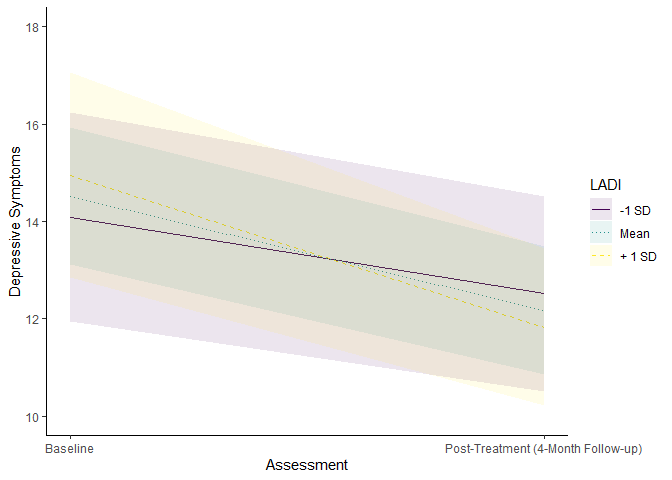
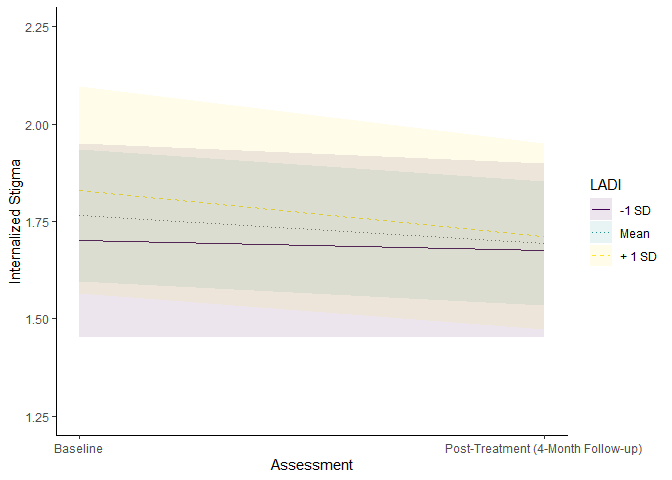
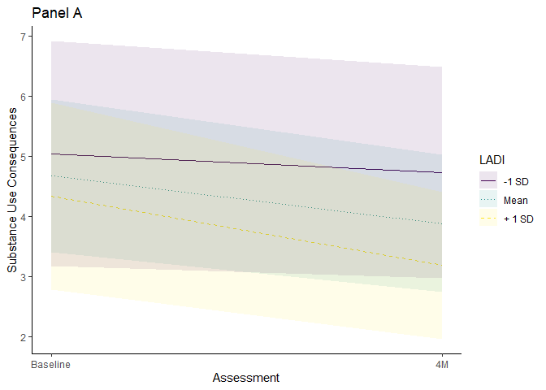
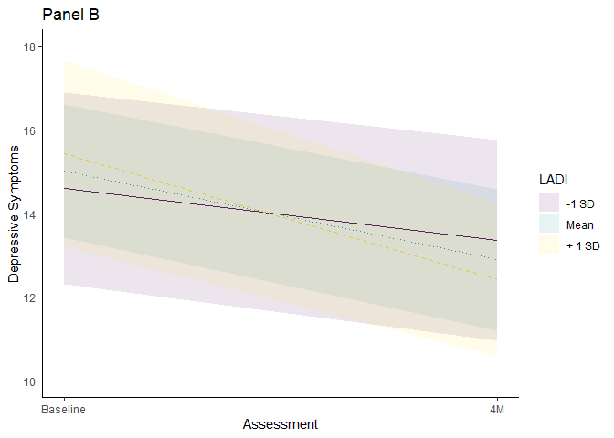
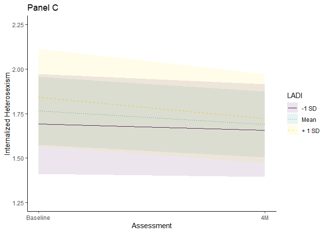
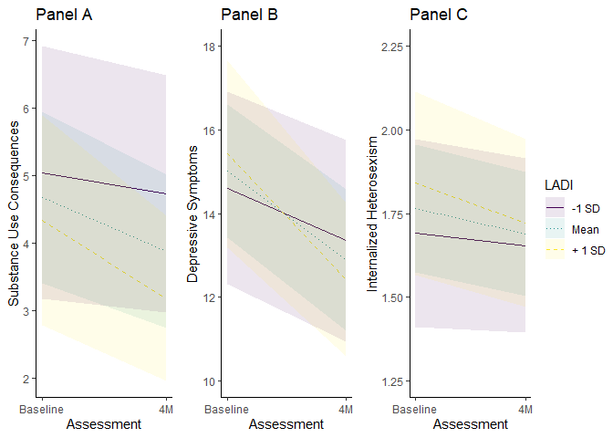

# LADI Validity Analyses


# Load packages and data

``` r
library(tidyverse)
library(sjmisc)
library(haven)
library(easystats)
library(purrr)
library(psych)
library(gee)
library(geepack)
library(glmtoolbox)
library(mice)
library(marginaleffects)
library(ggpubr)
```

# Load data

``` r
apps_outcome <- readRDS("data/apps_outcome.rds") 
```

# Modeling framework

For this project, we modeled validity analyses with generalized
estimating equations. We made this decision because:

1.  the substantive interest here is the fixed effect of LADI scores
    (which do not vary within individuals) on outcomes, where we need to
    account for clustering (repeated measures within participants) to
    yield valid estimates but otherwise this clustering is not part of
    the research question for this study

2.  with small sample sizes, assumptions of MLM (e.g., properly
    specified random effects structure) become difficult to evaluate due
    to convergence problems that are introduced as well as it being
    impossible to compare model fit when using restricted maximum
    likelihood estimation

3.  with binary or count outcomes, GEEs can be more stable than MLMs

For sources supporting this decision, see McNeish, 2014; McNeish et
al. 2017. Further, for support that you don’t need normal residuals,
see:
https://www.researchgate.net/post/What_are_the_assumptions_of_the_generalized_estimating_equations

Resources for GEEs:
https://library.virginia.edu/data/articles/getting-started-with-generalized-estimating-equations
\*\* great https://www.rpubs.com/samopolo/759327
https://ehsanx.github.io/EpiMethods/longitudinal2.html
https://tysonbarrett.com/Rstats/chapter-6-multilevel-modeling.html

## Model interpretation

*For outcomes, here is what the parameters represent:*

- <u>**Intercept**:</u> Expected value of the outcome at
  post-intervention, which is the first follow-up appointment. This is
  *NOT* baseline because of the way that we opted to center assessment
  so the intercept is interpetable as post-intervention symptoms.

- <u>**Assessment_c**:</u> Instantaneous rate of change at
  post-intervention. This is the expected linear slope of change at
  post-intervention (much like pre-post change, except it’s an estimate
  that accounts for the entire trajectory). Because we are modeling
  nonlinear change, the slope is dependent on the timepoint. There are
  different slopes for 4MFU (post-intervention), 8MFU, and 12MFU that
  reflects the initial change and then leveling out of that change.

- <u>**Assessment_c_quad**</u>: Curvature of change overall. A positive
  number means the curve is a smiley face (turns upward) and a negative
  number means the curve is a frowney face (turns downward).

- <u>**Average_c_affirm**</u>: Association between affirmative technique
  and mean outcome score assessed at post-intervention. This reflects
  mean levels, *NOT* change over time.

- <u>**Average_c_affirm\*Assessment_c:**</u> Interaction between
  affirmative technique and the instantaneous rate of change at
  post-intervention. In other words, this term tests whether rates of
  change are different across levels of affirmative techniques. If
  significant, this needs to be probed to plot the expected slopes
  across levels of affirmative technique to see whether change
  strengthens or weakens as a function of the LGBTQ-APPS.

*Interpreting interactions:*

To fully understand the nature of any significant interactions, which is
one of our main estimands of interest, then these need to be probed
further. A common approach is to “pick a point” (usually 1 SD above and
below the mean) and see if the slope is different from zero at that
point. This method has been critiqued as being somewhat limited in
capturing the full range of information. The Johnson-Neyman technique is
one method that has been advanced that overcomes this limitation and is
going to be the preferred one reported here (although will also report
simple slopes). In these analyses, we are looking to see whether change
over time is moderated by the LGBTQ-APPS. The J-N technique allows us to
see at what values of the LGBTQ-APPS is change over time significantly
different from zero, and it does so across the entire range of the
LGBTQ-APPS instead of just 1 SD above and below the mean. **The neat
thing about this is that it allows us to see *exactly* what LGBTQ-APPS
scores are needed to lead to significant change in outcomes.** For more
information on this technique, check out these two papers: McCabe et
al. 2018 (link: <https://doi.org/10.1177/2515245917746792>) and Preacher
et al. 2006 (link: <https://doi.org/10.3102/107699860310044>). Of note,
we do not exactly do the J-N technique because we are 1) using multiple
imputation, and 2) using GEEs, where available software in R to my
knowledge cannot easily and possibly not accurately handle these models.
However, the `marginaleffects` project lets us calculate marginal
effects for each value in the dataset to approximate a J-N technique.

## Set of analyses

Based on preliminary analyses and exploration of the data, we are going
to conduct the following sets of analyses:

1.  unadjusted models

2.  adjusted models with covariates: study site, continued treatment at
    the same community mental health agency, mental health treatment
    elsewhere, medication, and alliance; additionally, we’ll control for
    total number of sex acts in models predicting HIV transmission risk
    behavior.

3.  SIDAS: evaluating consistency of results with SIDAS scored
    continuously or discretely

4.  HAMD, IHS, and SOC: evaluating consistency of results when excluding
    potential bivariate outlier

# Missing data

We’ll handle missing data with multiple imputation via the `mice`
package with 20 datasets.

``` r
imp_df <- apps_outcome |> 
  mutate(Assessment_quad = Assessment*Assessment) |> 
  select(ParticipantID, Assessment, Assessment_quad, Assessment_c, Assessment_c_quad, Site, CMHT, MHgen, Medication, WAI_avg_c, Sx_totalacts_sum_c, Average_Affirm, Average_Affirm_c, Sx_CASriskacts, AUDIT_sum, SIP_sum, HAMD_sum, BAI_sum, SIDAS_sum, SIDAS_yn, IHS_mean, RS_mean, SOC_concealment_mean, LGBIS_identaffirm) 

# run the mice code with 0 iterations to get the predictorMatrix and methods of imputation
imp <- mice(imp_df, seed = 808, maxit = 0)
predM <- imp$predictorMatrix
meth <- imp$method

# change imputation model method for dichotomous SIDAS since coded as numeric  
log <- c("SIDAS_yn")
meth[log] <- "logreg"
meth
```

           ParticipantID           Assessment      Assessment_quad 
                      ""                   ""                   "" 
            Assessment_c    Assessment_c_quad                 Site 
                      ""                   ""                   "" 
                    CMHT                MHgen           Medication 
                      ""                   ""                   "" 
               WAI_avg_c   Sx_totalacts_sum_c       Average_Affirm 
                      ""                "pmm"                   "" 
        Average_Affirm_c       Sx_CASriskacts            AUDIT_sum 
                      ""                "pmm"                "pmm" 
                 SIP_sum             HAMD_sum              BAI_sum 
                   "pmm"                "pmm"                "pmm" 
               SIDAS_sum             SIDAS_yn             IHS_mean 
                   "pmm"             "logreg"                "pmm" 
                 RS_mean SOC_concealment_mean    LGBIS_identaffirm 
                   "pmm"                "pmm"                "pmm" 

``` r
imp <- mice(imp_df, seed = 808, maxit = 20, method = meth, print = F)
```

# Unadjusted models

## TLFB

``` r
m1_tlfb <- with(imp, 
               geeglm(Sx_CASriskacts ~ Assessment_c + Assessment_c_quad + Average_Affirm_c + Assessment_c*Average_Affirm_c,
                     id = ParticipantID,
                     family = poisson,
                     corstr = "ar1")) 
o1 <- pool(m1_tlfb) |> 
  summary() |> 
  as.data.frame() |> 
  mutate_if(is.numeric, round, digits = 3) |> 
  mutate(variable = "TLFB") |> relocate(variable, 1)
o1
```

      variable                          term estimate std.error statistic      df
    1     TLFB                   (Intercept)    1.452     0.160     9.103  67.686
    2     TLFB                  Assessment_c   -0.191     0.101    -1.899 119.348
    3     TLFB             Assessment_c_quad    0.095     0.076     1.248  44.075
    4     TLFB              Average_Affirm_c    0.135     0.070     1.940 210.388
    5     TLFB Assessment_c:Average_Affirm_c    0.057     0.069     0.818 217.911
      p.value
    1   0.000
    2   0.060
    3   0.219
    4   0.054
    5   0.414

## AUDIT

``` r
m2_audit <- with(imp, 
               geeglm(AUDIT_sum ~ Assessment_c + Assessment_c_quad + Average_Affirm_c + Assessment_c*Average_Affirm_c,
                     id = ParticipantID,
                     family = gaussian,
                     corstr = "ar1")) 

o2 <- pool(m2_audit) |> 
  summary() |> 
  as.data.frame() |> 
  mutate_if(is.numeric, round, digits = 3) |> 
  mutate(variable = "AUDIT") |> relocate(variable, 1)

o2
```

      variable                          term estimate std.error statistic      df
    1    AUDIT                   (Intercept)    8.703     0.808    10.766 193.611
    2    AUDIT                  Assessment_c   -0.840     0.368    -2.279 148.042
    3    AUDIT             Assessment_c_quad   -0.061     0.228    -0.269 166.863
    4    AUDIT              Average_Affirm_c   -0.137     0.716    -0.191 220.823
    5    AUDIT Assessment_c:Average_Affirm_c   -0.207     0.242    -0.856 217.938
      p.value
    1   0.000
    2   0.024
    3   0.788
    4   0.849
    5   0.393

## SIP

``` r
m3_sip <- with(imp, 
               geeglm(SIP_sum ~ Assessment_c + Assessment_c_quad + Average_Affirm_c + Assessment_c*Average_Affirm_c,
                     id = ParticipantID,
                     family = poisson,
                     corstr = "ar1")) 

o3 <- pool(m3_sip) |> 
  summary() |> 
  as.data.frame() |> 
  mutate_if(is.numeric, round, digits = 3) |> 
  mutate(variable = "SIP") |> relocate(variable, 1)

o3
```

      variable                          term estimate std.error statistic      df
    1      SIP                   (Intercept)    1.247     0.141     8.823 191.046
    2      SIP                  Assessment_c   -0.185     0.061    -3.022 190.981
    3      SIP             Assessment_c_quad   -0.024     0.051    -0.481  57.913
    4      SIP              Average_Affirm_c   -0.111     0.104    -1.072 209.911
    5      SIP Assessment_c:Average_Affirm_c   -0.104     0.053    -1.966 172.223
      p.value
    1   0.000
    2   0.003
    3   0.633
    4   0.285
    5   0.051

## HAMD

``` r
m4_hamd <- with(imp, 
               geeglm(HAMD_sum ~ Assessment_c + Assessment_c_quad + Average_Affirm_c + Assessment_c*Average_Affirm_c,
                     id = ParticipantID,
                     family = gaussian,
                     corstr = "ar1")) 

o4 <- pool(m4_hamd) |> 
  summary() |> 
  as.data.frame() |> 
  mutate_if(is.numeric, round, digits = 3) |> 
  mutate(variable = "HAMD") |> relocate(variable, 1)

o4
```

      variable                          term estimate std.error statistic      df
    1     HAMD                   (Intercept)   12.171     0.667    18.244 179.885
    2     HAMD                  Assessment_c   -2.348     0.511    -4.598 202.775
    3     HAMD             Assessment_c_quad    0.888     0.352     2.525 195.574
    4     HAMD              Average_Affirm_c   -0.285     0.532    -0.536 211.900
    5     HAMD Assessment_c:Average_Affirm_c   -0.645     0.294    -2.191 199.268
      p.value
    1   0.000
    2   0.000
    3   0.012
    4   0.593
    5   0.030

### Interaction probing

Since the interaction was significant, we need to probe this deeper.

Get a J-N type of estimate where we can see each value of the LADI and a
test of whether the association between LADI and instantaneous linear
change is significantly different from zero

``` r
avg_slopes(m4_hamd, variables = "Assessment_c", by = "Average_Affirm_c")
```


     Average_Affirm_c Estimate Std. Error     t Pr(>|t|)    S 2.5 % 97.5 %  Df
               -1.377    -1.46      0.581 -2.51  0.01307  6.3 -2.61 -0.312 151
               -1.127    -1.62      0.547 -2.96  0.00353  8.1 -2.70 -0.540 155
               -0.877    -1.78      0.522 -3.42  < 0.001 10.3 -2.81 -0.753 163
               -0.627    -1.94      0.505 -3.85  < 0.001 12.5 -2.94 -0.947 173
               -0.377    -2.10      0.499 -4.22  < 0.001 14.7 -3.09 -1.120 185
               -0.127    -2.27      0.504 -4.50  < 0.001 16.4 -3.26 -1.272 197
                0.123    -2.43      0.519 -4.67  < 0.001 17.5 -3.45 -1.403 207
                0.373    -2.59      0.544 -4.75  < 0.001 18.1 -3.66 -1.515 214
                0.873    -2.91      0.618 -4.71  < 0.001 17.8 -4.13 -1.693 219
                1.123    -3.07      0.664 -4.63  < 0.001 17.3 -4.38 -1.764 220
                1.373    -3.23      0.715 -4.52  < 0.001 16.6 -4.64 -1.825 221
                1.623    -3.39      0.769 -4.41  < 0.001 15.9 -4.91 -1.879 221
                1.873    -3.56      0.826 -4.30  < 0.001 15.3 -5.18 -1.927 221
                2.123    -3.72      0.886 -4.19  < 0.001 14.6 -5.46 -1.971 221
                2.623    -4.04      1.011 -4.00  < 0.001 13.5 -6.03 -2.047 220
                3.373    -4.52      1.208 -3.74  < 0.001 12.1 -6.90 -2.143 219

    Term: Assessment_c
    Type:  response 
    Comparison: dY/dX

Get simple slopes at +/- SD (1.20):

``` r
avg_slopes(m4_hamd, variables = "Assessment_c", by = "Average_Affirm_c", newdata = datagrid(Average_Affirm_c = c(-1.2, 1.2)))
```


     Average_Affirm_c Estimate Std. Error     t Pr(>|t|)    S 2.5 % 97.5 %  Df
                 -1.2    -1.57      0.556 -2.83  0.00529  7.6 -2.67 -0.475 154
                  1.2    -3.12      0.679 -4.60  < 0.001 17.1 -4.46 -1.783 220

    Term: Assessment_c
    Type:  response 
    Comparison: dY/dX

Create a manual version of the `plot_predictions` function from
`marginaleffects` package that can handle the imputed data, focusing on
simple slopes & the instantaneous rate of change from pre-post treatment
as this was the effect of interest.

``` r
dg <- apps_outcome |> 
  select(ParticipantID, Assessment_c, Assessment_c_quad, Average_Affirm_c) 

predictions <- predictions(m4_hamd, condition = c("Assessment_c", "Average_Affirm_c"), datagrid(ParticipantID = unique, Assessment_c = c(-1, 0), Assessment_c_quad = 0, Average_Affirm_c = c(-1.20, 0, 1.20), newdata = dg)
)

ggplot(predictions, aes(x = Assessment_c, y = estimate, color = as.factor(Average_Affirm_c), linetype = as.factor(Average_Affirm_c))) +
  geom_line(aes(linetype = as.factor(Average_Affirm_c))) +
  geom_ribbon(aes(ymin = conf.low, ymax = conf.high, fill = as.factor(Average_Affirm_c)), alpha = 0.1, color = NA) +
  scale_x_continuous(breaks = c(-1, 0), labels = c('Baseline', 'Post-Treatment (4-Month Follow-up)')) +
  scale_color_viridis_d(name = "LADI", labels = c("-1 SD", "Mean", "+ 1 SD")) +
  scale_fill_viridis_d(name = "LADI", labels = c("-1 SD", "Mean", "+ 1 SD")) + 
  scale_linetype_manual(name = "LADI", values = c("solid", "dotted", "dashed"), labels = c("-1 SD", "Mean", "+ 1 SD")) +
  labs(x = "Assessment", y = "Depressive Symptoms") +
  theme_classic()  +
  ylim(10, 18)
```



As all values of the LADI are significant, we are not going to create a
J-N type plot that delineates when the slope moves from significant to
not significant for this outcome.

## BAI

``` r
m5_bai <- with(imp, 
               geeglm(BAI_sum ~ Assessment_c + Assessment_c_quad + Average_Affirm_c + Assessment_c*Average_Affirm_c,
                     id = ParticipantID,
                     family = gaussian,
                     corstr = "ar1")) 

o5 <- pool(m5_bai) |> 
  summary() |> 
  as.data.frame() |> 
  mutate_if(is.numeric, round, digits = 3) |> 
  mutate(variable = "BAI") |> relocate(variable, 1)

o5
```

      variable                          term estimate std.error statistic      df
    1      BAI                   (Intercept)   18.231     1.248    14.607 186.130
    2      BAI                  Assessment_c   -3.621     0.689    -5.258 163.728
    3      BAI             Assessment_c_quad    1.499     0.502     2.985 168.924
    4      BAI              Average_Affirm_c   -0.443     1.065    -0.416 218.444
    5      BAI Assessment_c:Average_Affirm_c   -0.076     0.423    -0.180 195.369
      p.value
    1   0.000
    2   0.000
    3   0.003
    4   0.678
    5   0.857

## SIDAS (continuous)

``` r
m6_sidascont <- with(imp, 
               geeglm(SIDAS_sum ~ Assessment_c + Assessment_c_quad + Average_Affirm_c + Assessment_c*Average_Affirm_c,
                     id = ParticipantID,
                     family = gaussian,
                     corstr = "ar1")) 

o6 <- pool(m6_sidascont) |> 
  summary() |> 
  as.data.frame() |> 
  mutate_if(is.numeric, round, digits = 3) |> 
  mutate(variable = "SIDAS_cont") |> relocate(variable, 1)

o6
```

        variable                          term estimate std.error statistic      df
    1 SIDAS_cont                   (Intercept)    2.737     0.685     3.995 156.707
    2 SIDAS_cont                  Assessment_c   -1.200     0.431    -2.784 134.724
    3 SIDAS_cont             Assessment_c_quad    0.242     0.261     0.927  99.881
    4 SIDAS_cont              Average_Affirm_c   -0.683     0.511    -1.336 206.210
    5 SIDAS_cont Assessment_c:Average_Affirm_c    0.024     0.228     0.106 202.023
      p.value
    1   0.000
    2   0.006
    3   0.356
    4   0.183
    5   0.916

## IHS

``` r
m7_ihs <- with(imp, 
               geeglm(IHS_mean ~ Assessment_c + Assessment_c_quad + Average_Affirm_c + Assessment_c*Average_Affirm_c,
                     id = ParticipantID,
                     family = gaussian,
                     corstr = "ar1")) 

o7 <- pool(m7_ihs) |> 
  summary() |> 
  as.data.frame() |> 
  mutate_if(is.numeric, round, digits = 3) |> 
  mutate(variable = "IHS") |> relocate(variable, 1)

o7
```

      variable                          term estimate std.error statistic      df
    1      IHS                   (Intercept)    1.693     0.081    20.882 181.497
    2      IHS                  Assessment_c   -0.073     0.033    -2.201  98.078
    3      IHS             Assessment_c_quad   -0.002     0.027    -0.068 116.649
    4      IHS              Average_Affirm_c    0.015     0.071     0.209 220.782
    5      IHS Assessment_c:Average_Affirm_c   -0.039     0.017    -2.225 214.961
      p.value
    1   0.000
    2   0.030
    3   0.946
    4   0.835
    5   0.027

### Interaction probing

Get a J-N type of estimate where we can see each value of the LADI and a
test of whether the association between LADI and instantaneous linear
change is significantly different from zero

``` r
avg_slopes(m7_ihs, variables = "Assessment_c", by = "Average_Affirm_c")
```


     Average_Affirm_c Estimate Std. Error      t Pr(>|t|)   S   2.5 %   97.5 %
               -1.377  -0.0193     0.0373 -0.517  0.60579 0.7 -0.0932  0.05456
               -1.127  -0.0290     0.0354 -0.820  0.41416 1.3 -0.0991  0.04111
               -0.877  -0.0387     0.0339 -1.141  0.25636 2.0 -0.1060  0.02855
               -0.627  -0.0484     0.0330 -1.469  0.14511 2.8 -0.1138  0.01700
               -0.377  -0.0581     0.0325 -1.785  0.07741 3.7 -0.1227  0.00651
               -0.127  -0.0678     0.0327 -2.072  0.04097 4.6 -0.1328 -0.00284
                0.123  -0.0775     0.0335 -2.315  0.02265 5.5 -0.1439 -0.01108
                0.373  -0.0872     0.0348 -2.508  0.01363 6.2 -0.1561 -0.01829
                0.873  -0.1066     0.0387 -2.754  0.00676 7.2 -0.1832 -0.03000
                1.123  -0.1163     0.0412 -2.822  0.00549 7.5 -0.1978 -0.03479
                1.373  -0.1260     0.0440 -2.861  0.00484 7.7 -0.2130 -0.03896
                1.623  -0.1357     0.0471 -2.882  0.00451 7.8 -0.2287 -0.04269
                1.873  -0.1454     0.0503 -2.889  0.00438 7.8 -0.2447 -0.04603
                2.123  -0.1551     0.0537 -2.887  0.00439 7.8 -0.2611 -0.04904
                2.623  -0.1745     0.0609 -2.865  0.00465 7.7 -0.2946 -0.05434
                3.373  -0.2036     0.0723 -2.817  0.00534 7.5 -0.3461 -0.06106
        Df
     121.7
     111.9
     103.8
      98.3
      95.7
      96.5
     100.4
     107.0
     125.7
     136.0
     146.2
     155.5
     163.8
     171.0
     182.3
     193.2

    Term: Assessment_c
    Type:  response 
    Comparison: dY/dX

Get simple slopes at +/- SD (1.20):

``` r
avg_slopes(m7_ihs, variables = "Assessment_c", by = "Average_Affirm_c", newdata = datagrid(Average_Affirm_c = c(-1.2, 1.2)))
```


     Average_Affirm_c Estimate Std. Error      t Pr(>|t|)   S   2.5 %  97.5 %  Df
                 -1.2  -0.0262     0.0359 -0.729  0.46762 1.1 -0.0973  0.0450 115
                  1.2  -0.1193     0.0421 -2.835  0.00527 7.6 -0.2025 -0.0361 139

    Term: Assessment_c
    Type:  response 
    Comparison: dY/dX

Simple slopes plot:

``` r
predictions <- predictions(m7_ihs, condition = c("Assessment_c", "Average_Affirm_c"), datagrid(ParticipantID = unique, Assessment_c = c(-1, 0), Assessment_c_quad = 0, Average_Affirm_c = c(-1.20, 0, 1.20), newdata = dg)
)

ggplot(predictions, aes(x = Assessment_c, y = estimate, color = as.factor(Average_Affirm_c), linetype = as.factor(Average_Affirm_c))) +
  geom_line(aes(linetype = as.factor(Average_Affirm_c))) +
  geom_ribbon(aes(ymin = conf.low, ymax = conf.high, fill = as.factor(Average_Affirm_c)), alpha = 0.1, color = NA) +
  scale_x_continuous(breaks = c(-1, 0), labels = c('Baseline', 'Post-Treatment (4-Month Follow-up)')) +
  scale_color_viridis_d(name = "LADI", labels = c("-1 SD", "Mean", "+ 1 SD")) +
  scale_fill_viridis_d(name = "LADI", labels = c("-1 SD", "Mean", "+ 1 SD")) + 
  scale_linetype_manual(name = "LADI", values = c("solid", "dotted", "dashed"), labels = c("-1 SD", "Mean", "+ 1 SD")) +
  labs(x = "Assessment", y = "Internalized Stigma") +
  theme_classic()  +
  ylim(1.25, 2.25)
```



## RS

``` r
m8_rs <- with(imp, 
               geeglm(RS_mean ~ Assessment_c + Assessment_c_quad + Average_Affirm_c + Assessment_c*Average_Affirm_c,
                     id = ParticipantID,
                     family = gaussian,
                     corstr = "ar1")) 

o8 <- pool(m8_rs) |> 
  summary() |> 
  as.data.frame() |> 
  mutate_if(is.numeric, round, digits = 3) |> 
  mutate(variable = "RS") |> relocate(variable, 1)

o8
```

      variable                          term estimate std.error statistic      df
    1       RS                   (Intercept)   12.661     0.884    14.330 208.267
    2       RS                  Assessment_c   -1.697     0.437    -3.882 214.301
    3       RS             Assessment_c_quad    0.348     0.310     1.125 131.496
    4       RS              Average_Affirm_c    0.167     0.768     0.218 220.434
    5       RS Assessment_c:Average_Affirm_c   -0.181     0.204    -0.889 188.319
      p.value
    1   0.000
    2   0.000
    3   0.263
    4   0.828
    5   0.375

## SOC

``` r
m9_soc <- with(imp, 
               geeglm(SOC_concealment_mean ~ Assessment_c + Assessment_c_quad + Average_Affirm_c + Assessment_c*Average_Affirm_c,
                     id = ParticipantID,
                     family = gaussian,
                     corstr = "ar1")) 

o9 <- pool(m9_soc) |> 
  summary() |> 
  as.data.frame() |> 
  mutate_if(is.numeric, round, digits = 3) |> 
  mutate(variable = "SOC") |> relocate(variable, 1)

o9
```

      variable                          term estimate std.error statistic      df
    1      SOC                   (Intercept)    1.849     0.086    21.432 216.139
    2      SOC                  Assessment_c    0.060     0.031     1.946 199.276
    3      SOC             Assessment_c_quad   -0.045     0.024    -1.888 200.636
    4      SOC              Average_Affirm_c   -0.141     0.073    -1.927 220.604
    5      SOC Assessment_c:Average_Affirm_c   -0.010     0.013    -0.740 194.497
      p.value
    1   0.000
    2   0.053
    3   0.061
    4   0.055
    5   0.460

## LGBIS identity affirmation

``` r
m10_lgbis <- with(imp, 
               geeglm(LGBIS_identaffirm ~ Assessment_c + Assessment_c_quad + Average_Affirm_c + Assessment_c*Average_Affirm_c,
                     id = ParticipantID,
                     family = gaussian,
                     corstr = "ar1")) 

o10 <- pool(m10_lgbis) |> 
  summary() |> 
  as.data.frame() |> 
  mutate_if(is.numeric, round, digits = 3) |> 
  mutate(variable = "LGBIS") |> relocate(variable, 1)

o10
```

      variable                          term estimate std.error statistic      df
    1    LGBIS                   (Intercept)    4.474     0.169    26.458 156.937
    2    LGBIS                  Assessment_c    0.036     0.069     0.523  71.546
    3    LGBIS             Assessment_c_quad    0.029     0.049     0.595  93.776
    4    LGBIS              Average_Affirm_c    0.003     0.137     0.020 220.112
    5    LGBIS Assessment_c:Average_Affirm_c    0.048     0.032     1.508 122.664
      p.value
    1   0.000
    2   0.603
    3   0.553
    4   0.984
    5   0.134

# Adjusted models (with covariates)

## TLFB

``` r
m1.2_tlfb <- with(imp, 
               geeglm(Sx_CASriskacts ~ Site + CMHT + MHgen + Medication + WAI_avg_c + Sx_totalacts_sum_c + Assessment_c + Assessment_c_quad + Average_Affirm_c + Assessment_c*Average_Affirm_c,
                     id = ParticipantID,
                     family = poisson,
                     corstr = "ar1")) 
o1.2 <- pool(m1.2_tlfb) |> 
  summary() |> 
  as.data.frame() |> 
  mutate_if(is.numeric, round, digits = 3) |> 
  mutate(variable = "TLFB.cov") |> relocate(variable, 1)
o1.2
```

       variable                          term estimate std.error statistic      df
    1  TLFB.cov                   (Intercept)    1.422     0.206     6.887 124.679
    2  TLFB.cov                     SiteMiami   -0.272     0.333    -0.816  70.237
    3  TLFB.cov                 CMHTContinued    0.127     0.644     0.197 212.226
    4  TLFB.cov                 MHgenUtilized   -0.092     0.445    -0.206 214.747
    5  TLFB.cov               MedicationTaken    0.630     0.310     2.030 118.493
    6  TLFB.cov                     WAI_avg_c    0.006     0.009     0.708 210.176
    7  TLFB.cov            Sx_totalacts_sum_c    0.002     0.001     4.140  11.983
    8  TLFB.cov                  Assessment_c   -0.294     0.094    -3.143  74.632
    9  TLFB.cov             Assessment_c_quad    0.116     0.068     1.705  44.977
    10 TLFB.cov              Average_Affirm_c    0.135     0.093     1.452 163.529
    11 TLFB.cov Assessment_c:Average_Affirm_c    0.074     0.074     0.994 209.454
       p.value
    1    0.000
    2    0.417
    3    0.844
    4    0.837
    5    0.045
    6    0.480
    7    0.001
    8    0.002
    9    0.095
    10   0.148
    11   0.321

## AUDIT

``` r
m2.2_audit <- with(imp, 
               geeglm(AUDIT_sum ~ Site + CMHT + MHgen + Medication + WAI_avg_c + Assessment_c + Assessment_c_quad + Average_Affirm_c + Assessment_c*Average_Affirm_c,
                     id = ParticipantID,
                     family = gaussian,
                     corstr = "ar1")) 

o2.2 <- pool(m2.2_audit) |> 
  summary() |> 
  as.data.frame() |> 
  mutate_if(is.numeric, round, digits = 3) |> 
  mutate(variable = "AUDIT.cov") |> relocate(variable, 1)

o2.2
```

        variable                          term estimate std.error statistic      df
    1  AUDIT.cov                   (Intercept)    9.938     1.036     9.589 154.996
    2  AUDIT.cov                     SiteMiami   -2.466     1.547    -1.594 215.579
    3  AUDIT.cov                 CMHTContinued   -0.103     1.372    -0.075 213.701
    4  AUDIT.cov                 MHgenUtilized   -1.605     0.765    -2.097 215.213
    5  AUDIT.cov               MedicationTaken   -1.978     1.714    -1.154  31.051
    6  AUDIT.cov                     WAI_avg_c    0.060     0.062     0.975 207.417
    7  AUDIT.cov                  Assessment_c   -0.496     0.417    -1.188  62.458
    8  AUDIT.cov             Assessment_c_quad   -0.175     0.247    -0.707 104.896
    9  AUDIT.cov              Average_Affirm_c   -0.414     0.764    -0.541 215.608
    10 AUDIT.cov Assessment_c:Average_Affirm_c   -0.242     0.238    -1.018 214.101
       p.value
    1    0.000
    2    0.112
    3    0.940
    4    0.037
    5    0.257
    6    0.331
    7    0.239
    8    0.481
    9    0.589
    10   0.310

## SIP

``` r
m3.2_sip <- with(imp, 
               geeglm(SIP_sum ~ Site + CMHT + MHgen + Medication + WAI_avg_c + Assessment_c + Assessment_c_quad + Average_Affirm_c + Assessment_c*Average_Affirm_c,
                     id = ParticipantID,
                     family = poisson,
                     corstr = "ar1")) 

o3.2 <- pool(m3.2_sip) |> 
  summary() |> 
  as.data.frame() |> 
  mutate_if(is.numeric, round, digits = 3) |> 
  mutate(variable = "SIP_cov") |> relocate(variable, 1)

o3.2
```

       variable                          term estimate std.error statistic      df
    1   SIP_cov                   (Intercept)    1.356     0.149     9.105 170.342
    2   SIP_cov                     SiteMiami   -0.446     0.299    -1.491 211.799
    3   SIP_cov                 CMHTContinued    0.212     0.339     0.625 215.484
    4   SIP_cov                 MHgenUtilized   -0.184     0.200    -0.920 215.176
    5   SIP_cov               MedicationTaken    0.111     0.311     0.358  35.438
    6   SIP_cov                     WAI_avg_c    0.019     0.014     1.379 205.935
    7   SIP_cov                  Assessment_c   -0.187     0.069    -2.694 100.418
    8   SIP_cov             Assessment_c_quad   -0.023     0.052    -0.438  63.909
    9   SIP_cov              Average_Affirm_c   -0.165     0.101    -1.643 202.421
    10  SIP_cov Assessment_c:Average_Affirm_c   -0.102     0.050    -2.038 180.582
       p.value
    1    0.000
    2    0.138
    3    0.533
    4    0.359
    5    0.723
    6    0.169
    7    0.008
    8    0.663
    9    0.102
    10   0.043

### Interaction probing

Get a J-N type of estimate where we can see each value of the LADI and a
test of whether the association between LADI and instantaneous linear
change is significantly different from zero

``` r
avg_slopes(m3.2_sip, variables = "Assessment_c", by = "Average_Affirm_c")
```


     Average_Affirm_c Estimate Std. Error      t Pr(>|t|)   S  2.5 %  97.5 %    Df
               -1.377   -0.176      0.350 -0.502  0.61638 0.7 -0.869  0.5171 126.0
               -1.127   -0.274      0.318 -0.863  0.38987 1.4 -0.903  0.3549 123.9
               -0.877   -0.364      0.281 -1.295  0.19781 2.3 -0.921  0.1927 119.7
               -0.627   -0.392      0.236 -1.660  0.09974 3.3 -0.860  0.0760 108.5
               -0.377   -0.449      0.211 -2.132  0.03481 4.8 -0.865 -0.0325 136.4
               -0.127   -0.694      0.277 -2.504  0.01402 6.2 -1.245 -0.1437  92.8
                0.123   -0.441      0.183 -2.411  0.01698 5.9 -0.802 -0.0799 171.1
                0.373   -0.698      0.234 -2.984  0.00347 8.2 -1.162 -0.2347 116.0
                0.873   -0.629      0.214 -2.937  0.00370 8.1 -1.052 -0.2068 203.1
                1.123   -0.945      0.295 -3.208  0.00157 9.3 -1.526 -0.3639 184.5
                1.373   -0.848      0.280 -3.027  0.00278 8.5 -1.401 -0.2959 205.3
                1.623   -1.049      0.332 -3.161  0.00182 9.1 -1.703 -0.3944 196.3
                1.873   -0.994      0.328 -3.034  0.00272 8.5 -1.640 -0.3480 206.4
                2.123   -0.871      0.323 -2.699  0.00751 7.1 -1.507 -0.2349 213.1
                2.623   -1.311      0.529 -2.479  0.01399 6.2 -2.354 -0.2682 206.8
                3.373   -1.020      0.478 -2.137  0.03376 4.9 -1.961 -0.0790 215.4

    Term: Assessment_c
    Type:  response 
    Comparison: dY/dX

Get simple slopes at +/- SD (1.20):

``` r
avg_slopes(m3.2_sip, variables = "Assessment_c", by = "Average_Affirm_c", newdata = datagrid(Average_Affirm_c = c(-1.2, 1.2)))
```


     Average_Affirm_c Estimate Std. Error      t Pr(>|t|)    S 2.5 % 97.5 %  Df
                 -1.2   -0.281      0.373 -0.753    0.453  1.1 -1.02  0.458 124
                  1.2   -0.814      0.236 -3.444   <0.001 10.5 -1.28 -0.348 201

    Term: Assessment_c
    Type:  response 
    Comparison: dY/dX

Create a manual version of the `plot_predictions` function from
`marginaleffects` package that can handle the imputed data, focusing on
simple slopes & the instantaneous rate of change from pre-post treatment
as this was the effect of interest.

``` r
dg <- apps_outcome |> 
  select(ParticipantID, Assessment_c, Assessment_c_quad, Average_Affirm_c, Site, CMHT, MHgen, Medication, WAI_avg_c) 

predictions <- predictions(m3.2_sip, condition = c("Assessment_c", "Average_Affirm_c"), datagrid(ParticipantID = unique, Assessment_c = c(-1, 0), Assessment_c_quad = 0, Average_Affirm_c = c(-1.20, 0, 1.20), Site = "NYC", CMHT = "No or no data", MHgen = "No or no data", Medication = "No or no data", newdata = dg)
)

fig_sip_cov <- ggplot(predictions, aes(x = Assessment_c, y = estimate, color = as.factor(Average_Affirm_c), linetype = as.factor(Average_Affirm_c))) +
  geom_line(aes(linetype = as.factor(Average_Affirm_c))) +
  geom_ribbon(aes(ymin = conf.low, ymax = conf.high, fill = as.factor(Average_Affirm_c)), alpha = 0.1, color = NA) +
  scale_x_continuous(breaks = c(-1, 0), labels = c('Baseline', '4M')) +
  scale_color_viridis_d(name = "LADI", labels = c("-1 SD", "Mean", "+ 1 SD")) +
  scale_fill_viridis_d(name = "LADI", labels = c("-1 SD", "Mean", "+ 1 SD")) + 
  scale_linetype_manual(name = "LADI", values = c("solid", "dotted", "dashed"), labels = c("-1 SD", "Mean", "+ 1 SD")) +
  labs(title = "Panel A", x = "Assessment", y = "Substance Use Consequences") +
  theme_classic() 
#+
  # code below puts the "Panel A" in the plot since this is surprisingly complicated
#  labs(tag = "Panel A",
#    caption = " \n ") +
#  theme(plot.tag.position = "bottom",
#        plot.tag.location = "plot")
  
fig_sip_cov
```



## HAMD

``` r
m4.2_hamd <- with(imp, 
               geeglm(HAMD_sum ~ Site + CMHT + MHgen + Medication + WAI_avg_c + Assessment_c + Assessment_c_quad + Average_Affirm_c + Assessment_c*Average_Affirm_c,
                     id = ParticipantID,
                     family = gaussian,
                     corstr = "ar1")) 

o4.2 <- pool(m4.2_hamd) |> 
  summary() |> 
  as.data.frame() |> 
  mutate_if(is.numeric, round, digits = 3) |> 
  mutate(variable = "HAMD_cov") |> relocate(variable, 1)

o4.2
```

       variable                          term estimate std.error statistic      df
    1  HAMD_cov                   (Intercept)   12.892     0.852    15.138  78.402
    2  HAMD_cov                     SiteMiami   -1.174     1.440    -0.816 127.490
    3  HAMD_cov                 CMHTContinued    2.971     2.228     1.334 212.081
    4  HAMD_cov                 MHgenUtilized   -1.359     1.525    -0.891 212.990
    5  HAMD_cov               MedicationTaken   -2.194     1.640    -1.338 140.304
    6  HAMD_cov                     WAI_avg_c   -0.069     0.060    -1.146 183.164
    7  HAMD_cov                  Assessment_c   -2.124     0.573    -3.707 171.585
    8  HAMD_cov             Assessment_c_quad    0.771     0.380     2.029 190.209
    9  HAMD_cov              Average_Affirm_c   -0.390     0.553    -0.706 173.411
    10 HAMD_cov Assessment_c:Average_Affirm_c   -0.728     0.301    -2.423 182.978
       p.value
    1    0.000
    2    0.416
    3    0.184
    4    0.374
    5    0.183
    6    0.253
    7    0.000
    8    0.044
    9    0.481
    10   0.016

### Interaction probing

Get a J-N type of estimate where we can see each value of the LADI and a
test of whether the association between LADI and instantaneous linear
change is significantly different from zero

``` r
avg_slopes(m4.2_hamd, variables = "Assessment_c", by = "Average_Affirm_c")
```


     Average_Affirm_c Estimate Std. Error     t Pr(>|t|)    S 2.5 %  97.5 %  Df
               -1.377    -1.12      0.671 -1.67  0.09771  3.4 -2.45  0.2089 115
               -1.127    -1.30      0.635 -2.05  0.04232  4.6 -2.56 -0.0459 119
               -0.877    -1.48      0.605 -2.45  0.01555  6.0 -2.68 -0.2867 125
               -0.627    -1.67      0.584 -2.85  0.00502  7.6 -2.82 -0.5114 135
               -0.377    -1.85      0.572 -3.23  0.00152  9.4 -2.98 -0.7179 148
               -0.127    -2.03      0.570 -3.56  < 0.001 11.0 -3.16 -0.9051 163
                0.123    -2.21      0.578 -3.83  < 0.001 12.5 -3.35 -1.0728 179
                0.373    -2.40      0.595 -4.02  < 0.001 13.6 -3.57 -1.2216 193
                0.873    -2.76      0.655 -4.22  < 0.001 14.7 -4.05 -1.4693 209
                1.123    -2.94      0.695 -4.24  < 0.001 14.8 -4.31 -1.5726 212
                1.373    -3.12      0.740 -4.22  < 0.001 14.8 -4.58 -1.6650 214
                1.623    -3.31      0.790 -4.18  < 0.001 14.5 -4.86 -1.7484 215
                1.873    -3.49      0.844 -4.13  < 0.001 14.2 -5.15 -1.8244 216
                2.123    -3.67      0.901 -4.07  < 0.001 13.9 -5.45 -1.8945 216
                2.623    -4.03      1.022 -3.95  < 0.001 13.2 -6.05 -2.0205 215
                3.373    -4.58      1.215 -3.77  < 0.001 12.2 -6.98 -2.1850 214

    Term: Assessment_c
    Type:  response 
    Comparison: dY/dX

Get simple slopes at +/- SD (1.20):

``` r
avg_slopes(m4.2_hamd, variables = "Assessment_c", by = "Average_Affirm_c", newdata = datagrid(Average_Affirm_c = c(-1.2, 1.2)))
```


     Average_Affirm_c Estimate Std. Error     t Pr(>|t|)    S 2.5 %  97.5 %  Df
                 -1.2    -1.25      0.645 -1.94   0.0549  4.2 -2.53  0.0269 117
                  1.2    -3.00      0.708 -4.23   <0.001 14.8 -4.39 -1.6022 213

    Term: Assessment_c
    Type:  response 
    Comparison: dY/dX

Create a manual version of the `plot_predictions` function from
`marginaleffects` package that can handle the imputed data, focusing on
simple slopes & the instantaneous rate of change from pre-post treatment
as this was the effect of interest.

``` r
dg <- apps_outcome |> 
  select(ParticipantID, Assessment_c, Assessment_c_quad, Average_Affirm_c, Site, CMHT, MHgen, Medication, WAI_avg_c) 

predictions <- predictions(m4.2_hamd, condition = c("Assessment_c", "Average_Affirm_c"), datagrid(ParticipantID = unique, Assessment_c = c(-1, 0), Assessment_c_quad = 0, Average_Affirm_c = c(-1.20, 0, 1.20), Site = "NYC", CMHT = "No or no data", MHgen = "No or no data", Medication = "No or no data", newdata = dg)
)

fig_hamd_cov <- ggplot(predictions, aes(x = Assessment_c, y = estimate, color = as.factor(Average_Affirm_c), linetype = as.factor(Average_Affirm_c))) +
  geom_line(aes(linetype = as.factor(Average_Affirm_c))) +
  geom_ribbon(aes(ymin = conf.low, ymax = conf.high, fill = as.factor(Average_Affirm_c)), alpha = 0.1, color = NA) +
  scale_x_continuous(breaks = c(-1, 0), labels = c('Baseline', '4M')) +
  scale_color_viridis_d(name = "LADI", labels = c("-1 SD", "Mean", "+ 1 SD")) +
  scale_fill_viridis_d(name = "LADI", labels = c("-1 SD", "Mean", "+ 1 SD")) + 
  scale_linetype_manual(name = "LADI", values = c("solid", "dotted", "dashed"), labels = c("-1 SD", "Mean", "+ 1 SD")) +
  labs(title = "Panel B", x = "Assessment", y = "Depressive Symptoms") +
  theme_classic()  +
  ylim(10, 18) 

fig_hamd_cov
```



## BAI

``` r
m5.2_bai <- with(imp, 
               geeglm(BAI_sum ~ Site + CMHT + MHgen + Medication + WAI_avg_c + Assessment_c + Assessment_c_quad + Average_Affirm_c + Assessment_c*Average_Affirm_c,
                     id = ParticipantID,
                     family = gaussian,
                     corstr = "ar1")) 

o5.2 <- pool(m5.2_bai) |> 
  summary() |> 
  as.data.frame() |> 
  mutate_if(is.numeric, round, digits = 3) |> 
  mutate(variable = "BAI_cov") |> relocate(variable, 1)

o5.2
```

       variable                          term estimate std.error statistic      df
    1   BAI_cov                   (Intercept)   20.077     1.552    12.938 127.531
    2   BAI_cov                     SiteMiami   -6.678     2.029    -3.290 196.137
    3   BAI_cov                 CMHTContinued   -3.226     2.833    -1.139 214.078
    4   BAI_cov                 MHgenUtilized   -1.271     2.075    -0.613 215.632
    5   BAI_cov               MedicationTaken    3.987     3.207     1.243 132.586
    6   BAI_cov                     WAI_avg_c    0.030     0.101     0.297 199.962
    7   BAI_cov                  Assessment_c   -3.743     0.785    -4.767 105.662
    8   BAI_cov             Assessment_c_quad    1.629     0.493     3.303 130.022
    9   BAI_cov              Average_Affirm_c   -0.655     0.991    -0.661 203.328
    10  BAI_cov Assessment_c:Average_Affirm_c    0.102     0.426     0.239 170.752
       p.value
    1    0.000
    2    0.001
    3    0.256
    4    0.541
    5    0.216
    6    0.767
    7    0.000
    8    0.001
    9    0.509
    10   0.812

## SIDAS (continuous)

``` r
m6.2_sidascont <- with(imp, 
               geeglm(SIDAS_sum ~ Site + CMHT + MHgen + Medication + WAI_avg_c + Assessment_c + Assessment_c_quad + Average_Affirm_c + Assessment_c*Average_Affirm_c,
                     id = ParticipantID,
                     family = gaussian,
                     corstr = "ar1")) 

o6.2 <- pool(m6.2_sidascont) |> 
  summary() |> 
  as.data.frame() |> 
  mutate_if(is.numeric, round, digits = 3) |> 
  mutate(variable = "SIDAS_cont_cov") |> relocate(variable, 1)

o6.2
```

             variable                          term estimate std.error statistic
    1  SIDAS_cont_cov                   (Intercept)    3.209     0.990     3.242
    2  SIDAS_cont_cov                     SiteMiami   -0.750     1.062    -0.706
    3  SIDAS_cont_cov                 CMHTContinued    1.946     1.016     1.915
    4  SIDAS_cont_cov                 MHgenUtilized   -1.853     0.918    -2.018
    5  SIDAS_cont_cov               MedicationTaken   -0.591     1.156    -0.511
    6  SIDAS_cont_cov                     WAI_avg_c   -0.004     0.036    -0.113
    7  SIDAS_cont_cov                  Assessment_c   -1.040     0.504    -2.064
    8  SIDAS_cont_cov             Assessment_c_quad    0.178     0.287     0.621
    9  SIDAS_cont_cov              Average_Affirm_c   -0.759     0.555    -1.368
    10 SIDAS_cont_cov Assessment_c:Average_Affirm_c    0.008     0.233     0.033
            df p.value
    1  160.768   0.001
    2  136.958   0.481
    3  152.284   0.057
    4  207.811   0.045
    5   60.761   0.611
    6  181.722   0.910
    7  119.469   0.041
    8  104.096   0.536
    9  193.217   0.173
    10 179.195   0.974

## IHS

``` r
m7.2_ihs <- with(imp, 
               geeglm(IHS_mean ~ Site + CMHT + MHgen + Medication + WAI_avg_c + Assessment_c + Assessment_c_quad + Average_Affirm_c + Assessment_c*Average_Affirm_c,
                     id = ParticipantID,
                     family = gaussian,
                     corstr = "ar1")) 

o7.2 <- pool(m7.2_ihs) |> 
  summary() |> 
  as.data.frame() |> 
  mutate_if(is.numeric, round, digits = 3) |> 
  mutate(variable = "IHS_cov") |> relocate(variable, 1)

o7.2
```

       variable                          term estimate std.error statistic      df
    1   IHS_cov                   (Intercept)    1.688     0.094    17.987 184.715
    2   IHS_cov                     SiteMiami   -0.012     0.187    -0.062 212.155
    3   IHS_cov                 CMHTContinued   -0.114     0.185    -0.613 198.649
    4   IHS_cov                 MHgenUtilized    0.007     0.104     0.063 155.814
    5   IHS_cov               MedicationTaken    0.090     0.130     0.694  37.585
    6   IHS_cov                     WAI_avg_c   -0.006     0.008    -0.762 206.774
    7   IHS_cov                  Assessment_c   -0.078     0.037    -2.107  51.499
    8   IHS_cov             Assessment_c_quad    0.002     0.028     0.065  93.914
    9   IHS_cov              Average_Affirm_c    0.028     0.075     0.370 215.442
    10  IHS_cov Assessment_c:Average_Affirm_c   -0.035     0.017    -2.090 204.771
       p.value
    1    0.000
    2    0.950
    3    0.541
    4    0.950
    5    0.492
    6    0.447
    7    0.040
    8    0.948
    9    0.712
    10   0.038

### Interaction probing

Get a J-N type of estimate where we can see each value of the LADI and a
test of whether the association between LADI and instantaneous linear
change is significantly different from zero

``` r
avg_slopes(m7.2_ihs, variables = "Assessment_c", by = "Average_Affirm_c")
```


     Average_Affirm_c Estimate Std. Error      t Pr(>|t|)   S  2.5 %    97.5 %
               -1.377  -0.0297     0.0430 -0.692  0.49178 1.0 -0.116  0.056360
               -1.127  -0.0384     0.0410 -0.938  0.35272 1.5 -0.121  0.043810
               -0.877  -0.0471     0.0393 -1.198  0.23670 2.1 -0.126  0.031921
               -0.627  -0.0558     0.0381 -1.466  0.14923 2.7 -0.132  0.020749
               -0.377  -0.0645     0.0372 -1.732  0.08965 3.5 -0.139  0.010366
               -0.127  -0.0732     0.0369 -1.986  0.05253 4.3 -0.147  0.000833
                0.123  -0.0819     0.0369 -2.217  0.03088 5.0 -0.156 -0.007826
                0.373  -0.0906     0.0375 -2.417  0.01874 5.7 -0.166 -0.015592
                0.873  -0.1080     0.0399 -2.708  0.00831 6.9 -0.187 -0.028584
                1.123  -0.1166     0.0416 -2.801  0.00622 7.3 -0.199 -0.033924
                1.373  -0.1253     0.0437 -2.866  0.00503 7.6 -0.212 -0.038610
                1.623  -0.1340     0.0461 -2.906  0.00436 7.8 -0.225 -0.042716
                1.873  -0.1427     0.0487 -2.928  0.00401 8.0 -0.239 -0.046320
                2.123  -0.1514     0.0516 -2.937  0.00385 8.0 -0.253 -0.049522
                2.623  -0.1688     0.0577 -2.926  0.00391 8.0 -0.283 -0.054912
                3.373  -0.1949     0.0677 -2.876  0.00449 7.8 -0.328 -0.061220
        Df
      55.6
      51.9
      49.2
      47.9
      48.0
      49.8
      53.7
      59.6
      78.6
      91.2
     105.2
     119.7
     134.0
     147.2
     168.8
     189.1

    Term: Assessment_c
    Type:  response 
    Comparison: dY/dX

Get simple slopes at +/- SD (1.20):

``` r
avg_slopes(m7.2_ihs, variables = "Assessment_c", by = "Average_Affirm_c", newdata = datagrid(Average_Affirm_c = c(-1.2, 1.2)))
```


     Average_Affirm_c Estimate Std. Error      t Pr(>|t|)   S  2.5 %  97.5 %   Df
                 -1.2  -0.0359     0.0415 -0.864  0.39127 1.4 -0.119  0.0474 52.9
                  1.2  -0.1193     0.0423 -2.824  0.00578 7.4 -0.203 -0.0354 95.4

    Term: Assessment_c
    Type:  response 
    Comparison: dY/dX

Simple slopes plot:

``` r
predictions <- predictions(m7.2_ihs, condition = c("Assessment_c", "Average_Affirm_c"), datagrid(ParticipantID = unique, Assessment_c = c(-1, 0), Assessment_c_quad = 0, Average_Affirm_c = c(-1.20, 0, 1.20), newdata = dg)
)

fig_ihs_cov <- ggplot(predictions, aes(x = Assessment_c, y = estimate, color = as.factor(Average_Affirm_c), linetype = as.factor(Average_Affirm_c))) +
  geom_line(aes(linetype = as.factor(Average_Affirm_c))) +
  geom_ribbon(aes(ymin = conf.low, ymax = conf.high, fill = as.factor(Average_Affirm_c)), alpha = 0.1, color = NA) +
  scale_x_continuous(breaks = c(-1, 0), labels = c('Baseline', '4M')) +
  scale_color_viridis_d(name = "LADI", labels = c("-1 SD", "Mean", "+ 1 SD")) +
  scale_fill_viridis_d(name = "LADI", labels = c("-1 SD", "Mean", "+ 1 SD")) + 
  scale_linetype_manual(name = "LADI", values = c("solid", "dotted", "dashed"), labels = c("-1 SD", "Mean", "+ 1 SD")) +
  labs(title = "Panel C", x = "Assessment", y = "Internalized Heterosexism") +
  theme_classic()  +
  ylim(1.25, 2.25) 
fig_ihs_cov 
```



## RS

``` r
m8.2_rs <- with(imp, 
               geeglm(RS_mean ~ Site + CMHT + MHgen + Medication + WAI_avg_c + Assessment_c + Assessment_c_quad + Average_Affirm_c + Assessment_c*Average_Affirm_c,
                     id = ParticipantID,
                     family = gaussian,
                     corstr = "ar1")) 

o8.2 <- pool(m8.2_rs) |> 
  summary() |> 
  as.data.frame() |> 
  mutate_if(is.numeric, round, digits = 3) |> 
  mutate(variable = "RS_cov") |> relocate(variable, 1)

o8.2
```

       variable                          term estimate std.error statistic      df
    1    RS_cov                   (Intercept)   13.626     1.152    11.831 207.706
    2    RS_cov                     SiteMiami   -2.535     1.596    -1.588 210.042
    3    RS_cov                 CMHTContinued   -1.073     1.522    -0.705 215.579
    4    RS_cov                 MHgenUtilized    0.752     0.941     0.799 215.302
    5    RS_cov               MedicationTaken   -1.645     1.730    -0.951 155.470
    6    RS_cov                     WAI_avg_c    0.076     0.071     1.062 211.791
    7    RS_cov                  Assessment_c   -1.581     0.472    -3.352 208.041
    8    RS_cov             Assessment_c_quad    0.300     0.311     0.966 131.884
    9    RS_cov              Average_Affirm_c   -0.139     0.783    -0.178 213.860
    10   RS_cov Assessment_c:Average_Affirm_c   -0.224     0.211    -1.061 180.836
       p.value
    1    0.000
    2    0.114
    3    0.481
    4    0.425
    5    0.343
    6    0.289
    7    0.001
    8    0.336
    9    0.859
    10   0.290

## SOC

``` r
m9.2_soc <- with(imp, 
               geeglm(SOC_concealment_mean ~ Site + CMHT + MHgen + Medication + WAI_avg_c + Assessment_c + Assessment_c_quad + Average_Affirm_c + Assessment_c*Average_Affirm_c,
                     id = ParticipantID,
                     family = gaussian,
                     corstr = "ar1")) 

o9.2 <- pool(m9.2_soc) |> 
  summary() |> 
  as.data.frame() |> 
  mutate_if(is.numeric, round, digits = 3) |> 
  mutate(variable = "SOC_cov") |> relocate(variable, 1)

o9.2
```

       variable                          term estimate std.error statistic      df
    1   SOC_cov                   (Intercept)    1.896     0.114    16.624 181.503
    2   SOC_cov                     SiteMiami   -0.037     0.151    -0.245 190.881
    3   SOC_cov                 CMHTContinued    0.018     0.084     0.213 209.219
    4   SOC_cov                 MHgenUtilized   -0.180     0.079    -2.289 214.557
    5   SOC_cov               MedicationTaken   -0.113     0.230    -0.492  80.911
    6   SOC_cov                     WAI_avg_c   -0.009     0.009    -1.002 207.602
    7   SOC_cov                  Assessment_c    0.087     0.038     2.305  98.479
    8   SOC_cov             Assessment_c_quad   -0.053     0.024    -2.218 128.361
    9   SOC_cov              Average_Affirm_c   -0.133     0.072    -1.856 211.690
    10  SOC_cov Assessment_c:Average_Affirm_c   -0.011     0.015    -0.735 160.371
       p.value
    1    0.000
    2    0.807
    3    0.831
    4    0.023
    5    0.624
    6    0.318
    7    0.023
    8    0.028
    9    0.065
    10   0.464

## LGBIS identity affirmation

``` r
m10.2_lgbis <- with(imp, 
               geeglm(LGBIS_identaffirm ~ Site + CMHT + MHgen + Medication + WAI_avg_c + Assessment_c + Assessment_c_quad + Average_Affirm_c + Assessment_c*Average_Affirm_c,
                     id = ParticipantID,
                     family = gaussian,
                     corstr = "ar1")) 

o10.2 <- pool(m10.2_lgbis) |> 
  summary() |> 
  as.data.frame() |> 
  mutate_if(is.numeric, round, digits = 3) |> 
  mutate(variable = "LGBIS_cov") |> relocate(variable, 1)

o10.2
```

        variable                          term estimate std.error statistic      df
    1  LGBIS_cov                   (Intercept)    4.309     0.205    21.013 152.182
    2  LGBIS_cov                     SiteMiami    0.351     0.313     1.121 209.432
    3  LGBIS_cov                 CMHTContinued   -0.022     0.244    -0.088 209.899
    4  LGBIS_cov                 MHgenUtilized    0.242     0.196     1.235 199.585
    5  LGBIS_cov               MedicationTaken    0.201     0.259     0.775  94.788
    6  LGBIS_cov                     WAI_avg_c    0.016     0.018     0.891 215.042
    7  LGBIS_cov                  Assessment_c   -0.005     0.080    -0.068  58.522
    8  LGBIS_cov             Assessment_c_quad    0.042     0.050     0.845  77.246
    9  LGBIS_cov              Average_Affirm_c    0.007     0.136     0.055 213.446
    10 LGBIS_cov Assessment_c:Average_Affirm_c    0.051     0.033     1.546 107.990
       p.value
    1    0.000
    2    0.264
    3    0.930
    4    0.218
    5    0.440
    6    0.374
    7    0.946
    8    0.401
    9    0.956
    10   0.125

# Sensitivity analysis a: SIDAS discrete

``` r
m6.3_sidasyn <- with(imp, 
               geeglm(SIDAS_yn ~ Site + CMHT + MHgen + Medication + WAI_avg_c + Assessment_c + Assessment_c_quad + Average_Affirm_c + Assessment_c*Average_Affirm_c,
                     id = ParticipantID,
                     family = binomial,
                     corstr = "ar1")) 

o6.3 <- pool(m6.3_sidasyn) |> 
  summary() |> 
  as.data.frame() |> 
  mutate_if(is.numeric, round, digits = 3) |> 
  mutate(variable = "SIDAS_yn") |> relocate(variable, 1)

o6.3
```

       variable                          term estimate std.error statistic      df
    1  SIDAS_yn                   (Intercept)   -1.158     0.345    -3.355  85.480
    2  SIDAS_yn                     SiteMiami    0.042     0.487     0.087 195.186
    3  SIDAS_yn                 CMHTContinued    0.410     0.846     0.485 215.721
    4  SIDAS_yn                 MHgenUtilized   -0.252     0.302    -0.834 213.183
    5  SIDAS_yn               MedicationTaken    0.458     0.686     0.667 181.213
    6  SIDAS_yn                     WAI_avg_c   -0.008     0.017    -0.493 173.952
    7  SIDAS_yn                  Assessment_c   -0.763     0.199    -3.832 106.353
    8  SIDAS_yn             Assessment_c_quad    0.328     0.119     2.750 101.789
    9  SIDAS_yn              Average_Affirm_c   -0.256     0.220    -1.164 178.394
    10 SIDAS_yn Assessment_c:Average_Affirm_c   -0.010     0.141    -0.074 194.790
       p.value
    1    0.001
    2    0.931
    3    0.628
    4    0.405
    5    0.505
    6    0.623
    7    0.000
    8    0.007
    9    0.246
    10   0.941

# Sensitivity analysis b: HAMD, IHS, and SOC w/ potential outlier excluded

Identify the outlier (score of 4.75 on LADI):

``` r
apps_outcome |> select(ParticipantID, Average_Affirm) |> arrange(desc(Average_Affirm))
```

    # A tibble: 228 × 2
       ParticipantID Average_Affirm
               <dbl>          <dbl>
     1          3115           4.75
     2          3115           4.75
     3          3115           4.75
     4          3115           4.75
     5          3153           4   
     6          3153           4   
     7          3153           4   
     8          3153           4   
     9          3081           3.5 
    10          3081           3.5 
    # ℹ 218 more rows

Create a new imputed dataset without 3115:

``` r
imp_df_sens <- apps_outcome |> 
  mutate(Assessment_quad = Assessment*Assessment) |> 
  filter(ParticipantID != 3115) |> 
  select(ParticipantID, Assessment, Assessment_quad, Assessment_c, Assessment_c_quad, Site, CMHT, MHgen, Medication, WAI_avg_c, Sx_totalacts_sum_c, Average_Affirm, Average_Affirm_c, Sx_CASriskacts, AUDIT_sum, SIP_sum, HAMD_sum, BAI_sum, SIDAS_sum, SIDAS_yn, IHS_mean, RS_mean, SOC_concealment_mean, LGBIS_identaffirm) 

imp_sens <- mice(imp_df_sens, seed = 808, maxit = 20, method = meth, print = F)
```

## HAMD

``` r
m4.3_hamd <- with(imp_sens, 
               geeglm(HAMD_sum ~ Site + CMHT + MHgen + Medication + WAI_avg_c + Assessment_c + Assessment_c_quad + Average_Affirm_c + Assessment_c*Average_Affirm_c,
                     id = ParticipantID,
                     family = gaussian,
                     corstr = "ar1")) 

o4.3 <- pool(m4.3_hamd) |> 
  summary() |> 
  as.data.frame() |> 
  mutate_if(is.numeric, round, digits = 3) |> 
  mutate(variable = "HAMD_nooutlier") |> relocate(variable, 1)

o4.3
```

             variable                          term estimate std.error statistic
    1  HAMD_nooutlier                   (Intercept)   12.895     0.765    16.862
    2  HAMD_nooutlier                     SiteMiami   -1.222     1.345    -0.908
    3  HAMD_nooutlier                 CMHTContinued    2.827     2.230     1.267
    4  HAMD_nooutlier                 MHgenUtilized   -1.335     1.512    -0.883
    5  HAMD_nooutlier               MedicationTaken   -2.121     1.589    -1.334
    6  HAMD_nooutlier                     WAI_avg_c   -0.072     0.058    -1.245
    7  HAMD_nooutlier                  Assessment_c   -2.145     0.575    -3.730
    8  HAMD_nooutlier             Assessment_c_quad    0.780     0.385     2.027
    9  HAMD_nooutlier              Average_Affirm_c   -0.250     0.612    -0.408
    10 HAMD_nooutlier Assessment_c:Average_Affirm_c   -0.711     0.347    -2.049
            df p.value
    1  209.803   0.000
    2  200.456   0.365
    3  211.003   0.206
    4  211.236   0.378
    5  200.955   0.184
    6  205.050   0.215
    7  207.692   0.000
    8  202.937   0.044
    9  209.036   0.684
    10 207.899   0.042

## IHS

``` r
m7.3_ihs <- with(imp_sens, 
               geeglm(IHS_mean ~ Site + CMHT + MHgen + Medication + WAI_avg_c + Assessment_c + Assessment_c_quad + Average_Affirm_c + Assessment_c*Average_Affirm_c,
                     id = ParticipantID,
                     family = gaussian,
                     corstr = "ar1")) 

o7.3 <- pool(m7.3_ihs) |> 
  summary() |> 
  as.data.frame() |> 
  mutate_if(is.numeric, round, digits = 3) |> 
  mutate(variable = "IHS_nooutlier") |> relocate(variable, 1)

o7.3
```

            variable                          term estimate std.error statistic
    1  IHS_nooutlier                   (Intercept)    1.667     0.092    18.136
    2  IHS_nooutlier                     SiteMiami   -0.018     0.190    -0.096
    3  IHS_nooutlier                 CMHTContinued   -0.115     0.179    -0.645
    4  IHS_nooutlier                 MHgenUtilized    0.007     0.098     0.071
    5  IHS_nooutlier               MedicationTaken    0.123     0.116     1.058
    6  IHS_nooutlier                     WAI_avg_c   -0.005     0.009    -0.617
    7  IHS_nooutlier                  Assessment_c   -0.079     0.035    -2.258
    8  IHS_nooutlier             Assessment_c_quad    0.006     0.028     0.207
    9  IHS_nooutlier              Average_Affirm_c   -0.016     0.076    -0.209
    10 IHS_nooutlier Assessment_c:Average_Affirm_c   -0.027     0.017    -1.565
            df p.value
    1  155.875   0.000
    2  210.593   0.924
    3  209.932   0.520
    4  197.855   0.943
    5   20.480   0.303
    6  208.571   0.538
    7   62.654   0.027
    8   81.853   0.837
    9  211.604   0.834
    10 208.447   0.119

## SOC

``` r
m9.3_soc <- with(imp_sens, 
               geeglm(SOC_concealment_mean ~ Site + CMHT + MHgen + Medication + WAI_avg_c + Assessment_c + Assessment_c_quad + Average_Affirm_c + Assessment_c*Average_Affirm_c,
                     id = ParticipantID,
                     family = gaussian,
                     corstr = "ar1")) 

o9.3 <- pool(m9.3_soc) |> 
  summary() |> 
  as.data.frame() |> 
  mutate_if(is.numeric, round, digits = 3) |> 
  mutate(variable = "SOC_nooutlier") |> relocate(variable, 1)

o9.3
```

            variable                          term estimate std.error statistic
    1  SOC_nooutlier                   (Intercept)    1.866     0.113    16.525
    2  SOC_nooutlier                     SiteMiami   -0.024     0.145    -0.165
    3  SOC_nooutlier                 CMHTContinued    0.015     0.086     0.170
    4  SOC_nooutlier                 MHgenUtilized   -0.177     0.079    -2.242
    5  SOC_nooutlier               MedicationTaken   -0.130     0.232    -0.563
    6  SOC_nooutlier                     WAI_avg_c   -0.008     0.009    -0.984
    7  SOC_nooutlier                  Assessment_c    0.084     0.037     2.283
    8  SOC_nooutlier             Assessment_c_quad   -0.043     0.025    -1.762
    9  SOC_nooutlier              Average_Affirm_c   -0.164     0.077    -2.124
    10 SOC_nooutlier Assessment_c:Average_Affirm_c   -0.009     0.018    -0.500
            df p.value
    1  202.837   0.000
    2  199.489   0.869
    3  210.570   0.865
    4  211.205   0.026
    5  167.162   0.574
    6  208.639   0.326
    7  193.155   0.024
    8   74.360   0.082
    9  208.349   0.035
    10 121.582   0.618

# Output for reporting

## Tables

Unadjusted models in one dataframe

``` r
output1_unadj <- rbind(o1, o2, o3, o4, o5, o6, o7, o8, o9, o10)
output1_unadj
```

         variable                          term estimate std.error statistic
    1        TLFB                   (Intercept)    1.452     0.160     9.103
    2        TLFB                  Assessment_c   -0.191     0.101    -1.899
    3        TLFB             Assessment_c_quad    0.095     0.076     1.248
    4        TLFB              Average_Affirm_c    0.135     0.070     1.940
    5        TLFB Assessment_c:Average_Affirm_c    0.057     0.069     0.818
    6       AUDIT                   (Intercept)    8.703     0.808    10.766
    7       AUDIT                  Assessment_c   -0.840     0.368    -2.279
    8       AUDIT             Assessment_c_quad   -0.061     0.228    -0.269
    9       AUDIT              Average_Affirm_c   -0.137     0.716    -0.191
    10      AUDIT Assessment_c:Average_Affirm_c   -0.207     0.242    -0.856
    11        SIP                   (Intercept)    1.247     0.141     8.823
    12        SIP                  Assessment_c   -0.185     0.061    -3.022
    13        SIP             Assessment_c_quad   -0.024     0.051    -0.481
    14        SIP              Average_Affirm_c   -0.111     0.104    -1.072
    15        SIP Assessment_c:Average_Affirm_c   -0.104     0.053    -1.966
    16       HAMD                   (Intercept)   12.171     0.667    18.244
    17       HAMD                  Assessment_c   -2.348     0.511    -4.598
    18       HAMD             Assessment_c_quad    0.888     0.352     2.525
    19       HAMD              Average_Affirm_c   -0.285     0.532    -0.536
    20       HAMD Assessment_c:Average_Affirm_c   -0.645     0.294    -2.191
    21        BAI                   (Intercept)   18.231     1.248    14.607
    22        BAI                  Assessment_c   -3.621     0.689    -5.258
    23        BAI             Assessment_c_quad    1.499     0.502     2.985
    24        BAI              Average_Affirm_c   -0.443     1.065    -0.416
    25        BAI Assessment_c:Average_Affirm_c   -0.076     0.423    -0.180
    26 SIDAS_cont                   (Intercept)    2.737     0.685     3.995
    27 SIDAS_cont                  Assessment_c   -1.200     0.431    -2.784
    28 SIDAS_cont             Assessment_c_quad    0.242     0.261     0.927
    29 SIDAS_cont              Average_Affirm_c   -0.683     0.511    -1.336
    30 SIDAS_cont Assessment_c:Average_Affirm_c    0.024     0.228     0.106
    31        IHS                   (Intercept)    1.693     0.081    20.882
    32        IHS                  Assessment_c   -0.073     0.033    -2.201
    33        IHS             Assessment_c_quad   -0.002     0.027    -0.068
    34        IHS              Average_Affirm_c    0.015     0.071     0.209
    35        IHS Assessment_c:Average_Affirm_c   -0.039     0.017    -2.225
    36         RS                   (Intercept)   12.661     0.884    14.330
    37         RS                  Assessment_c   -1.697     0.437    -3.882
    38         RS             Assessment_c_quad    0.348     0.310     1.125
    39         RS              Average_Affirm_c    0.167     0.768     0.218
    40         RS Assessment_c:Average_Affirm_c   -0.181     0.204    -0.889
    41        SOC                   (Intercept)    1.849     0.086    21.432
    42        SOC                  Assessment_c    0.060     0.031     1.946
    43        SOC             Assessment_c_quad   -0.045     0.024    -1.888
    44        SOC              Average_Affirm_c   -0.141     0.073    -1.927
    45        SOC Assessment_c:Average_Affirm_c   -0.010     0.013    -0.740
    46      LGBIS                   (Intercept)    4.474     0.169    26.458
    47      LGBIS                  Assessment_c    0.036     0.069     0.523
    48      LGBIS             Assessment_c_quad    0.029     0.049     0.595
    49      LGBIS              Average_Affirm_c    0.003     0.137     0.020
    50      LGBIS Assessment_c:Average_Affirm_c    0.048     0.032     1.508
            df p.value
    1   67.686   0.000
    2  119.348   0.060
    3   44.075   0.219
    4  210.388   0.054
    5  217.911   0.414
    6  193.611   0.000
    7  148.042   0.024
    8  166.863   0.788
    9  220.823   0.849
    10 217.938   0.393
    11 191.046   0.000
    12 190.981   0.003
    13  57.913   0.633
    14 209.911   0.285
    15 172.223   0.051
    16 179.885   0.000
    17 202.775   0.000
    18 195.574   0.012
    19 211.900   0.593
    20 199.268   0.030
    21 186.130   0.000
    22 163.728   0.000
    23 168.924   0.003
    24 218.444   0.678
    25 195.369   0.857
    26 156.707   0.000
    27 134.724   0.006
    28  99.881   0.356
    29 206.210   0.183
    30 202.023   0.916
    31 181.497   0.000
    32  98.078   0.030
    33 116.649   0.946
    34 220.782   0.835
    35 214.961   0.027
    36 208.267   0.000
    37 214.301   0.000
    38 131.496   0.263
    39 220.434   0.828
    40 188.319   0.375
    41 216.139   0.000
    42 199.276   0.053
    43 200.636   0.061
    44 220.604   0.055
    45 194.497   0.460
    46 156.937   0.000
    47  71.546   0.603
    48  93.776   0.553
    49 220.112   0.984
    50 122.664   0.134

Adjusted models in one dataframe

``` r
output2_adj <- rbind(o1.2, o2.2, o3.2, o4.2, o5.2, o6.2, o7.2, o8.2, o9.2, o10.2)
output2_adj
```

              variable                          term estimate std.error statistic
    1         TLFB.cov                   (Intercept)    1.422     0.206     6.887
    2         TLFB.cov                     SiteMiami   -0.272     0.333    -0.816
    3         TLFB.cov                 CMHTContinued    0.127     0.644     0.197
    4         TLFB.cov                 MHgenUtilized   -0.092     0.445    -0.206
    5         TLFB.cov               MedicationTaken    0.630     0.310     2.030
    6         TLFB.cov                     WAI_avg_c    0.006     0.009     0.708
    7         TLFB.cov            Sx_totalacts_sum_c    0.002     0.001     4.140
    8         TLFB.cov                  Assessment_c   -0.294     0.094    -3.143
    9         TLFB.cov             Assessment_c_quad    0.116     0.068     1.705
    10        TLFB.cov              Average_Affirm_c    0.135     0.093     1.452
    11        TLFB.cov Assessment_c:Average_Affirm_c    0.074     0.074     0.994
    12       AUDIT.cov                   (Intercept)    9.938     1.036     9.589
    13       AUDIT.cov                     SiteMiami   -2.466     1.547    -1.594
    14       AUDIT.cov                 CMHTContinued   -0.103     1.372    -0.075
    15       AUDIT.cov                 MHgenUtilized   -1.605     0.765    -2.097
    16       AUDIT.cov               MedicationTaken   -1.978     1.714    -1.154
    17       AUDIT.cov                     WAI_avg_c    0.060     0.062     0.975
    18       AUDIT.cov                  Assessment_c   -0.496     0.417    -1.188
    19       AUDIT.cov             Assessment_c_quad   -0.175     0.247    -0.707
    20       AUDIT.cov              Average_Affirm_c   -0.414     0.764    -0.541
    21       AUDIT.cov Assessment_c:Average_Affirm_c   -0.242     0.238    -1.018
    22         SIP_cov                   (Intercept)    1.356     0.149     9.105
    23         SIP_cov                     SiteMiami   -0.446     0.299    -1.491
    24         SIP_cov                 CMHTContinued    0.212     0.339     0.625
    25         SIP_cov                 MHgenUtilized   -0.184     0.200    -0.920
    26         SIP_cov               MedicationTaken    0.111     0.311     0.358
    27         SIP_cov                     WAI_avg_c    0.019     0.014     1.379
    28         SIP_cov                  Assessment_c   -0.187     0.069    -2.694
    29         SIP_cov             Assessment_c_quad   -0.023     0.052    -0.438
    30         SIP_cov              Average_Affirm_c   -0.165     0.101    -1.643
    31         SIP_cov Assessment_c:Average_Affirm_c   -0.102     0.050    -2.038
    32        HAMD_cov                   (Intercept)   12.892     0.852    15.138
    33        HAMD_cov                     SiteMiami   -1.174     1.440    -0.816
    34        HAMD_cov                 CMHTContinued    2.971     2.228     1.334
    35        HAMD_cov                 MHgenUtilized   -1.359     1.525    -0.891
    36        HAMD_cov               MedicationTaken   -2.194     1.640    -1.338
    37        HAMD_cov                     WAI_avg_c   -0.069     0.060    -1.146
    38        HAMD_cov                  Assessment_c   -2.124     0.573    -3.707
    39        HAMD_cov             Assessment_c_quad    0.771     0.380     2.029
    40        HAMD_cov              Average_Affirm_c   -0.390     0.553    -0.706
    41        HAMD_cov Assessment_c:Average_Affirm_c   -0.728     0.301    -2.423
    42         BAI_cov                   (Intercept)   20.077     1.552    12.938
    43         BAI_cov                     SiteMiami   -6.678     2.029    -3.290
    44         BAI_cov                 CMHTContinued   -3.226     2.833    -1.139
    45         BAI_cov                 MHgenUtilized   -1.271     2.075    -0.613
    46         BAI_cov               MedicationTaken    3.987     3.207     1.243
    47         BAI_cov                     WAI_avg_c    0.030     0.101     0.297
    48         BAI_cov                  Assessment_c   -3.743     0.785    -4.767
    49         BAI_cov             Assessment_c_quad    1.629     0.493     3.303
    50         BAI_cov              Average_Affirm_c   -0.655     0.991    -0.661
    51         BAI_cov Assessment_c:Average_Affirm_c    0.102     0.426     0.239
    52  SIDAS_cont_cov                   (Intercept)    3.209     0.990     3.242
    53  SIDAS_cont_cov                     SiteMiami   -0.750     1.062    -0.706
    54  SIDAS_cont_cov                 CMHTContinued    1.946     1.016     1.915
    55  SIDAS_cont_cov                 MHgenUtilized   -1.853     0.918    -2.018
    56  SIDAS_cont_cov               MedicationTaken   -0.591     1.156    -0.511
    57  SIDAS_cont_cov                     WAI_avg_c   -0.004     0.036    -0.113
    58  SIDAS_cont_cov                  Assessment_c   -1.040     0.504    -2.064
    59  SIDAS_cont_cov             Assessment_c_quad    0.178     0.287     0.621
    60  SIDAS_cont_cov              Average_Affirm_c   -0.759     0.555    -1.368
    61  SIDAS_cont_cov Assessment_c:Average_Affirm_c    0.008     0.233     0.033
    62         IHS_cov                   (Intercept)    1.688     0.094    17.987
    63         IHS_cov                     SiteMiami   -0.012     0.187    -0.062
    64         IHS_cov                 CMHTContinued   -0.114     0.185    -0.613
    65         IHS_cov                 MHgenUtilized    0.007     0.104     0.063
    66         IHS_cov               MedicationTaken    0.090     0.130     0.694
    67         IHS_cov                     WAI_avg_c   -0.006     0.008    -0.762
    68         IHS_cov                  Assessment_c   -0.078     0.037    -2.107
    69         IHS_cov             Assessment_c_quad    0.002     0.028     0.065
    70         IHS_cov              Average_Affirm_c    0.028     0.075     0.370
    71         IHS_cov Assessment_c:Average_Affirm_c   -0.035     0.017    -2.090
    72          RS_cov                   (Intercept)   13.626     1.152    11.831
    73          RS_cov                     SiteMiami   -2.535     1.596    -1.588
    74          RS_cov                 CMHTContinued   -1.073     1.522    -0.705
    75          RS_cov                 MHgenUtilized    0.752     0.941     0.799
    76          RS_cov               MedicationTaken   -1.645     1.730    -0.951
    77          RS_cov                     WAI_avg_c    0.076     0.071     1.062
    78          RS_cov                  Assessment_c   -1.581     0.472    -3.352
    79          RS_cov             Assessment_c_quad    0.300     0.311     0.966
    80          RS_cov              Average_Affirm_c   -0.139     0.783    -0.178
    81          RS_cov Assessment_c:Average_Affirm_c   -0.224     0.211    -1.061
    82         SOC_cov                   (Intercept)    1.896     0.114    16.624
    83         SOC_cov                     SiteMiami   -0.037     0.151    -0.245
    84         SOC_cov                 CMHTContinued    0.018     0.084     0.213
    85         SOC_cov                 MHgenUtilized   -0.180     0.079    -2.289
    86         SOC_cov               MedicationTaken   -0.113     0.230    -0.492
    87         SOC_cov                     WAI_avg_c   -0.009     0.009    -1.002
    88         SOC_cov                  Assessment_c    0.087     0.038     2.305
    89         SOC_cov             Assessment_c_quad   -0.053     0.024    -2.218
    90         SOC_cov              Average_Affirm_c   -0.133     0.072    -1.856
    91         SOC_cov Assessment_c:Average_Affirm_c   -0.011     0.015    -0.735
    92       LGBIS_cov                   (Intercept)    4.309     0.205    21.013
    93       LGBIS_cov                     SiteMiami    0.351     0.313     1.121
    94       LGBIS_cov                 CMHTContinued   -0.022     0.244    -0.088
    95       LGBIS_cov                 MHgenUtilized    0.242     0.196     1.235
    96       LGBIS_cov               MedicationTaken    0.201     0.259     0.775
    97       LGBIS_cov                     WAI_avg_c    0.016     0.018     0.891
    98       LGBIS_cov                  Assessment_c   -0.005     0.080    -0.068
    99       LGBIS_cov             Assessment_c_quad    0.042     0.050     0.845
    100      LGBIS_cov              Average_Affirm_c    0.007     0.136     0.055
    101      LGBIS_cov Assessment_c:Average_Affirm_c    0.051     0.033     1.546
             df p.value
    1   124.679   0.000
    2    70.237   0.417
    3   212.226   0.844
    4   214.747   0.837
    5   118.493   0.045
    6   210.176   0.480
    7    11.983   0.001
    8    74.632   0.002
    9    44.977   0.095
    10  163.529   0.148
    11  209.454   0.321
    12  154.996   0.000
    13  215.579   0.112
    14  213.701   0.940
    15  215.213   0.037
    16   31.051   0.257
    17  207.417   0.331
    18   62.458   0.239
    19  104.896   0.481
    20  215.608   0.589
    21  214.101   0.310
    22  170.342   0.000
    23  211.799   0.138
    24  215.484   0.533
    25  215.176   0.359
    26   35.438   0.723
    27  205.935   0.169
    28  100.418   0.008
    29   63.909   0.663
    30  202.421   0.102
    31  180.582   0.043
    32   78.402   0.000
    33  127.490   0.416
    34  212.081   0.184
    35  212.990   0.374
    36  140.304   0.183
    37  183.164   0.253
    38  171.585   0.000
    39  190.209   0.044
    40  173.411   0.481
    41  182.978   0.016
    42  127.531   0.000
    43  196.137   0.001
    44  214.078   0.256
    45  215.632   0.541
    46  132.586   0.216
    47  199.962   0.767
    48  105.662   0.000
    49  130.022   0.001
    50  203.328   0.509
    51  170.752   0.812
    52  160.768   0.001
    53  136.958   0.481
    54  152.284   0.057
    55  207.811   0.045
    56   60.761   0.611
    57  181.722   0.910
    58  119.469   0.041
    59  104.096   0.536
    60  193.217   0.173
    61  179.195   0.974
    62  184.715   0.000
    63  212.155   0.950
    64  198.649   0.541
    65  155.814   0.950
    66   37.585   0.492
    67  206.774   0.447
    68   51.499   0.040
    69   93.914   0.948
    70  215.442   0.712
    71  204.771   0.038
    72  207.706   0.000
    73  210.042   0.114
    74  215.579   0.481
    75  215.302   0.425
    76  155.470   0.343
    77  211.791   0.289
    78  208.041   0.001
    79  131.884   0.336
    80  213.860   0.859
    81  180.836   0.290
    82  181.503   0.000
    83  190.881   0.807
    84  209.219   0.831
    85  214.557   0.023
    86   80.911   0.624
    87  207.602   0.318
    88   98.479   0.023
    89  128.361   0.028
    90  211.690   0.065
    91  160.371   0.464
    92  152.182   0.000
    93  209.432   0.264
    94  209.899   0.930
    95  199.585   0.218
    96   94.788   0.440
    97  215.042   0.374
    98   58.522   0.946
    99   77.246   0.401
    100 213.446   0.956
    101 107.990   0.125

Note: sensitivity analysis a (SIDAS discrete) is not going into a table
since it’s a single model.

Sensitivity analysis b (outlier exclusion for HAMD, IHS, SOC):

``` r
output3_sens <- rbind(o4.3, o7.3, o9.3)
output3_sens
```

             variable                          term estimate std.error statistic
    1  HAMD_nooutlier                   (Intercept)   12.895     0.765    16.862
    2  HAMD_nooutlier                     SiteMiami   -1.222     1.345    -0.908
    3  HAMD_nooutlier                 CMHTContinued    2.827     2.230     1.267
    4  HAMD_nooutlier                 MHgenUtilized   -1.335     1.512    -0.883
    5  HAMD_nooutlier               MedicationTaken   -2.121     1.589    -1.334
    6  HAMD_nooutlier                     WAI_avg_c   -0.072     0.058    -1.245
    7  HAMD_nooutlier                  Assessment_c   -2.145     0.575    -3.730
    8  HAMD_nooutlier             Assessment_c_quad    0.780     0.385     2.027
    9  HAMD_nooutlier              Average_Affirm_c   -0.250     0.612    -0.408
    10 HAMD_nooutlier Assessment_c:Average_Affirm_c   -0.711     0.347    -2.049
    11  IHS_nooutlier                   (Intercept)    1.667     0.092    18.136
    12  IHS_nooutlier                     SiteMiami   -0.018     0.190    -0.096
    13  IHS_nooutlier                 CMHTContinued   -0.115     0.179    -0.645
    14  IHS_nooutlier                 MHgenUtilized    0.007     0.098     0.071
    15  IHS_nooutlier               MedicationTaken    0.123     0.116     1.058
    16  IHS_nooutlier                     WAI_avg_c   -0.005     0.009    -0.617
    17  IHS_nooutlier                  Assessment_c   -0.079     0.035    -2.258
    18  IHS_nooutlier             Assessment_c_quad    0.006     0.028     0.207
    19  IHS_nooutlier              Average_Affirm_c   -0.016     0.076    -0.209
    20  IHS_nooutlier Assessment_c:Average_Affirm_c   -0.027     0.017    -1.565
    21  SOC_nooutlier                   (Intercept)    1.866     0.113    16.525
    22  SOC_nooutlier                     SiteMiami   -0.024     0.145    -0.165
    23  SOC_nooutlier                 CMHTContinued    0.015     0.086     0.170
    24  SOC_nooutlier                 MHgenUtilized   -0.177     0.079    -2.242
    25  SOC_nooutlier               MedicationTaken   -0.130     0.232    -0.563
    26  SOC_nooutlier                     WAI_avg_c   -0.008     0.009    -0.984
    27  SOC_nooutlier                  Assessment_c    0.084     0.037     2.283
    28  SOC_nooutlier             Assessment_c_quad   -0.043     0.025    -1.762
    29  SOC_nooutlier              Average_Affirm_c   -0.164     0.077    -2.124
    30  SOC_nooutlier Assessment_c:Average_Affirm_c   -0.009     0.018    -0.500
            df p.value
    1  209.803   0.000
    2  200.456   0.365
    3  211.003   0.206
    4  211.236   0.378
    5  200.955   0.184
    6  205.050   0.215
    7  207.692   0.000
    8  202.937   0.044
    9  209.036   0.684
    10 207.899   0.042
    11 155.875   0.000
    12 210.593   0.924
    13 209.932   0.520
    14 197.855   0.943
    15  20.480   0.303
    16 208.571   0.538
    17  62.654   0.027
    18  81.853   0.837
    19 211.604   0.834
    20 208.447   0.119
    21 202.837   0.000
    22 199.489   0.869
    23 210.570   0.865
    24 211.205   0.026
    25 167.162   0.574
    26 208.639   0.326
    27 193.155   0.024
    28  74.360   0.082
    29 208.349   0.035
    30 121.582   0.618

For the manuscript, we’re going to report the adjusted models in a
table.

``` r
save <- output2_adj |> 
  mutate(across(c("estimate", "std.error", "statistic", "df"), ~ format(round(., 2), nsmall  = 2))) |> 
  # formatting standard error to be in parentheses
  mutate(std.error = as.character(std.error)) |> 
  mutate(se = paste0('(', std.error) %>% paste0(')')) |>
  # formatting p-value stars
  mutate(p.value = ifelse(is.na(p.value), 1, p.value),
         p = ifelse(p.value < .10, '+', ''),
         p = ifelse(p.value < .05, '*', p),
         p = ifelse(p.value < .01, '**', p),
         p = ifelse(p.value < .001, '***', p)) |> 
  mutate(p = as.character(p)) |> 
  unite(Estimate_p, c("estimate", "p"), sep = "", remove = F) |> 
  unite(Estimate_p_SE, c("Estimate_p", "se"), sep = " ", remove = F) 

save <- save |> select(variable, term, Estimate_p_SE) |> 
  # puts a ' in front of any negative estimates so Excel will not view it as a formula >.<
  mutate(Estimate_p_SE = ifelse(str_detect(Estimate_p_SE, "-"), paste0("'", Estimate_p_SE), Estimate_p_SE))

write.csv(save, "output/table-output.csv")
```

## Graphs

Created combined plot:

``` r
combined <- ggarrange(fig_sip_cov, fig_hamd_cov, fig_ihs_cov, ncol = 3, common.legend = TRUE, legend = "right")
combined
```



Save combined plot:

``` r
ggsave(combined, filename = "output/interaction_figure.png", device = "png", width = 8, height = 3, dpi = 300) # note: width and height are in inches
```

# Session info

``` r
sessionInfo()
```

    R version 4.4.3 (2025-02-28 ucrt)
    Platform: x86_64-w64-mingw32/x64
    Running under: Windows 11 x64 (build 22631)

    Matrix products: default


    locale:
    [1] LC_COLLATE=English_United States.utf8 
    [2] LC_CTYPE=English_United States.utf8   
    [3] LC_MONETARY=English_United States.utf8
    [4] LC_NUMERIC=C                          
    [5] LC_TIME=English_United States.utf8    

    time zone: America/New_York
    tzcode source: internal

    attached base packages:
    [1] stats     graphics  grDevices utils     datasets  methods   base     

    other attached packages:
     [1] ggpubr_0.6.0           marginaleffects_0.25.1 mice_3.17.0           
     [4] glmtoolbox_0.1.12      geepack_1.3.12         gee_4.13-29           
     [7] psych_2.5.3            see_0.11.0             report_0.6.1          
    [10] parameters_0.24.2      performance_0.13.0     modelbased_0.10.0     
    [13] insight_1.1.0          effectsize_1.0.0       datawizard_1.0.2      
    [16] correlation_0.8.7      bayestestR_0.15.2      easystats_0.7.4       
    [19] haven_2.5.4            sjmisc_2.8.10          lubridate_1.9.4       
    [22] forcats_1.0.0          stringr_1.5.1          dplyr_1.1.4           
    [25] purrr_1.0.4            readr_2.1.5            tidyr_1.3.1           
    [28] tibble_3.2.1           ggplot2_3.5.1          tidyverse_2.0.0       

    loaded via a namespace (and not attached):
     [1] Rdpack_2.6.3        mnormt_2.1.1        gridExtra_2.3      
     [4] rlang_1.1.5         magrittr_2.0.3      compiler_4.4.3     
     [7] systemfonts_1.2.2   vctrs_0.6.5         pkgconfig_2.0.3    
    [10] shape_1.4.6.1       fastmap_1.2.0       backports_1.5.0    
    [13] labeling_0.4.3      rmarkdown_2.29      tzdb_0.5.0         
    [16] nloptr_2.2.1        ragg_1.3.3          xfun_0.52          
    [19] Rfast_2.1.5.1       glmnet_4.1-8        jomo_2.7-6         
    [22] jsonlite_2.0.0      SuppDists_1.1-9.9   pan_1.9            
    [25] broom_1.0.8         parallel_4.4.3      R6_2.6.1           
    [28] stringi_1.8.7       car_3.1-3           boot_1.3-31        
    [31] rpart_4.1.24        numDeriv_2016.8-1.1 estimability_1.5.1 
    [34] Rcpp_1.0.14         iterators_1.0.14    knitr_1.50         
    [37] Matrix_1.7-2        splines_4.4.3       nnet_7.3-20        
    [40] timechange_0.3.0    tidyselect_1.2.1    abind_1.4-8        
    [43] rstudioapi_0.17.1   yaml_2.3.10         codetools_0.2-20   
    [46] sjlabelled_1.2.0    lattice_0.22-6      withr_3.0.2        
    [49] coda_0.19-4.1       evaluate_1.0.3      survival_3.8-3     
    [52] RcppParallel_5.1.10 pillar_1.10.2       carData_3.0-5      
    [55] checkmate_2.3.2     foreach_1.5.2       reformulas_0.4.0   
    [58] generics_0.1.3      hms_1.1.3           munsell_0.5.1      
    [61] scales_1.3.0        minqa_1.2.8         xtable_1.8-4       
    [64] glue_1.8.0          emmeans_1.11.0      tools_4.4.3        
    [67] data.table_1.17.0   lme4_1.1-37         ggsignif_0.6.4     
    [70] mvtnorm_1.3-3       cowplot_1.1.3       grid_4.4.3         
    [73] rbibutils_2.3       colorspace_2.1-1    nlme_3.1-167       
    [76] Formula_1.2-5       cli_3.6.4           zigg_0.0.2         
    [79] textshaping_1.0.0   viridisLite_0.4.2   gtable_0.3.6       
    [82] rstatix_0.7.2       digest_0.6.37       farver_2.1.2       
    [85] htmltools_0.5.8.1   lifecycle_1.0.4     mitml_0.4-5        
    [88] statmod_1.5.0       MASS_7.3-64        
